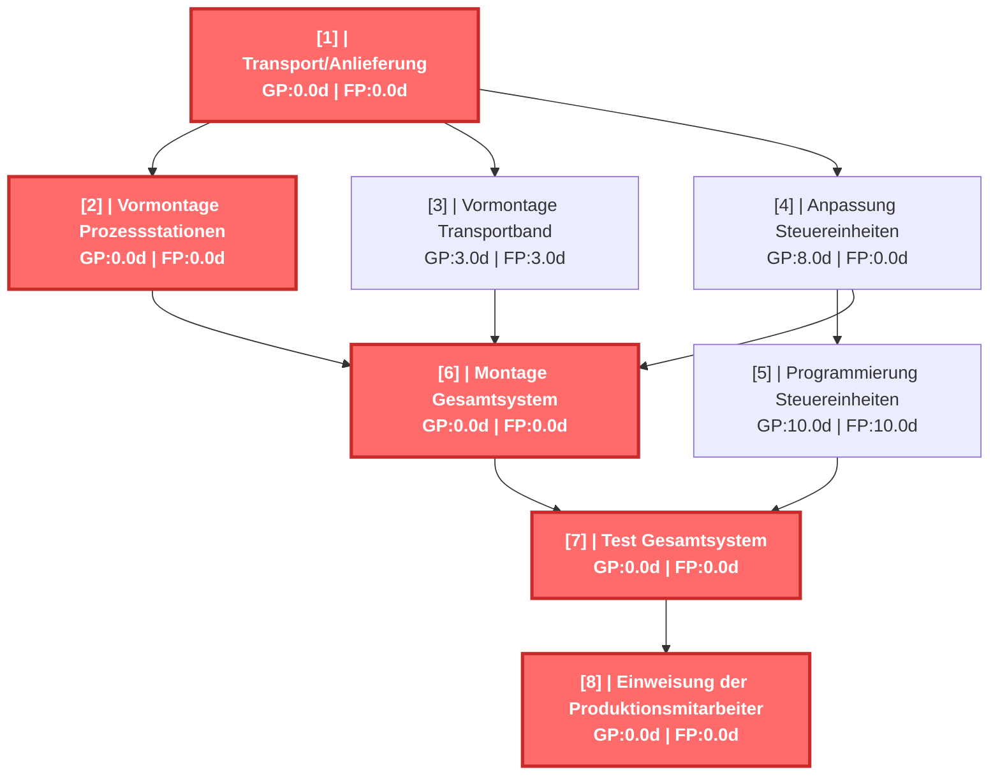
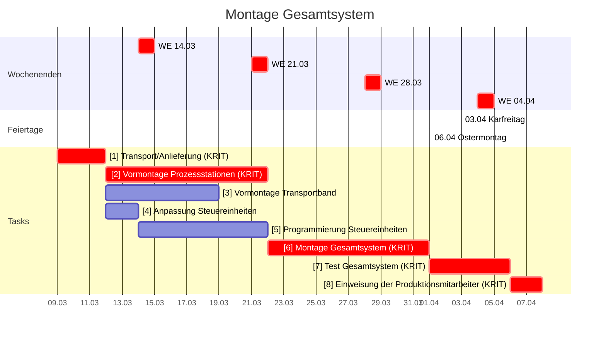

# Montage Gesamtsystem - CPM Report

Erstellt am: 2026-03-19 14:39:59

## CPM Analyse

### Projektzusammenfassung

- **Projekt:** Montage Gesamtsystem
- **Projektdauer:** 30.0d
- **Startdatum:** 2026-03-09 08:00
- **Enddatum (geschätzt):** 2026-04-08 08:00
- **Zeiteinheit:** days
- **Anzahl Tasks:** 8
- **Kritische Tasks:** 5

---

### Kritischer Pfad

Der kritische Pfad besteht aus folgenden Tasks:

- **[1]** Transport/Anlieferung (Dauer: 3.0d)
- **[2]** Vormontage Prozessstationen (Dauer: 10.0d)
- **[6]** Montage Gesamtsystem (Dauer: 10.0d)
- **[7]** Test Gesamtsystem (Dauer: 5.0d)
- **[8]** Einweisung der Produktionsmitarbeiter (Dauer: 2.0d)

---

### Netzplan

---

### Alle Tasks

| ID | Name | Dauer | FAZ | FEZ | SAZ | SEZ | GP | FP | Krit. |
|---|---|---|---|---|---|---|---|---|---|
| 1 | Transport/Anlieferung | 3.0d | 0.0d | 3.0d | 0.0d | 3.0d | 0.0d | 0.0d | JA |
| 2 | Vormontage Prozessstationen | 10.0d | 3.0d | 13.0d | 3.0d | 13.0d | 0.0d | 0.0d | JA |
| 3 | Vormontage Transportband | 7.0d | 3.0d | 10.0d | 6.0d | 13.0d | 3.0d | 3.0d |  |
| 4 | Anpassung Steuereinheiten | 2.0d | 3.0d | 5.0d | 11.0d | 13.0d | 8.0d | 0.0d |  |
| 5 | Programmierung Steuereinheiten | 8.0d | 5.0d | 13.0d | 15.0d | 23.0d | 10.0d | 10.0d |  |
| 6 | Montage Gesamtsystem | 10.0d | 13.0d | 23.0d | 13.0d | 23.0d | 0.0d | 0.0d | JA |
| 7 | Test Gesamtsystem | 5.0d | 23.0d | 28.0d | 23.0d | 28.0d | 0.0d | 0.0d | JA |
| 8 | Einweisung der Produktionsmitarb... | 2.0d | 28.0d | 30.0d | 28.0d | 30.0d | 0.0d | 0.0d | JA |

---

### Gantt Chart (mit Wochenenden)

---

### Resource List

*Keine Ressourcen-Informationen verfügbar.*

---

### Kostenübersicht

*Keine Kostendaten verfügbar – Stundensätze fehlen.*
