# Erdaushub 1000m3 - CPM Report

Erstellt am: 2026-03-20 16:35:13

## CPM Analyse

### Projektzusammenfassung

- **Projekt:** Erdaushub 1000m3
- **Projektdauer:** 727.0m
- **Startdatum:** 2026-03-20 16:35
- **Enddatum (geschätzt):** 2026-03-22 04:56
- **Zeiteinheit:** minutes
- **Anzahl Tasks:** 174
- **Kritische Tasks:** 174

---

### Kritischer Pfad

Der kritische Pfad besteht aus folgenden Tasks:

- **[1]** Initialisierung und Bereitstellung (Dauer: 15.0m)
- **[2-F1.1]** Beladen #1 (Dauer: 8.0m)
- **[2-F1.2]** Transport-Umlauf #1 (Dauer: 40.0m)
- **[2-F2.1]** Beladen #2 (Dauer: 8.0m)
- **[2-F2.2]** Transport-Umlauf #2 (Dauer: 40.0m)
- **[2-F3.1]** Beladen #3 (Dauer: 8.0m)
- **[2-F3.2]** Transport-Umlauf #3 (Dauer: 40.0m)
- **[2-F4.1]** Beladen #4 (Dauer: 8.0m)
- **[2-F4.2]** Transport-Umlauf #4 (Dauer: 40.0m)
- **[2-F5.1]** Beladen #5 (Dauer: 8.0m)
- **[2-F5.2]** Transport-Umlauf #5 (Dauer: 40.0m)
- **[2-F6.1]** Beladen #6 (Dauer: 8.0m)
- **[2-F6.2]** Transport-Umlauf #6 (Dauer: 40.0m)
- **[2-F7.1]** Beladen #7 (Dauer: 8.0m)
- **[2-F7.2]** Transport-Umlauf #7 (Dauer: 40.0m)
- **[2-F8.1]** Beladen #8 (Dauer: 8.0m)
- **[2-F8.2]** Transport-Umlauf #8 (Dauer: 40.0m)
- **[2-F9.1]** Beladen #9 (Dauer: 8.0m)
- **[2-F9.2]** Transport-Umlauf #9 (Dauer: 40.0m)
- **[2-F10.1]** Beladen #10 (Dauer: 8.0m)
- **[2-F10.2]** Transport-Umlauf #10 (Dauer: 40.0m)
- **[2-F11.1]** Beladen #11 (Dauer: 8.0m)
- **[2-F11.2]** Transport-Umlauf #11 (Dauer: 40.0m)
- **[2-F12.1]** Beladen #12 (Dauer: 8.0m)
- **[2-F12.2]** Transport-Umlauf #12 (Dauer: 40.0m)
- **[2-F13.1]** Beladen #13 (Dauer: 8.0m)
- **[2-F13.2]** Transport-Umlauf #13 (Dauer: 40.0m)
- **[2-F14.1]** Beladen #14 (Dauer: 8.0m)
- **[2-F14.2]** Transport-Umlauf #14 (Dauer: 40.0m)
- **[2-F15.1]** Beladen #15 (Dauer: 8.0m)
- **[2-F15.2]** Transport-Umlauf #15 (Dauer: 40.0m)
- **[2-F16.1]** Beladen #16 (Dauer: 8.0m)
- **[2-F11.2-BRK-P1]** Pause: Max Mustermann (Lenkzeitunterbrechung laut Fahrpersonalgesetz) (Dauer: 45.0m)
- **[2-F16.2]** Transport-Umlauf #16 (Dauer: 40.0m)
- **[2-F17.1]** Beladen #17 (Dauer: 8.0m)
- **[2-F12.2-BRK-P2]** Pause: Heinz Müller (Lenkzeitunterbrechung laut Fahrpersonalgesetz) (Dauer: 45.0m)
- **[2-F17.2]** Transport-Umlauf #17 (Dauer: 40.0m)
- **[2-F18.1]** Beladen #18 (Dauer: 8.0m)
- **[2-F18.2]** Transport-Umlauf #18 (Dauer: 40.0m)
- **[2-F19.1]** Beladen #19 (Dauer: 8.0m)
- **[2-F19.2]** Transport-Umlauf #19 (Dauer: 40.0m)
- **[2-F20.1]** Beladen #20 (Dauer: 8.0m)
- **[2-F15.2-BRK-P1]** Pause: Max Mustermann (Vorschrift laut Arbeitszeitgesetz) (Dauer: 30.0m)
- **[2-F20.2]** Transport-Umlauf #20 (Dauer: 40.0m)
- **[2-F21.1]** Beladen #21 (Dauer: 8.0m)
- **[2-F16.2-BRK-P2]** Pause: Heinz Müller (Vorschrift laut Arbeitszeitgesetz) (Dauer: 30.0m)
- **[2-F21.2]** Transport-Umlauf #21 (Dauer: 40.0m)
- **[2-F22.1]** Beladen #22 (Dauer: 8.0m)
- **[2-F22.2]** Transport-Umlauf #22 (Dauer: 40.0m)
- **[2-F23.1]** Beladen #23 (Dauer: 8.0m)
- **[2-F23.2]** Transport-Umlauf #23 (Dauer: 40.0m)
- **[2-F24.1]** Beladen #24 (Dauer: 8.0m)
- **[2-F24.2]** Transport-Umlauf #24 (Dauer: 40.0m)
- **[2-F25.1]** Beladen #25 (Dauer: 8.0m)
- **[2-F25.2]** Transport-Umlauf #25 (Dauer: 40.0m)
- **[2-F26.1]** Beladen #26 (Dauer: 8.0m)
- **[2-F26.2]** Transport-Umlauf #26 (Dauer: 40.0m)
- **[2-F27.1]** Beladen #27 (Dauer: 8.0m)
- **[2-F27.2]** Transport-Umlauf #27 (Dauer: 40.0m)
- **[2-F28.1]** Beladen #28 (Dauer: 8.0m)
- **[2-F28.2]** Transport-Umlauf #28 (Dauer: 40.0m)
- **[2-F29.1]** Beladen #29 (Dauer: 8.0m)
- **[2-F29.2]** Transport-Umlauf #29 (Dauer: 40.0m)
- **[2-F30.1]** Beladen #30 (Dauer: 8.0m)
- **[2-F30.2]** Transport-Umlauf #30 (Dauer: 40.0m)
- **[2-F31.1]** Beladen #31 (Dauer: 8.0m)
- **[2-F31.2]** Transport-Umlauf #31 (Dauer: 40.0m)
- **[2-F32.1]** Beladen #32 (Dauer: 8.0m)
- **[2-F32.2]** Transport-Umlauf #32 (Dauer: 40.0m)
- **[2-F33.1]** Beladen #33 (Dauer: 8.0m)
- **[2-F33.2]** Transport-Umlauf #33 (Dauer: 40.0m)
- **[2-F34.1]** Beladen #34 (Dauer: 8.0m)
- **[2-F34.2]** Transport-Umlauf #34 (Dauer: 40.0m)
- **[2-F35.1]** Beladen #35 (Dauer: 8.0m)
- **[2-F35.2]** Transport-Umlauf #35 (Dauer: 40.0m)
- **[2-F36.1]** Beladen #36 (Dauer: 8.0m)
- **[2-F36.2]** Transport-Umlauf #36 (Dauer: 40.0m)
- **[2-F37.1]** Beladen #37 (Dauer: 8.0m)
- **[2-F37.2]** Transport-Umlauf #37 (Dauer: 40.0m)
- **[2-F38.1]** Beladen #38 (Dauer: 8.0m)
- **[2-F38.2]** Transport-Umlauf #38 (Dauer: 40.0m)
- **[2-F39.1]** Beladen #39 (Dauer: 8.0m)
- **[2-F39.2]** Transport-Umlauf #39 (Dauer: 40.0m)
- **[2-F40.1]** Beladen #40 (Dauer: 8.0m)
- **[2-F40.2]** Transport-Umlauf #40 (Dauer: 40.0m)
- **[2-F41.1]** Beladen #41 (Dauer: 8.0m)
- **[2-F41.2]** Transport-Umlauf #41 (Dauer: 40.0m)
- **[2-F42.1]** Beladen #42 (Dauer: 8.0m)
- **[2-F42.2]** Transport-Umlauf #42 (Dauer: 40.0m)
- **[2-F43.1]** Beladen #43 (Dauer: 8.0m)
- **[2-F43.2]** Transport-Umlauf #43 (Dauer: 40.0m)
- **[2-F44.1]** Beladen #44 (Dauer: 8.0m)
- **[2-F44.1-BRK-P3]** Pause: Bodo Schmidt (Vorschrift laut Arbeitszeitgesetz) (Dauer: 30.0m)
- **[2-F44.2]** Transport-Umlauf #44 (Dauer: 40.0m)
- **[2-F45.1]** Beladen #45 (Dauer: 8.0m)
- **[2-F45.2]** Transport-Umlauf #45 (Dauer: 40.0m)
- **[2-F46.1]** Beladen #46 (Dauer: 8.0m)
- **[2-F46.2]** Transport-Umlauf #46 (Dauer: 40.0m)
- **[2-F47.1]** Beladen #47 (Dauer: 8.0m)
- **[2-F47.2]** Transport-Umlauf #47 (Dauer: 40.0m)
- **[2-F48.1]** Beladen #48 (Dauer: 8.0m)
- **[2-F48.2]** Transport-Umlauf #48 (Dauer: 40.0m)
- **[2-F49.1]** Beladen #49 (Dauer: 8.0m)
- **[2-F49.2]** Transport-Umlauf #49 (Dauer: 40.0m)
- **[2-F50.1]** Beladen #50 (Dauer: 8.0m)
- **[2-F50.2]** Transport-Umlauf #50 (Dauer: 40.0m)
- **[2-F51.1]** Beladen #51 (Dauer: 8.0m)
- **[2-F51.2]** Transport-Umlauf #51 (Dauer: 40.0m)
- **[2-F52.1]** Beladen #52 (Dauer: 8.0m)
- **[2-F52.2]** Transport-Umlauf #52 (Dauer: 40.0m)
- **[2-F53.1]** Beladen #53 (Dauer: 8.0m)
- **[2-F53.2]** Transport-Umlauf #53 (Dauer: 40.0m)
- **[2-F54.1]** Beladen #54 (Dauer: 8.0m)
- **[2-F54.2]** Transport-Umlauf #54 (Dauer: 40.0m)
- **[2-F55.1]** Beladen #55 (Dauer: 8.0m)
- **[2-F55.2]** Transport-Umlauf #55 (Dauer: 40.0m)
- **[2-F56.1]** Beladen #56 (Dauer: 8.0m)
- **[2-F56.2]** Transport-Umlauf #56 (Dauer: 40.0m)
- **[2-F57.1]** Beladen #57 (Dauer: 8.0m)
- **[2-F57.2]** Transport-Umlauf #57 (Dauer: 40.0m)
- **[2-F58.1]** Beladen #58 (Dauer: 8.0m)
- **[2-F58.2]** Transport-Umlauf #58 (Dauer: 40.0m)
- **[2-F59.1]** Beladen #59 (Dauer: 8.0m)
- **[2-F59.2]** Transport-Umlauf #59 (Dauer: 40.0m)
- **[2-F60.1]** Beladen #60 (Dauer: 8.0m)
- **[2-F60.2]** Transport-Umlauf #60 (Dauer: 40.0m)
- **[2-F61.1]** Beladen #61 (Dauer: 8.0m)
- **[2-F61.2]** Transport-Umlauf #61 (Dauer: 40.0m)
- **[2-F62.1]** Beladen #62 (Dauer: 8.0m)
- **[2-F62.2]** Transport-Umlauf #62 (Dauer: 40.0m)
- **[2-F63.1]** Beladen #63 (Dauer: 8.0m)
- **[2-F63.2]** Transport-Umlauf #63 (Dauer: 40.0m)
- **[2-F64.1]** Beladen #64 (Dauer: 8.0m)
- **[2-F64.2]** Transport-Umlauf #64 (Dauer: 40.0m)
- **[2-F65.1]** Beladen #65 (Dauer: 8.0m)
- **[2-F65.2]** Transport-Umlauf #65 (Dauer: 40.0m)
- **[2-F66.1]** Beladen #66 (Dauer: 8.0m)
- **[2-F66.2]** Transport-Umlauf #66 (Dauer: 40.0m)
- **[2-F67.1]** Beladen #67 (Dauer: 8.0m)
- **[2-F67.2]** Transport-Umlauf #67 (Dauer: 40.0m)
- **[2-F68.1]** Beladen #68 (Dauer: 8.0m)
- **[2-F68.2]** Transport-Umlauf #68 (Dauer: 40.0m)
- **[2-F69.1]** Beladen #69 (Dauer: 8.0m)
- **[2-F69.2]** Transport-Umlauf #69 (Dauer: 40.0m)
- **[2-F70.1]** Beladen #70 (Dauer: 8.0m)
- **[2-F70.2]** Transport-Umlauf #70 (Dauer: 40.0m)
- **[2-F71.1]** Beladen #71 (Dauer: 8.0m)
- **[2-F71.2]** Transport-Umlauf #71 (Dauer: 40.0m)
- **[2-F72.1]** Beladen #72 (Dauer: 8.0m)
- **[2-F72.2]** Transport-Umlauf #72 (Dauer: 40.0m)
- **[2-F73.1]** Beladen #73 (Dauer: 8.0m)
- **[2-F73.2]** Transport-Umlauf #73 (Dauer: 40.0m)
- **[2-F74.1]** Beladen #74 (Dauer: 8.0m)
- **[2-F74.2]** Transport-Umlauf #74 (Dauer: 40.0m)
- **[2-F75.1]** Beladen #75 (Dauer: 8.0m)
- **[2-F75.2]** Transport-Umlauf #75 (Dauer: 40.0m)
- **[2-F76.1]** Beladen #76 (Dauer: 8.0m)
- **[2-F76.2]** Transport-Umlauf #76 (Dauer: 40.0m)
- **[2-F77.1]** Beladen #77 (Dauer: 8.0m)
- **[2-F77.2]** Transport-Umlauf #77 (Dauer: 40.0m)
- **[2-F78.1]** Beladen #78 (Dauer: 8.0m)
- **[2-F78.2]** Transport-Umlauf #78 (Dauer: 40.0m)
- **[2-F79.1]** Beladen #79 (Dauer: 8.0m)
- **[2-F79.2]** Transport-Umlauf #79 (Dauer: 40.0m)
- **[2-F80.1]** Beladen #80 (Dauer: 8.0m)
- **[2-F80.2]** Transport-Umlauf #80 (Dauer: 40.0m)
- **[2-F81.1]** Beladen #81 (Dauer: 8.0m)
- **[2-F81.2]** Transport-Umlauf #81 (Dauer: 40.0m)
- **[2-F82.1]** Beladen #82 (Dauer: 8.0m)
- **[2-F82.2]** Transport-Umlauf #82 (Dauer: 40.0m)
- **[2-F83.1]** Beladen #83 (Dauer: 8.0m)
- **[2-F83.2]** Transport-Umlauf #83 (Dauer: 40.0m)
- **[2-F84.1]** Beladen #84 (Dauer: 8.0m)
- **[2-F84.2]** Transport-Umlauf #84 (Dauer: 40.0m)

---

### Netzplan

```mermaid
graph TD

    N1["<b>[1] | Initialisierung und Bereitstellung<br/>GP:-0.0m | FP:0.0m</b>"]:::critical
    N2-F1.1["<b>[2-F1.1] | Beladen #1<br/>GP:-0.0m | FP:0.0m</b>"]:::critical
    N2-F1.2["<b>[2-F1.2] | Transport-Umlauf #1<br/>GP:-0.0m | FP:-0.0m</b>"]:::critical
    N2-F2.1["<b>[2-F2.1] | Beladen #2<br/>GP:-0.0m | FP:0.0m</b>"]:::critical
    N2-F2.2["<b>[2-F2.2] | Transport-Umlauf #2<br/>GP:-0.0m | FP:-0.0m</b>"]:::critical
    N2-F3.1["<b>[2-F3.1] | Beladen #3<br/>GP:-0.0m | FP:0.0m</b>"]:::critical
    N2-F3.2["<b>[2-F3.2] | Transport-Umlauf #3<br/>GP:-0.0m | FP:-0.0m</b>"]:::critical
    N2-F4.1["<b>[2-F4.1] | Beladen #4<br/>GP:-0.0m | FP:0.0m</b>"]:::critical
    N2-F4.2["<b>[2-F4.2] | Transport-Umlauf #4<br/>GP:-0.0m | FP:-0.0m</b>"]:::critical
    N2-F5.1["<b>[2-F5.1] | Beladen #5<br/>GP:-0.0m | FP:0.0m</b>"]:::critical
    N2-F5.2["<b>[2-F5.2] | Transport-Umlauf #5<br/>GP:-0.0m | FP:-0.0m</b>"]:::critical
    N2-F6.1["<b>[2-F6.1] | Beladen #6<br/>GP:-0.0m | FP:0.0m</b>"]:::critical
    N2-F6.2["<b>[2-F6.2] | Transport-Umlauf #6<br/>GP:0.0m | FP:0.0m</b>"]:::critical
    N2-F7.1["<b>[2-F7.1] | Beladen #7<br/>GP:-0.0m | FP:0.0m</b>"]:::critical
    N2-F7.2["<b>[2-F7.2] | Transport-Umlauf #7<br/>GP:0.0m | FP:0.0m</b>"]:::critical
    N2-F8.1["<b>[2-F8.1] | Beladen #8<br/>GP:-0.0m | FP:0.0m</b>"]:::critical
    N2-F8.2["<b>[2-F8.2] | Transport-Umlauf #8<br/>GP:0.0m | FP:0.0m</b>"]:::critical
    N2-F9.1["<b>[2-F9.1] | Beladen #9<br/>GP:-0.0m | FP:0.0m</b>"]:::critical
    N2-F9.2["<b>[2-F9.2] | Transport-Umlauf #9<br/>GP:0.0m | FP:0.0m</b>"]:::critical
    N2-F10.1["<b>[2-F10.1] | Beladen #10<br/>GP:-0.0m | FP:0.0m</b>"]:::critical
    N2-F10.2["<b>[2-F10.2] | Transport-Umlauf #10<br/>GP:0.0m | FP:0.0m</b>"]:::critical
    N2-F11.1["<b>[2-F11.1] | Beladen #11<br/>GP:-0.0m | FP:0.0m</b>"]:::critical
    N2-F11.2["<b>[2-F11.2] | Transport-Umlauf #11<br/>GP:0.0m | FP:0.0m</b>"]:::critical
    N2-F11.2-BRK-P1["<b>[2-F11.2-BRK-P1] | Pause: Max Mustermann (Lenkzeitunterbrechung laut Fahrpersonalgesetz)<br/>GP:0.0m | FP:0.0m</b>"]:::critical
    N2-F12.1["<b>[2-F12.1] | Beladen #12<br/>GP:-0.0m | FP:0.0m</b>"]:::critical
    N2-F12.2["<b>[2-F12.2] | Transport-Umlauf #12<br/>GP:0.0m | FP:0.0m</b>"]:::critical
    N2-F12.2-BRK-P2["<b>[2-F12.2-BRK-P2] | Pause: Heinz Müller (Lenkzeitunterbrechung laut Fahrpersonalgesetz)<br/>GP:0.0m | FP:0.0m</b>"]:::critical
    N2-F13.1["<b>[2-F13.1] | Beladen #13<br/>GP:-0.0m | FP:0.0m</b>"]:::critical
    N2-F13.2["<b>[2-F13.2] | Transport-Umlauf #13<br/>GP:0.0m | FP:0.0m</b>"]:::critical
    N2-F14.1["<b>[2-F14.1] | Beladen #14<br/>GP:-0.0m | FP:0.0m</b>"]:::critical
    N2-F14.2["<b>[2-F14.2] | Transport-Umlauf #14<br/>GP:0.0m | FP:0.0m</b>"]:::critical
    N2-F15.1["<b>[2-F15.1] | Beladen #15<br/>GP:-0.0m | FP:0.0m</b>"]:::critical
    N2-F15.2["<b>[2-F15.2] | Transport-Umlauf #15<br/>GP:0.0m | FP:0.0m</b>"]:::critical
    N2-F15.2-BRK-P1["<b>[2-F15.2-BRK-P1] | Pause: Max Mustermann (Vorschrift laut Arbeitszeitgesetz)<br/>GP:0.0m | FP:0.0m</b>"]:::critical
    N2-F16.1["<b>[2-F16.1] | Beladen #16<br/>GP:-0.0m | FP:0.0m</b>"]:::critical
    N2-F16.2["<b>[2-F16.2] | Transport-Umlauf #16<br/>GP:0.0m | FP:0.0m</b>"]:::critical
    N2-F16.2-BRK-P2["<b>[2-F16.2-BRK-P2] | Pause: Heinz Müller (Vorschrift laut Arbeitszeitgesetz)<br/>GP:0.0m | FP:0.0m</b>"]:::critical
    N2-F17.1["<b>[2-F17.1] | Beladen #17<br/>GP:-0.0m | FP:0.0m</b>"]:::critical
    N2-F17.2["<b>[2-F17.2] | Transport-Umlauf #17<br/>GP:0.0m | FP:0.0m</b>"]:::critical
    N2-F18.1["<b>[2-F18.1] | Beladen #18<br/>GP:-0.0m | FP:0.0m</b>"]:::critical
    N2-F18.2["<b>[2-F18.2] | Transport-Umlauf #18<br/>GP:0.0m | FP:0.0m</b>"]:::critical
    N2-F19.1["<b>[2-F19.1] | Beladen #19<br/>GP:-0.0m | FP:0.0m</b>"]:::critical
    N2-F19.2["<b>[2-F19.2] | Transport-Umlauf #19<br/>GP:0.0m | FP:0.0m</b>"]:::critical
    N2-F20.1["<b>[2-F20.1] | Beladen #20<br/>GP:-0.0m | FP:0.0m</b>"]:::critical
    N2-F20.2["<b>[2-F20.2] | Transport-Umlauf #20<br/>GP:0.0m | FP:0.0m</b>"]:::critical
    N2-F21.1["<b>[2-F21.1] | Beladen #21<br/>GP:-0.0m | FP:0.0m</b>"]:::critical
    N2-F21.2["<b>[2-F21.2] | Transport-Umlauf #21<br/>GP:0.0m | FP:0.0m</b>"]:::critical
    N2-F22.1["<b>[2-F22.1] | Beladen #22<br/>GP:-0.0m | FP:0.0m</b>"]:::critical
    N2-F22.2["<b>[2-F22.2] | Transport-Umlauf #22<br/>GP:0.0m | FP:0.0m</b>"]:::critical
    N2-F23.1["<b>[2-F23.1] | Beladen #23<br/>GP:-0.0m | FP:0.0m</b>"]:::critical
    N2-F23.2["<b>[2-F23.2] | Transport-Umlauf #23<br/>GP:0.0m | FP:0.0m</b>"]:::critical
    N2-F24.1["<b>[2-F24.1] | Beladen #24<br/>GP:-0.0m | FP:0.0m</b>"]:::critical
    N2-F24.2["<b>[2-F24.2] | Transport-Umlauf #24<br/>GP:0.0m | FP:0.0m</b>"]:::critical
    N2-F25.1["<b>[2-F25.1] | Beladen #25<br/>GP:-0.0m | FP:0.0m</b>"]:::critical
    N2-F25.2["<b>[2-F25.2] | Transport-Umlauf #25<br/>GP:0.0m | FP:0.0m</b>"]:::critical
    N2-F26.1["<b>[2-F26.1] | Beladen #26<br/>GP:-0.0m | FP:0.0m</b>"]:::critical
    N2-F26.2["<b>[2-F26.2] | Transport-Umlauf #26<br/>GP:0.0m | FP:0.0m</b>"]:::critical
    N2-F27.1["<b>[2-F27.1] | Beladen #27<br/>GP:-0.0m | FP:0.0m</b>"]:::critical
    N2-F27.2["<b>[2-F27.2] | Transport-Umlauf #27<br/>GP:0.0m | FP:0.0m</b>"]:::critical
    N2-F28.1["<b>[2-F28.1] | Beladen #28<br/>GP:-0.0m | FP:0.0m</b>"]:::critical
    N2-F28.2["<b>[2-F28.2] | Transport-Umlauf #28<br/>GP:0.0m | FP:0.0m</b>"]:::critical
    N2-F29.1["<b>[2-F29.1] | Beladen #29<br/>GP:-0.0m | FP:0.0m</b>"]:::critical
    N2-F29.2["<b>[2-F29.2] | Transport-Umlauf #29<br/>GP:0.0m | FP:0.0m</b>"]:::critical
    N2-F30.1["<b>[2-F30.1] | Beladen #30<br/>GP:-0.0m | FP:0.0m</b>"]:::critical
    N2-F30.2["<b>[2-F30.2] | Transport-Umlauf #30<br/>GP:0.0m | FP:0.0m</b>"]:::critical
    N2-F31.1["<b>[2-F31.1] | Beladen #31<br/>GP:-0.0m | FP:0.0m</b>"]:::critical
    N2-F31.2["<b>[2-F31.2] | Transport-Umlauf #31<br/>GP:0.0m | FP:0.0m</b>"]:::critical
    N2-F32.1["<b>[2-F32.1] | Beladen #32<br/>GP:-0.0m | FP:0.0m</b>"]:::critical
    N2-F32.2["<b>[2-F32.2] | Transport-Umlauf #32<br/>GP:0.0m | FP:0.0m</b>"]:::critical
    N2-F33.1["<b>[2-F33.1] | Beladen #33<br/>GP:-0.0m | FP:0.0m</b>"]:::critical
    N2-F33.2["<b>[2-F33.2] | Transport-Umlauf #33<br/>GP:0.0m | FP:0.0m</b>"]:::critical
    N2-F34.1["<b>[2-F34.1] | Beladen #34<br/>GP:-0.0m | FP:0.0m</b>"]:::critical
    N2-F34.2["<b>[2-F34.2] | Transport-Umlauf #34<br/>GP:0.0m | FP:0.0m</b>"]:::critical
    N2-F35.1["<b>[2-F35.1] | Beladen #35<br/>GP:-0.0m | FP:0.0m</b>"]:::critical
    N2-F35.2["<b>[2-F35.2] | Transport-Umlauf #35<br/>GP:0.0m | FP:0.0m</b>"]:::critical
    N2-F36.1["<b>[2-F36.1] | Beladen #36<br/>GP:-0.0m | FP:0.0m</b>"]:::critical
    N2-F36.2["<b>[2-F36.2] | Transport-Umlauf #36<br/>GP:0.0m | FP:0.0m</b>"]:::critical
    N2-F37.1["<b>[2-F37.1] | Beladen #37<br/>GP:-0.0m | FP:0.0m</b>"]:::critical
    N2-F37.2["<b>[2-F37.2] | Transport-Umlauf #37<br/>GP:0.0m | FP:0.0m</b>"]:::critical
    N2-F38.1["<b>[2-F38.1] | Beladen #38<br/>GP:-0.0m | FP:0.0m</b>"]:::critical
    N2-F38.2["<b>[2-F38.2] | Transport-Umlauf #38<br/>GP:0.0m | FP:0.0m</b>"]:::critical
    N2-F39.1["<b>[2-F39.1] | Beladen #39<br/>GP:-0.0m | FP:0.0m</b>"]:::critical
    N2-F39.2["<b>[2-F39.2] | Transport-Umlauf #39<br/>GP:0.0m | FP:0.0m</b>"]:::critical
    N2-F40.1["<b>[2-F40.1] | Beladen #40<br/>GP:-0.0m | FP:0.0m</b>"]:::critical
    N2-F40.2["<b>[2-F40.2] | Transport-Umlauf #40<br/>GP:0.0m | FP:0.0m</b>"]:::critical
    N2-F41.1["<b>[2-F41.1] | Beladen #41<br/>GP:-0.0m | FP:0.0m</b>"]:::critical
    N2-F41.2["<b>[2-F41.2] | Transport-Umlauf #41<br/>GP:0.0m | FP:0.0m</b>"]:::critical
    N2-F42.1["<b>[2-F42.1] | Beladen #42<br/>GP:-0.0m | FP:0.0m</b>"]:::critical
    N2-F42.2["<b>[2-F42.2] | Transport-Umlauf #42<br/>GP:0.0m | FP:0.0m</b>"]:::critical
    N2-F43.1["<b>[2-F43.1] | Beladen #43<br/>GP:-0.0m | FP:0.0m</b>"]:::critical
    N2-F43.2["<b>[2-F43.2] | Transport-Umlauf #43<br/>GP:0.0m | FP:0.0m</b>"]:::critical
    N2-F44.1["<b>[2-F44.1] | Beladen #44<br/>GP:-0.0m | FP:0.0m</b>"]:::critical
    N2-F44.1-BRK-P3["<b>[2-F44.1-BRK-P3] | Pause: Bodo Schmidt (Vorschrift laut Arbeitszeitgesetz)<br/>GP:0.0m | FP:0.0m</b>"]:::critical
    N2-F44.2["<b>[2-F44.2] | Transport-Umlauf #44<br/>GP:0.0m | FP:0.0m</b>"]:::critical
    N2-F45.1["<b>[2-F45.1] | Beladen #45<br/>GP:-0.0m | FP:0.0m</b>"]:::critical
    N2-F45.2["<b>[2-F45.2] | Transport-Umlauf #45<br/>GP:0.0m | FP:0.0m</b>"]:::critical
    N2-F46.1["<b>[2-F46.1] | Beladen #46<br/>GP:-0.0m | FP:0.0m</b>"]:::critical
    N2-F46.2["<b>[2-F46.2] | Transport-Umlauf #46<br/>GP:0.0m | FP:0.0m</b>"]:::critical
    N2-F47.1["<b>[2-F47.1] | Beladen #47<br/>GP:-0.0m | FP:0.0m</b>"]:::critical
    N2-F47.2["<b>[2-F47.2] | Transport-Umlauf #47<br/>GP:0.0m | FP:0.0m</b>"]:::critical
    N2-F48.1["<b>[2-F48.1] | Beladen #48<br/>GP:-0.0m | FP:0.0m</b>"]:::critical
    N2-F48.2["<b>[2-F48.2] | Transport-Umlauf #48<br/>GP:0.0m | FP:0.0m</b>"]:::critical
    N2-F49.1["<b>[2-F49.1] | Beladen #49<br/>GP:-0.0m | FP:0.0m</b>"]:::critical
    N2-F49.2["<b>[2-F49.2] | Transport-Umlauf #49<br/>GP:0.0m | FP:0.0m</b>"]:::critical
    N2-F50.1["<b>[2-F50.1] | Beladen #50<br/>GP:-0.0m | FP:0.0m</b>"]:::critical
    N2-F50.2["<b>[2-F50.2] | Transport-Umlauf #50<br/>GP:0.0m | FP:0.0m</b>"]:::critical
    N2-F51.1["<b>[2-F51.1] | Beladen #51<br/>GP:-0.0m | FP:0.0m</b>"]:::critical
    N2-F51.2["<b>[2-F51.2] | Transport-Umlauf #51<br/>GP:0.0m | FP:0.0m</b>"]:::critical
    N2-F52.1["<b>[2-F52.1] | Beladen #52<br/>GP:-0.0m | FP:0.0m</b>"]:::critical
    N2-F52.2["<b>[2-F52.2] | Transport-Umlauf #52<br/>GP:0.0m | FP:0.0m</b>"]:::critical
    N2-F53.1["<b>[2-F53.1] | Beladen #53<br/>GP:-0.0m | FP:0.0m</b>"]:::critical
    N2-F53.2["<b>[2-F53.2] | Transport-Umlauf #53<br/>GP:0.0m | FP:0.0m</b>"]:::critical
    N2-F54.1["<b>[2-F54.1] | Beladen #54<br/>GP:-0.0m | FP:0.0m</b>"]:::critical
    N2-F54.2["<b>[2-F54.2] | Transport-Umlauf #54<br/>GP:-0.0m | FP:-0.0m</b>"]:::critical
    N2-F55.1["<b>[2-F55.1] | Beladen #55<br/>GP:-0.0m | FP:0.0m</b>"]:::critical
    N2-F55.2["<b>[2-F55.2] | Transport-Umlauf #55<br/>GP:0.0m | FP:0.0m</b>"]:::critical
    N2-F56.1["<b>[2-F56.1] | Beladen #56<br/>GP:-0.0m | FP:0.0m</b>"]:::critical
    N2-F56.2["<b>[2-F56.2] | Transport-Umlauf #56<br/>GP:-0.0m | FP:-0.0m</b>"]:::critical
    N2-F57.1["<b>[2-F57.1] | Beladen #57<br/>GP:-0.0m | FP:0.0m</b>"]:::critical
    N2-F57.2["<b>[2-F57.2] | Transport-Umlauf #57<br/>GP:0.0m | FP:0.0m</b>"]:::critical
    N2-F58.1["<b>[2-F58.1] | Beladen #58<br/>GP:-0.0m | FP:0.0m</b>"]:::critical
    N2-F58.2["<b>[2-F58.2] | Transport-Umlauf #58<br/>GP:-0.0m | FP:-0.0m</b>"]:::critical
    N2-F59.1["<b>[2-F59.1] | Beladen #59<br/>GP:-0.0m | FP:0.0m</b>"]:::critical
    N2-F59.2["<b>[2-F59.2] | Transport-Umlauf #59<br/>GP:0.0m | FP:0.0m</b>"]:::critical
    N2-F60.1["<b>[2-F60.1] | Beladen #60<br/>GP:0.0m | FP:0.0m</b>"]:::critical
    N2-F60.2["<b>[2-F60.2] | Transport-Umlauf #60<br/>GP:0.0m | FP:0.0m</b>"]:::critical
    N2-F61.1["<b>[2-F61.1] | Beladen #61<br/>GP:0.0m | FP:0.0m</b>"]:::critical
    N2-F61.2["<b>[2-F61.2] | Transport-Umlauf #61<br/>GP:0.0m | FP:0.0m</b>"]:::critical
    N2-F62.1["<b>[2-F62.1] | Beladen #62<br/>GP:0.0m | FP:0.0m</b>"]:::critical
    N2-F62.2["<b>[2-F62.2] | Transport-Umlauf #62<br/>GP:0.0m | FP:0.0m</b>"]:::critical
    N2-F63.1["<b>[2-F63.1] | Beladen #63<br/>GP:0.0m | FP:0.0m</b>"]:::critical
    N2-F63.2["<b>[2-F63.2] | Transport-Umlauf #63<br/>GP:0.0m | FP:0.0m</b>"]:::critical
    N2-F64.1["<b>[2-F64.1] | Beladen #64<br/>GP:0.0m | FP:0.0m</b>"]:::critical
    N2-F64.2["<b>[2-F64.2] | Transport-Umlauf #64<br/>GP:0.0m | FP:0.0m</b>"]:::critical
    N2-F65.1["<b>[2-F65.1] | Beladen #65<br/>GP:0.0m | FP:0.0m</b>"]:::critical
    N2-F65.2["<b>[2-F65.2] | Transport-Umlauf #65<br/>GP:0.0m | FP:0.0m</b>"]:::critical
    N2-F66.1["<b>[2-F66.1] | Beladen #66<br/>GP:0.0m | FP:0.0m</b>"]:::critical
    N2-F66.2["<b>[2-F66.2] | Transport-Umlauf #66<br/>GP:0.0m | FP:0.0m</b>"]:::critical
    N2-F67.1["<b>[2-F67.1] | Beladen #67<br/>GP:0.0m | FP:0.0m</b>"]:::critical
    N2-F67.2["<b>[2-F67.2] | Transport-Umlauf #67<br/>GP:0.0m | FP:0.0m</b>"]:::critical
    N2-F68.1["<b>[2-F68.1] | Beladen #68<br/>GP:0.0m | FP:0.0m</b>"]:::critical
    N2-F68.2["<b>[2-F68.2] | Transport-Umlauf #68<br/>GP:0.0m | FP:0.0m</b>"]:::critical
    N2-F69.1["<b>[2-F69.1] | Beladen #69<br/>GP:0.0m | FP:0.0m</b>"]:::critical
    N2-F69.2["<b>[2-F69.2] | Transport-Umlauf #69<br/>GP:0.0m | FP:0.0m</b>"]:::critical
    N2-F70.1["<b>[2-F70.1] | Beladen #70<br/>GP:0.0m | FP:0.0m</b>"]:::critical
    N2-F70.2["<b>[2-F70.2] | Transport-Umlauf #70<br/>GP:0.0m | FP:0.0m</b>"]:::critical
    N2-F71.1["<b>[2-F71.1] | Beladen #71<br/>GP:0.0m | FP:0.0m</b>"]:::critical
    N2-F71.2["<b>[2-F71.2] | Transport-Umlauf #71<br/>GP:0.0m | FP:0.0m</b>"]:::critical
    N2-F72.1["<b>[2-F72.1] | Beladen #72<br/>GP:0.0m | FP:0.0m</b>"]:::critical
    N2-F72.2["<b>[2-F72.2] | Transport-Umlauf #72<br/>GP:0.0m | FP:0.0m</b>"]:::critical
    N2-F73.1["<b>[2-F73.1] | Beladen #73<br/>GP:0.0m | FP:0.0m</b>"]:::critical
    N2-F73.2["<b>[2-F73.2] | Transport-Umlauf #73<br/>GP:0.0m | FP:0.0m</b>"]:::critical
    N2-F74.1["<b>[2-F74.1] | Beladen #74<br/>GP:0.0m | FP:0.0m</b>"]:::critical
    N2-F74.2["<b>[2-F74.2] | Transport-Umlauf #74<br/>GP:0.0m | FP:0.0m</b>"]:::critical
    N2-F75.1["<b>[2-F75.1] | Beladen #75<br/>GP:0.0m | FP:0.0m</b>"]:::critical
    N2-F75.2["<b>[2-F75.2] | Transport-Umlauf #75<br/>GP:0.0m | FP:0.0m</b>"]:::critical
    N2-F76.1["<b>[2-F76.1] | Beladen #76<br/>GP:0.0m | FP:0.0m</b>"]:::critical
    N2-F76.2["<b>[2-F76.2] | Transport-Umlauf #76<br/>GP:0.0m | FP:0.0m</b>"]:::critical
    N2-F77.1["<b>[2-F77.1] | Beladen #77<br/>GP:0.0m | FP:0.0m</b>"]:::critical
    N2-F77.2["<b>[2-F77.2] | Transport-Umlauf #77<br/>GP:0.0m | FP:0.0m</b>"]:::critical
    N2-F78.1["<b>[2-F78.1] | Beladen #78<br/>GP:0.0m | FP:0.0m</b>"]:::critical
    N2-F78.2["<b>[2-F78.2] | Transport-Umlauf #78<br/>GP:0.0m | FP:0.0m</b>"]:::critical
    N2-F79.1["<b>[2-F79.1] | Beladen #79<br/>GP:0.0m | FP:0.0m</b>"]:::critical
    N2-F79.2["<b>[2-F79.2] | Transport-Umlauf #79<br/>GP:0.0m | FP:0.0m</b>"]:::critical
    N2-F80.1["<b>[2-F80.1] | Beladen #80<br/>GP:0.0m | FP:0.0m</b>"]:::critical
    N2-F80.2["<b>[2-F80.2] | Transport-Umlauf #80<br/>GP:0.0m | FP:0.0m</b>"]:::critical
    N2-F81.1["<b>[2-F81.1] | Beladen #81<br/>GP:0.0m | FP:0.0m</b>"]:::critical
    N2-F81.2["<b>[2-F81.2] | Transport-Umlauf #81<br/>GP:0.0m | FP:0.0m</b>"]:::critical
    N2-F82.1["<b>[2-F82.1] | Beladen #82<br/>GP:0.0m | FP:0.0m</b>"]:::critical
    N2-F82.2["<b>[2-F82.2] | Transport-Umlauf #82<br/>GP:0.0m | FP:0.0m</b>"]:::critical
    N2-F83.1["<b>[2-F83.1] | Beladen #83<br/>GP:0.0m | FP:0.0m</b>"]:::critical
    N2-F83.2["<b>[2-F83.2] | Transport-Umlauf #83<br/>GP:0.0m | FP:0.0m</b>"]:::critical
    N2-F84.1["<b>[2-F84.1] | Beladen #84<br/>GP:0.0m | FP:0.0m</b>"]:::critical
    N2-F84.2["<b>[2-F84.2] | Transport-Umlauf #84<br/>GP:0.0m | FP:0.0m</b>"]:::critical

    N1 --> N2-F1.1
    N2-F1.1 --> N2-F1.2
    N2-F1.1 --> N2-F2.1
    N2-F2.1 --> N2-F2.2
    N2-F2.1 --> N2-F3.1
    N2-F3.1 --> N2-F3.2
    N2-F3.1 --> N2-F4.1
    N2-F4.1 --> N2-F4.2
    N2-F4.1 --> N2-F5.1
    N2-F5.1 --> N2-F5.2
    N2-F5.1 --> N2-F6.1
    N2-F6.1 --> N2-F6.2
    N2-F6.1 --> N2-F7.1
    N2-F7.1 --> N2-F7.2
    N2-F7.1 --> N2-F8.1
    N2-F8.1 --> N2-F8.2
    N2-F8.1 --> N2-F9.1
    N2-F9.1 --> N2-F9.2
    N2-F9.1 --> N2-F10.1
    N2-F10.1 --> N2-F10.2
    N2-F10.1 --> N2-F11.1
    N2-F11.1 --> N2-F11.2
    N2-F11.1 --> N2-F12.1
    N2-F11.2 --> N2-F11.2-BRK-P1
    N2-F12.1 --> N2-F12.2
    N2-F12.1 --> N2-F13.1
    N2-F12.2 --> N2-F12.2-BRK-P2
    N2-F13.1 --> N2-F13.2
    N2-F13.1 --> N2-F14.1
    N2-F14.1 --> N2-F14.2
    N2-F14.1 --> N2-F15.1
    N2-F15.1 --> N2-F15.2
    N2-F15.1 --> N2-F16.1
    N2-F15.2 --> N2-F15.2-BRK-P1
    N2-F16.1 --> N2-F16.2
    N2-F16.1 --> N2-F17.1
    N2-F16.2 --> N2-F16.2-BRK-P2
    N2-F17.1 --> N2-F17.2
    N2-F17.1 --> N2-F18.1
    N2-F18.1 --> N2-F18.2
    N2-F18.1 --> N2-F19.1
    N2-F19.1 --> N2-F19.2
    N2-F19.1 --> N2-F20.1
    N2-F20.1 --> N2-F20.2
    N2-F20.1 --> N2-F21.1
    N2-F21.1 --> N2-F21.2
    N2-F21.1 --> N2-F22.1
    N2-F22.1 --> N2-F22.2
    N2-F22.1 --> N2-F23.1
    N2-F23.1 --> N2-F23.2
    N2-F23.1 --> N2-F24.1
    N2-F24.1 --> N2-F24.2
    N2-F24.1 --> N2-F25.1
    N2-F25.1 --> N2-F25.2
    N2-F25.1 --> N2-F26.1
    N2-F26.1 --> N2-F26.2
    N2-F26.1 --> N2-F27.1
    N2-F27.1 --> N2-F27.2
    N2-F27.1 --> N2-F28.1
    N2-F28.1 --> N2-F28.2
    N2-F28.1 --> N2-F29.1
    N2-F29.1 --> N2-F29.2
    N2-F29.1 --> N2-F30.1
    N2-F30.1 --> N2-F30.2
    N2-F30.1 --> N2-F31.1
    N2-F31.1 --> N2-F31.2
    N2-F31.1 --> N2-F32.1
    N2-F32.1 --> N2-F32.2
    N2-F32.1 --> N2-F33.1
    N2-F33.1 --> N2-F33.2
    N2-F33.1 --> N2-F34.1
    N2-F34.1 --> N2-F34.2
    N2-F34.1 --> N2-F35.1
    N2-F35.1 --> N2-F35.2
    N2-F35.1 --> N2-F36.1
    N2-F36.1 --> N2-F36.2
    N2-F36.1 --> N2-F37.1
    N2-F37.1 --> N2-F37.2
    N2-F37.1 --> N2-F38.1
    N2-F38.1 --> N2-F38.2
    N2-F38.1 --> N2-F39.1
    N2-F39.1 --> N2-F39.2
    N2-F39.1 --> N2-F40.1
    N2-F40.1 --> N2-F40.2
    N2-F40.1 --> N2-F41.1
    N2-F41.1 --> N2-F41.2
    N2-F41.1 --> N2-F42.1
    N2-F42.1 --> N2-F42.2
    N2-F42.1 --> N2-F43.1
    N2-F43.1 --> N2-F43.2
    N2-F43.1 --> N2-F44.1
    N2-F44.1 --> N2-F44.2
    N2-F44.1 --> N2-F45.1
    N2-F44.1 --> N2-F44.1-BRK-P3
    N2-F45.1 --> N2-F45.2
    N2-F45.1 --> N2-F46.1
    N2-F46.1 --> N2-F46.2
    N2-F46.1 --> N2-F47.1
    N2-F47.1 --> N2-F47.2
    N2-F47.1 --> N2-F48.1
    N2-F48.1 --> N2-F48.2
    N2-F48.1 --> N2-F49.1
    N2-F49.1 --> N2-F49.2
    N2-F49.1 --> N2-F50.1
    N2-F50.1 --> N2-F50.2
    N2-F50.1 --> N2-F51.1
    N2-F51.1 --> N2-F51.2
    N2-F51.1 --> N2-F52.1
    N2-F52.1 --> N2-F52.2
    N2-F52.1 --> N2-F53.1
    N2-F53.1 --> N2-F53.2
    N2-F53.1 --> N2-F54.1
    N2-F54.1 --> N2-F54.2
    N2-F54.1 --> N2-F55.1
    N2-F55.1 --> N2-F55.2
    N2-F55.1 --> N2-F56.1
    N2-F56.1 --> N2-F56.2
    N2-F56.1 --> N2-F57.1
    N2-F57.1 --> N2-F57.2
    N2-F57.1 --> N2-F58.1
    N2-F58.1 --> N2-F58.2
    N2-F58.1 --> N2-F59.1
    N2-F59.1 --> N2-F59.2
    N2-F59.1 --> N2-F60.1
    N2-F60.1 --> N2-F60.2
    N2-F60.1 --> N2-F61.1
    N2-F61.1 --> N2-F61.2
    N2-F61.1 --> N2-F62.1
    N2-F62.1 --> N2-F62.2
    N2-F62.1 --> N2-F63.1
    N2-F63.1 --> N2-F63.2
    N2-F63.1 --> N2-F64.1
    N2-F64.1 --> N2-F64.2
    N2-F64.1 --> N2-F65.1
    N2-F65.1 --> N2-F65.2
    N2-F65.1 --> N2-F66.1
    N2-F66.1 --> N2-F66.2
    N2-F66.1 --> N2-F67.1
    N2-F67.1 --> N2-F67.2
    N2-F67.1 --> N2-F68.1
    N2-F68.1 --> N2-F68.2
    N2-F68.1 --> N2-F69.1
    N2-F69.1 --> N2-F69.2
    N2-F69.1 --> N2-F70.1
    N2-F70.1 --> N2-F70.2
    N2-F70.1 --> N2-F71.1
    N2-F71.1 --> N2-F71.2
    N2-F71.1 --> N2-F72.1
    N2-F72.1 --> N2-F72.2
    N2-F72.1 --> N2-F73.1
    N2-F73.1 --> N2-F73.2
    N2-F73.1 --> N2-F74.1
    N2-F74.1 --> N2-F74.2
    N2-F74.1 --> N2-F75.1
    N2-F75.1 --> N2-F75.2
    N2-F75.1 --> N2-F76.1
    N2-F76.1 --> N2-F76.2
    N2-F76.1 --> N2-F77.1
    N2-F77.1 --> N2-F77.2
    N2-F77.1 --> N2-F78.1
    N2-F78.1 --> N2-F78.2
    N2-F78.1 --> N2-F79.1
    N2-F79.1 --> N2-F79.2
    N2-F79.1 --> N2-F80.1
    N2-F80.1 --> N2-F80.2
    N2-F80.1 --> N2-F81.1
    N2-F81.1 --> N2-F81.2
    N2-F81.1 --> N2-F82.1
    N2-F82.1 --> N2-F82.2
    N2-F82.1 --> N2-F83.1
    N2-F83.1 --> N2-F83.2
    N2-F83.1 --> N2-F84.1
    N2-F84.1 --> N2-F84.2

    classDef critical fill:#ff6b6b,stroke:#c92a2a,color:#fff,stroke-width:3px
    classDef normal   fill:#4472c4,stroke:#2f5496,color:#fff
```

---

### Alle Tasks

| ID | Name | Dauer | FAZ | FEZ | SAZ | SEZ | GP | FP | Krit. |
|---|---|---|---|---|---|---|---|---|---|
| 1 | Initialisierung und Bereitstellung | 15.0m | 0.0m | 15.0m | -0.0m | 15.0m | -0.0m | 0.0m | JA |
| 2-F1.1 | Beladen #1 | 8.0m | 15.0m | 23.0m | 15.0m | 23.0m | -0.0m | 0.0m | JA |
| 2-F1.2 | Transport-Umlauf #1 | 40.0m | 23.0m | 63.0m | 23.0m | 63.0m | -0.0m | -0.0m | JA |
| 2-F2.1 | Beladen #2 | 8.0m | 23.0m | 31.0m | 23.0m | 31.0m | -0.0m | 0.0m | JA |
| 2-F2.2 | Transport-Umlauf #2 | 40.0m | 31.0m | 71.0m | 31.0m | 71.0m | -0.0m | -0.0m | JA |
| 2-F3.1 | Beladen #3 | 8.0m | 31.0m | 39.0m | 31.0m | 39.0m | -0.0m | 0.0m | JA |
| 2-F3.2 | Transport-Umlauf #3 | 40.0m | 39.0m | 79.0m | 39.0m | 79.0m | -0.0m | -0.0m | JA |
| 2-F4.1 | Beladen #4 | 8.0m | 39.0m | 47.0m | 39.0m | 47.0m | -0.0m | 0.0m | JA |
| 2-F4.2 | Transport-Umlauf #4 | 40.0m | 47.0m | 87.0m | 47.0m | 87.0m | -0.0m | -0.0m | JA |
| 2-F5.1 | Beladen #5 | 8.0m | 47.0m | 55.0m | 47.0m | 55.0m | -0.0m | 0.0m | JA |
| 2-F5.2 | Transport-Umlauf #5 | 40.0m | 55.0m | 95.0m | 55.0m | 95.0m | -0.0m | -0.0m | JA |
| 2-F6.1 | Beladen #6 | 8.0m | 55.0m | 63.0m | 55.0m | 63.0m | -0.0m | 0.0m | JA |
| 2-F6.2 | Transport-Umlauf #6 | 40.0m | 63.0m | 103.0m | 63.0m | 103.0m | 0.0m | 0.0m | JA |
| 2-F7.1 | Beladen #7 | 8.0m | 63.0m | 71.0m | 63.0m | 71.0m | -0.0m | 0.0m | JA |
| 2-F7.2 | Transport-Umlauf #7 | 40.0m | 71.0m | 111.0m | 71.0m | 111.0m | 0.0m | 0.0m | JA |
| 2-F8.1 | Beladen #8 | 8.0m | 71.0m | 79.0m | 71.0m | 79.0m | -0.0m | 0.0m | JA |
| 2-F8.2 | Transport-Umlauf #8 | 40.0m | 79.0m | 119.0m | 79.0m | 119.0m | 0.0m | 0.0m | JA |
| 2-F9.1 | Beladen #9 | 8.0m | 79.0m | 87.0m | 79.0m | 87.0m | -0.0m | 0.0m | JA |
| 2-F9.2 | Transport-Umlauf #9 | 40.0m | 87.0m | 127.0m | 87.0m | 127.0m | 0.0m | 0.0m | JA |
| 2-F10.1 | Beladen #10 | 8.0m | 87.0m | 95.0m | 87.0m | 95.0m | -0.0m | 0.0m | JA |
| 2-F10.2 | Transport-Umlauf #10 | 40.0m | 95.0m | 135.0m | 95.0m | 135.0m | 0.0m | 0.0m | JA |
| 2-F11.1 | Beladen #11 | 8.0m | 95.0m | 103.0m | 95.0m | 103.0m | -0.0m | 0.0m | JA |
| 2-F11.2 | Transport-Umlauf #11 | 40.0m | 103.0m | 143.0m | 103.0m | 143.0m | 0.0m | 0.0m | JA |
| 2-F11.2-BRK-P1 | Pause: Max Mustermann (Lenkzeitu... | 45.0m | 143.0m | 188.0m | 143.0m | 188.0m | 0.0m | 0.0m | JA |
| 2-F12.1 | Beladen #12 | 8.0m | 103.0m | 111.0m | 103.0m | 111.0m | -0.0m | 0.0m | JA |
| 2-F12.2 | Transport-Umlauf #12 | 40.0m | 111.0m | 151.0m | 111.0m | 151.0m | 0.0m | 0.0m | JA |
| 2-F12.2-BRK-P2 | Pause: Heinz Müller (Lenkzeitunt... | 45.0m | 151.0m | 196.0m | 151.0m | 196.0m | 0.0m | 0.0m | JA |
| 2-F13.1 | Beladen #13 | 8.0m | 111.0m | 119.0m | 111.0m | 119.0m | -0.0m | 0.0m | JA |
| 2-F13.2 | Transport-Umlauf #13 | 40.0m | 119.0m | 159.0m | 119.0m | 159.0m | 0.0m | 0.0m | JA |
| 2-F14.1 | Beladen #14 | 8.0m | 119.0m | 127.0m | 119.0m | 127.0m | -0.0m | 0.0m | JA |
| 2-F14.2 | Transport-Umlauf #14 | 40.0m | 127.0m | 167.0m | 127.0m | 167.0m | 0.0m | 0.0m | JA |
| 2-F15.1 | Beladen #15 | 8.0m | 127.0m | 135.0m | 127.0m | 135.0m | -0.0m | 0.0m | JA |
| 2-F15.2 | Transport-Umlauf #15 | 40.0m | 135.0m | 175.0m | 135.0m | 175.0m | 0.0m | 0.0m | JA |
| 2-F15.2-BRK-P1 | Pause: Max Mustermann (Vorschrif... | 30.0m | 175.0m | 205.0m | 175.0m | 205.0m | 0.0m | 0.0m | JA |
| 2-F16.1 | Beladen #16 | 8.0m | 135.0m | 143.0m | 135.0m | 143.0m | -0.0m | 0.0m | JA |
| 2-F16.2 | Transport-Umlauf #16 | 40.0m | 143.0m | 183.0m | 143.0m | 183.0m | 0.0m | 0.0m | JA |
| 2-F16.2-BRK-P2 | Pause: Heinz Müller (Vorschrift ... | 30.0m | 183.0m | 213.0m | 183.0m | 213.0m | 0.0m | 0.0m | JA |
| 2-F17.1 | Beladen #17 | 8.0m | 143.0m | 151.0m | 143.0m | 151.0m | -0.0m | 0.0m | JA |
| 2-F17.2 | Transport-Umlauf #17 | 40.0m | 151.0m | 191.0m | 151.0m | 191.0m | 0.0m | 0.0m | JA |
| 2-F18.1 | Beladen #18 | 8.0m | 151.0m | 159.0m | 151.0m | 159.0m | -0.0m | 0.0m | JA |
| 2-F18.2 | Transport-Umlauf #18 | 40.0m | 159.0m | 199.0m | 159.0m | 199.0m | 0.0m | 0.0m | JA |
| 2-F19.1 | Beladen #19 | 8.0m | 159.0m | 167.0m | 159.0m | 167.0m | -0.0m | 0.0m | JA |
| 2-F19.2 | Transport-Umlauf #19 | 40.0m | 167.0m | 207.0m | 167.0m | 207.0m | 0.0m | 0.0m | JA |
| 2-F20.1 | Beladen #20 | 8.0m | 167.0m | 175.0m | 167.0m | 175.0m | -0.0m | 0.0m | JA |
| 2-F20.2 | Transport-Umlauf #20 | 40.0m | 175.0m | 215.0m | 175.0m | 215.0m | 0.0m | 0.0m | JA |
| 2-F21.1 | Beladen #21 | 8.0m | 175.0m | 183.0m | 175.0m | 183.0m | -0.0m | 0.0m | JA |
| 2-F21.2 | Transport-Umlauf #21 | 40.0m | 183.0m | 223.0m | 183.0m | 223.0m | 0.0m | 0.0m | JA |
| 2-F22.1 | Beladen #22 | 8.0m | 183.0m | 191.0m | 183.0m | 191.0m | -0.0m | 0.0m | JA |
| 2-F22.2 | Transport-Umlauf #22 | 40.0m | 191.0m | 231.0m | 191.0m | 231.0m | 0.0m | 0.0m | JA |
| 2-F23.1 | Beladen #23 | 8.0m | 191.0m | 199.0m | 191.0m | 199.0m | -0.0m | 0.0m | JA |
| 2-F23.2 | Transport-Umlauf #23 | 40.0m | 199.0m | 239.0m | 199.0m | 239.0m | 0.0m | 0.0m | JA |
| 2-F24.1 | Beladen #24 | 8.0m | 199.0m | 207.0m | 199.0m | 207.0m | -0.0m | 0.0m | JA |
| 2-F24.2 | Transport-Umlauf #24 | 40.0m | 207.0m | 247.0m | 207.0m | 247.0m | 0.0m | 0.0m | JA |
| 2-F25.1 | Beladen #25 | 8.0m | 207.0m | 215.0m | 207.0m | 215.0m | -0.0m | 0.0m | JA |
| 2-F25.2 | Transport-Umlauf #25 | 40.0m | 215.0m | 255.0m | 215.0m | 255.0m | 0.0m | 0.0m | JA |
| 2-F26.1 | Beladen #26 | 8.0m | 215.0m | 223.0m | 215.0m | 223.0m | -0.0m | 0.0m | JA |
| 2-F26.2 | Transport-Umlauf #26 | 40.0m | 223.0m | 263.0m | 223.0m | 263.0m | 0.0m | 0.0m | JA |
| 2-F27.1 | Beladen #27 | 8.0m | 223.0m | 231.0m | 223.0m | 231.0m | -0.0m | 0.0m | JA |
| 2-F27.2 | Transport-Umlauf #27 | 40.0m | 231.0m | 271.0m | 231.0m | 271.0m | 0.0m | 0.0m | JA |
| 2-F28.1 | Beladen #28 | 8.0m | 231.0m | 239.0m | 231.0m | 239.0m | -0.0m | 0.0m | JA |
| 2-F28.2 | Transport-Umlauf #28 | 40.0m | 239.0m | 279.0m | 239.0m | 279.0m | 0.0m | 0.0m | JA |
| 2-F29.1 | Beladen #29 | 8.0m | 239.0m | 247.0m | 239.0m | 247.0m | -0.0m | 0.0m | JA |
| 2-F29.2 | Transport-Umlauf #29 | 40.0m | 247.0m | 287.0m | 247.0m | 287.0m | 0.0m | 0.0m | JA |
| 2-F30.1 | Beladen #30 | 8.0m | 247.0m | 255.0m | 247.0m | 255.0m | -0.0m | 0.0m | JA |
| 2-F30.2 | Transport-Umlauf #30 | 40.0m | 255.0m | 295.0m | 255.0m | 295.0m | 0.0m | 0.0m | JA |
| 2-F31.1 | Beladen #31 | 8.0m | 255.0m | 263.0m | 255.0m | 263.0m | -0.0m | 0.0m | JA |
| 2-F31.2 | Transport-Umlauf #31 | 40.0m | 263.0m | 303.0m | 263.0m | 303.0m | 0.0m | 0.0m | JA |
| 2-F32.1 | Beladen #32 | 8.0m | 263.0m | 271.0m | 263.0m | 271.0m | -0.0m | 0.0m | JA |
| 2-F32.2 | Transport-Umlauf #32 | 40.0m | 271.0m | 311.0m | 271.0m | 311.0m | 0.0m | 0.0m | JA |
| 2-F33.1 | Beladen #33 | 8.0m | 271.0m | 279.0m | 271.0m | 279.0m | -0.0m | 0.0m | JA |
| 2-F33.2 | Transport-Umlauf #33 | 40.0m | 279.0m | 319.0m | 279.0m | 319.0m | 0.0m | 0.0m | JA |
| 2-F34.1 | Beladen #34 | 8.0m | 279.0m | 287.0m | 279.0m | 287.0m | -0.0m | 0.0m | JA |
| 2-F34.2 | Transport-Umlauf #34 | 40.0m | 287.0m | 327.0m | 287.0m | 327.0m | 0.0m | 0.0m | JA |
| 2-F35.1 | Beladen #35 | 8.0m | 287.0m | 295.0m | 287.0m | 295.0m | -0.0m | 0.0m | JA |
| 2-F35.2 | Transport-Umlauf #35 | 40.0m | 295.0m | 335.0m | 295.0m | 335.0m | 0.0m | 0.0m | JA |
| 2-F36.1 | Beladen #36 | 8.0m | 295.0m | 303.0m | 295.0m | 303.0m | -0.0m | 0.0m | JA |
| 2-F36.2 | Transport-Umlauf #36 | 40.0m | 303.0m | 343.0m | 303.0m | 343.0m | 0.0m | 0.0m | JA |
| 2-F37.1 | Beladen #37 | 8.0m | 303.0m | 311.0m | 303.0m | 311.0m | -0.0m | 0.0m | JA |
| 2-F37.2 | Transport-Umlauf #37 | 40.0m | 311.0m | 351.0m | 311.0m | 351.0m | 0.0m | 0.0m | JA |
| 2-F38.1 | Beladen #38 | 8.0m | 311.0m | 319.0m | 311.0m | 319.0m | -0.0m | 0.0m | JA |
| 2-F38.2 | Transport-Umlauf #38 | 40.0m | 319.0m | 359.0m | 319.0m | 359.0m | 0.0m | 0.0m | JA |
| 2-F39.1 | Beladen #39 | 8.0m | 319.0m | 327.0m | 319.0m | 327.0m | -0.0m | 0.0m | JA |
| 2-F39.2 | Transport-Umlauf #39 | 40.0m | 327.0m | 367.0m | 327.0m | 367.0m | 0.0m | 0.0m | JA |
| 2-F40.1 | Beladen #40 | 8.0m | 327.0m | 335.0m | 327.0m | 335.0m | -0.0m | 0.0m | JA |
| 2-F40.2 | Transport-Umlauf #40 | 40.0m | 335.0m | 375.0m | 335.0m | 375.0m | 0.0m | 0.0m | JA |
| 2-F41.1 | Beladen #41 | 8.0m | 335.0m | 343.0m | 335.0m | 343.0m | -0.0m | 0.0m | JA |
| 2-F41.2 | Transport-Umlauf #41 | 40.0m | 343.0m | 383.0m | 343.0m | 383.0m | 0.0m | 0.0m | JA |
| 2-F42.1 | Beladen #42 | 8.0m | 343.0m | 351.0m | 343.0m | 351.0m | -0.0m | 0.0m | JA |
| 2-F42.2 | Transport-Umlauf #42 | 40.0m | 351.0m | 391.0m | 351.0m | 391.0m | 0.0m | 0.0m | JA |
| 2-F43.1 | Beladen #43 | 8.0m | 351.0m | 359.0m | 351.0m | 359.0m | -0.0m | 0.0m | JA |
| 2-F43.2 | Transport-Umlauf #43 | 40.0m | 359.0m | 399.0m | 359.0m | 399.0m | 0.0m | 0.0m | JA |
| 2-F44.1 | Beladen #44 | 8.0m | 359.0m | 367.0m | 359.0m | 367.0m | -0.0m | 0.0m | JA |
| 2-F44.1-BRK-P3 | Pause: Bodo Schmidt (Vorschrift ... | 30.0m | 367.0m | 397.0m | 367.0m | 397.0m | 0.0m | 0.0m | JA |
| 2-F44.2 | Transport-Umlauf #44 | 40.0m | 367.0m | 407.0m | 367.0m | 407.0m | 0.0m | 0.0m | JA |
| 2-F45.1 | Beladen #45 | 8.0m | 367.0m | 375.0m | 367.0m | 375.0m | -0.0m | 0.0m | JA |
| 2-F45.2 | Transport-Umlauf #45 | 40.0m | 375.0m | 415.0m | 375.0m | 415.0m | 0.0m | 0.0m | JA |
| 2-F46.1 | Beladen #46 | 8.0m | 375.0m | 383.0m | 375.0m | 383.0m | -0.0m | 0.0m | JA |
| 2-F46.2 | Transport-Umlauf #46 | 40.0m | 383.0m | 423.0m | 383.0m | 423.0m | 0.0m | 0.0m | JA |
| 2-F47.1 | Beladen #47 | 8.0m | 383.0m | 391.0m | 383.0m | 391.0m | -0.0m | 0.0m | JA |
| 2-F47.2 | Transport-Umlauf #47 | 40.0m | 391.0m | 431.0m | 391.0m | 431.0m | 0.0m | 0.0m | JA |
| 2-F48.1 | Beladen #48 | 8.0m | 391.0m | 399.0m | 391.0m | 399.0m | -0.0m | 0.0m | JA |
| 2-F48.2 | Transport-Umlauf #48 | 40.0m | 399.0m | 439.0m | 399.0m | 439.0m | 0.0m | 0.0m | JA |
| 2-F49.1 | Beladen #49 | 8.0m | 399.0m | 407.0m | 399.0m | 407.0m | -0.0m | 0.0m | JA |
| 2-F49.2 | Transport-Umlauf #49 | 40.0m | 407.0m | 447.0m | 407.0m | 447.0m | 0.0m | 0.0m | JA |
| 2-F50.1 | Beladen #50 | 8.0m | 407.0m | 415.0m | 407.0m | 415.0m | -0.0m | 0.0m | JA |
| 2-F50.2 | Transport-Umlauf #50 | 40.0m | 415.0m | 455.0m | 415.0m | 455.0m | 0.0m | 0.0m | JA |
| 2-F51.1 | Beladen #51 | 8.0m | 415.0m | 423.0m | 415.0m | 423.0m | -0.0m | 0.0m | JA |
| 2-F51.2 | Transport-Umlauf #51 | 40.0m | 423.0m | 463.0m | 423.0m | 463.0m | 0.0m | 0.0m | JA |
| 2-F52.1 | Beladen #52 | 8.0m | 423.0m | 431.0m | 423.0m | 431.0m | -0.0m | 0.0m | JA |
| 2-F52.2 | Transport-Umlauf #52 | 40.0m | 431.0m | 471.0m | 431.0m | 471.0m | 0.0m | 0.0m | JA |
| 2-F53.1 | Beladen #53 | 8.0m | 431.0m | 439.0m | 431.0m | 439.0m | -0.0m | 0.0m | JA |
| 2-F53.2 | Transport-Umlauf #53 | 40.0m | 439.0m | 479.0m | 439.0m | 479.0m | 0.0m | 0.0m | JA |
| 2-F54.1 | Beladen #54 | 8.0m | 439.0m | 447.0m | 439.0m | 447.0m | -0.0m | 0.0m | JA |
| 2-F54.2 | Transport-Umlauf #54 | 40.0m | 447.0m | 487.0m | 447.0m | 487.0m | -0.0m | -0.0m | JA |
| 2-F55.1 | Beladen #55 | 8.0m | 447.0m | 455.0m | 447.0m | 455.0m | -0.0m | 0.0m | JA |
| 2-F55.2 | Transport-Umlauf #55 | 40.0m | 455.0m | 495.0m | 455.0m | 495.0m | 0.0m | 0.0m | JA |
| 2-F56.1 | Beladen #56 | 8.0m | 455.0m | 463.0m | 455.0m | 463.0m | -0.0m | 0.0m | JA |
| 2-F56.2 | Transport-Umlauf #56 | 40.0m | 463.0m | 503.0m | 463.0m | 503.0m | -0.0m | -0.0m | JA |
| 2-F57.1 | Beladen #57 | 8.0m | 463.0m | 471.0m | 463.0m | 471.0m | -0.0m | 0.0m | JA |
| 2-F57.2 | Transport-Umlauf #57 | 40.0m | 471.0m | 511.0m | 471.0m | 511.0m | 0.0m | 0.0m | JA |
| 2-F58.1 | Beladen #58 | 8.0m | 471.0m | 479.0m | 471.0m | 479.0m | -0.0m | 0.0m | JA |
| 2-F58.2 | Transport-Umlauf #58 | 40.0m | 479.0m | 519.0m | 479.0m | 519.0m | -0.0m | -0.0m | JA |
| 2-F59.1 | Beladen #59 | 8.0m | 479.0m | 487.0m | 479.0m | 487.0m | -0.0m | 0.0m | JA |
| 2-F59.2 | Transport-Umlauf #59 | 40.0m | 487.0m | 527.0m | 487.0m | 527.0m | 0.0m | 0.0m | JA |
| 2-F60.1 | Beladen #60 | 8.0m | 487.0m | 495.0m | 487.0m | 495.0m | 0.0m | 0.0m | JA |
| 2-F60.2 | Transport-Umlauf #60 | 40.0m | 495.0m | 535.0m | 495.0m | 535.0m | 0.0m | 0.0m | JA |
| 2-F61.1 | Beladen #61 | 8.0m | 495.0m | 503.0m | 495.0m | 503.0m | 0.0m | 0.0m | JA |
| 2-F61.2 | Transport-Umlauf #61 | 40.0m | 503.0m | 543.0m | 503.0m | 543.0m | 0.0m | 0.0m | JA |
| 2-F62.1 | Beladen #62 | 8.0m | 503.0m | 511.0m | 503.0m | 511.0m | 0.0m | 0.0m | JA |
| 2-F62.2 | Transport-Umlauf #62 | 40.0m | 511.0m | 551.0m | 511.0m | 551.0m | 0.0m | 0.0m | JA |
| 2-F63.1 | Beladen #63 | 8.0m | 511.0m | 519.0m | 511.0m | 519.0m | 0.0m | 0.0m | JA |
| 2-F63.2 | Transport-Umlauf #63 | 40.0m | 519.0m | 559.0m | 519.0m | 559.0m | 0.0m | 0.0m | JA |
| 2-F64.1 | Beladen #64 | 8.0m | 519.0m | 527.0m | 519.0m | 527.0m | 0.0m | 0.0m | JA |
| 2-F64.2 | Transport-Umlauf #64 | 40.0m | 527.0m | 567.0m | 527.0m | 567.0m | 0.0m | 0.0m | JA |
| 2-F65.1 | Beladen #65 | 8.0m | 527.0m | 535.0m | 527.0m | 535.0m | 0.0m | 0.0m | JA |
| 2-F65.2 | Transport-Umlauf #65 | 40.0m | 535.0m | 575.0m | 535.0m | 575.0m | 0.0m | 0.0m | JA |
| 2-F66.1 | Beladen #66 | 8.0m | 535.0m | 543.0m | 535.0m | 543.0m | 0.0m | 0.0m | JA |
| 2-F66.2 | Transport-Umlauf #66 | 40.0m | 543.0m | 583.0m | 543.0m | 583.0m | 0.0m | 0.0m | JA |
| 2-F67.1 | Beladen #67 | 8.0m | 543.0m | 551.0m | 543.0m | 551.0m | 0.0m | 0.0m | JA |
| 2-F67.2 | Transport-Umlauf #67 | 40.0m | 551.0m | 591.0m | 551.0m | 591.0m | 0.0m | 0.0m | JA |
| 2-F68.1 | Beladen #68 | 8.0m | 551.0m | 559.0m | 551.0m | 559.0m | 0.0m | 0.0m | JA |
| 2-F68.2 | Transport-Umlauf #68 | 40.0m | 559.0m | 599.0m | 559.0m | 599.0m | 0.0m | 0.0m | JA |
| 2-F69.1 | Beladen #69 | 8.0m | 559.0m | 567.0m | 559.0m | 567.0m | 0.0m | 0.0m | JA |
| 2-F69.2 | Transport-Umlauf #69 | 40.0m | 567.0m | 607.0m | 567.0m | 607.0m | 0.0m | 0.0m | JA |
| 2-F70.1 | Beladen #70 | 8.0m | 567.0m | 575.0m | 567.0m | 575.0m | 0.0m | 0.0m | JA |
| 2-F70.2 | Transport-Umlauf #70 | 40.0m | 575.0m | 615.0m | 575.0m | 615.0m | 0.0m | 0.0m | JA |
| 2-F71.1 | Beladen #71 | 8.0m | 575.0m | 583.0m | 575.0m | 583.0m | 0.0m | 0.0m | JA |
| 2-F71.2 | Transport-Umlauf #71 | 40.0m | 583.0m | 623.0m | 583.0m | 623.0m | 0.0m | 0.0m | JA |
| 2-F72.1 | Beladen #72 | 8.0m | 583.0m | 591.0m | 583.0m | 591.0m | 0.0m | 0.0m | JA |
| 2-F72.2 | Transport-Umlauf #72 | 40.0m | 591.0m | 631.0m | 591.0m | 631.0m | 0.0m | 0.0m | JA |
| 2-F73.1 | Beladen #73 | 8.0m | 591.0m | 599.0m | 591.0m | 599.0m | 0.0m | 0.0m | JA |
| 2-F73.2 | Transport-Umlauf #73 | 40.0m | 599.0m | 639.0m | 599.0m | 639.0m | 0.0m | 0.0m | JA |
| 2-F74.1 | Beladen #74 | 8.0m | 599.0m | 607.0m | 599.0m | 607.0m | 0.0m | 0.0m | JA |
| 2-F74.2 | Transport-Umlauf #74 | 40.0m | 607.0m | 647.0m | 607.0m | 647.0m | 0.0m | 0.0m | JA |
| 2-F75.1 | Beladen #75 | 8.0m | 607.0m | 615.0m | 607.0m | 615.0m | 0.0m | 0.0m | JA |
| 2-F75.2 | Transport-Umlauf #75 | 40.0m | 615.0m | 655.0m | 615.0m | 655.0m | 0.0m | 0.0m | JA |
| 2-F76.1 | Beladen #76 | 8.0m | 615.0m | 623.0m | 615.0m | 623.0m | 0.0m | 0.0m | JA |
| 2-F76.2 | Transport-Umlauf #76 | 40.0m | 623.0m | 663.0m | 623.0m | 663.0m | 0.0m | 0.0m | JA |
| 2-F77.1 | Beladen #77 | 8.0m | 623.0m | 631.0m | 623.0m | 631.0m | 0.0m | 0.0m | JA |
| 2-F77.2 | Transport-Umlauf #77 | 40.0m | 631.0m | 671.0m | 631.0m | 671.0m | 0.0m | 0.0m | JA |
| 2-F78.1 | Beladen #78 | 8.0m | 631.0m | 639.0m | 631.0m | 639.0m | 0.0m | 0.0m | JA |
| 2-F78.2 | Transport-Umlauf #78 | 40.0m | 639.0m | 679.0m | 639.0m | 679.0m | 0.0m | 0.0m | JA |
| 2-F79.1 | Beladen #79 | 8.0m | 639.0m | 647.0m | 639.0m | 647.0m | 0.0m | 0.0m | JA |
| 2-F79.2 | Transport-Umlauf #79 | 40.0m | 647.0m | 687.0m | 647.0m | 687.0m | 0.0m | 0.0m | JA |
| 2-F80.1 | Beladen #80 | 8.0m | 647.0m | 655.0m | 647.0m | 655.0m | 0.0m | 0.0m | JA |
| 2-F80.2 | Transport-Umlauf #80 | 40.0m | 655.0m | 695.0m | 655.0m | 695.0m | 0.0m | 0.0m | JA |
| 2-F81.1 | Beladen #81 | 8.0m | 655.0m | 663.0m | 655.0m | 663.0m | 0.0m | 0.0m | JA |
| 2-F81.2 | Transport-Umlauf #81 | 40.0m | 663.0m | 703.0m | 663.0m | 703.0m | 0.0m | 0.0m | JA |
| 2-F82.1 | Beladen #82 | 8.0m | 663.0m | 671.0m | 663.0m | 671.0m | 0.0m | 0.0m | JA |
| 2-F82.2 | Transport-Umlauf #82 | 40.0m | 671.0m | 711.0m | 671.0m | 711.0m | 0.0m | 0.0m | JA |
| 2-F83.1 | Beladen #83 | 8.0m | 671.0m | 679.0m | 671.0m | 679.0m | 0.0m | 0.0m | JA |
| 2-F83.2 | Transport-Umlauf #83 | 40.0m | 679.0m | 719.0m | 679.0m | 719.0m | 0.0m | 0.0m | JA |
| 2-F84.1 | Beladen #84 | 8.0m | 679.0m | 687.0m | 679.0m | 687.0m | 0.0m | 0.0m | JA |
| 2-F84.2 | Transport-Umlauf #84 | 40.0m | 687.0m | 727.0m | 687.0m | 727.0m | 0.0m | 0.0m | JA |

---

### Gantt Chart (mit Wochenenden)

```mermaid
gantt
    title Erdaushub 1000m3
    dateFormat  YYYY-MM-DD HH:mm
    axisFormat  %d.%m

    section Feiertage
    section Tasks
    [1] Initialisierung und Bereitstellung (KRIT) :crit, 2026-03-20 16:35, 2026-03-20 16:50
    [2-F1.1] Beladen #1 (KRIT) :crit, 2026-03-20 16:50, 2026-03-20 16:58
    [2-F1.2] Transport-Umlauf #1 (KRIT) :crit, 2026-03-20 16:58, 2026-03-20 17:37
    [2-F2.1] Beladen #2 (KRIT) :crit, 2026-03-20 16:58, 2026-03-20 17:05
    [2-F2.2] Transport-Umlauf #2 (KRIT) :crit, 2026-03-20 17:05, 2026-03-20 17:45
    [2-F3.1] Beladen #3 (KRIT) :crit, 2026-03-20 17:05, 2026-03-20 17:13
    [2-F3.2] Transport-Umlauf #3 (KRIT) :crit, 2026-03-20 17:13, 2026-03-20 17:53
    [2-F4.1] Beladen #4 (KRIT) :crit, 2026-03-20 17:13, 2026-03-20 17:21
    [2-F4.2] Transport-Umlauf #4 (KRIT) :crit, 2026-03-20 17:21, 2026-03-20 18:01
    [2-F5.1] Beladen #5 (KRIT) :crit, 2026-03-20 17:21, 2026-03-20 17:29
    [2-F5.2] Transport-Umlauf #5 (KRIT) :crit, 2026-03-20 17:29, 2026-03-20 18:09
    [2-F6.1] Beladen #6 (KRIT) :crit, 2026-03-20 17:29, 2026-03-20 17:37
    [2-F6.2] Transport-Umlauf #6 (KRIT) :crit, 2026-03-20 17:37, 2026-03-20 18:17
    [2-F7.1] Beladen #7 (KRIT) :crit, 2026-03-20 17:37, 2026-03-20 17:45
    [2-F7.2] Transport-Umlauf #7 (KRIT) :crit, 2026-03-20 17:45, 2026-03-20 18:25
    [2-F8.1] Beladen #8 (KRIT) :crit, 2026-03-20 17:45, 2026-03-20 17:53
    [2-F8.2] Transport-Umlauf #8 (KRIT) :crit, 2026-03-20 17:53, 2026-03-20 18:33
    [2-F9.1] Beladen #9 (KRIT) :crit, 2026-03-20 17:53, 2026-03-20 18:01
    [2-F9.2] Transport-Umlauf #9 (KRIT) :crit, 2026-03-20 18:01, 2026-03-20 18:41
    [2-F10.1] Beladen #10 (KRIT) :crit, 2026-03-20 18:01, 2026-03-20 18:09
    [2-F10.2] Transport-Umlauf #10 (KRIT) :crit, 2026-03-20 18:09, 2026-03-20 18:49
    [2-F11.1] Beladen #11 (KRIT) :crit, 2026-03-20 18:09, 2026-03-20 18:17
    [2-F11.2] Transport-Umlauf #11 (KRIT) :crit, 2026-03-20 18:17, 2026-03-20 18:57
    [2-F11.2-BRK-P1] Pause Max Mustermann (Lenkzeitunterbrechung laut Fahrpersonalgesetz) (KRIT) :crit, 2026-03-20 18:57, 2026-03-20 19:42
    [2-F12.1] Beladen #12 (KRIT) :crit, 2026-03-20 18:17, 2026-03-20 18:25
    [2-F12.2] Transport-Umlauf #12 (KRIT) :crit, 2026-03-20 18:25, 2026-03-20 19:05
    [2-F12.2-BRK-P2] Pause Heinz Müller (Lenkzeitunterbrechung laut Fahrpersonalgesetz) (KRIT) :crit, 2026-03-20 19:05, 2026-03-20 19:50
    [2-F13.1] Beladen #13 (KRIT) :crit, 2026-03-20 18:25, 2026-03-20 18:33
    [2-F13.2] Transport-Umlauf #13 (KRIT) :crit, 2026-03-20 18:33, 2026-03-20 19:13
    [2-F14.1] Beladen #14 (KRIT) :crit, 2026-03-20 18:33, 2026-03-20 18:41
    [2-F14.2] Transport-Umlauf #14 (KRIT) :crit, 2026-03-20 18:41, 2026-03-20 19:21
    [2-F15.1] Beladen #15 (KRIT) :crit, 2026-03-20 18:41, 2026-03-20 18:49
    [2-F15.2] Transport-Umlauf #15 (KRIT) :crit, 2026-03-20 18:49, 2026-03-20 19:29
    [2-F15.2-BRK-P1] Pause Max Mustermann (Vorschrift laut Arbeitszeitgesetz) (KRIT) :crit, 2026-03-20 19:29, 2026-03-20 19:59
    [2-F16.1] Beladen #16 (KRIT) :crit, 2026-03-20 18:49, 2026-03-20 18:57
    [2-F16.2] Transport-Umlauf #16 (KRIT) :crit, 2026-03-20 18:57, 2026-03-20 19:37
    [2-F16.2-BRK-P2] Pause Heinz Müller (Vorschrift laut Arbeitszeitgesetz) (KRIT) :crit, 2026-03-20 19:37, 2026-03-20 20:07
    [2-F17.1] Beladen #17 (KRIT) :crit, 2026-03-20 18:57, 2026-03-20 19:05
    [2-F17.2] Transport-Umlauf #17 (KRIT) :crit, 2026-03-20 19:05, 2026-03-20 19:45
    [2-F18.1] Beladen #18 (KRIT) :crit, 2026-03-20 19:05, 2026-03-20 19:13
    [2-F18.2] Transport-Umlauf #18 (KRIT) :crit, 2026-03-20 19:13, 2026-03-20 19:53
    [2-F19.1] Beladen #19 (KRIT) :crit, 2026-03-20 19:13, 2026-03-20 19:21
    [2-F19.2] Transport-Umlauf #19 (KRIT) :crit, 2026-03-20 19:21, 2026-03-20 20:01
    [2-F20.1] Beladen #20 (KRIT) :crit, 2026-03-20 19:21, 2026-03-20 19:29
    [2-F20.2] Transport-Umlauf #20 (KRIT) :crit, 2026-03-20 19:29, 2026-03-20 20:09
    [2-F21.1] Beladen #21 (KRIT) :crit, 2026-03-20 19:29, 2026-03-20 19:37
    [2-F21.2] Transport-Umlauf #21 (KRIT) :crit, 2026-03-20 19:37, 2026-03-20 20:17
    [2-F22.1] Beladen #22 (KRIT) :crit, 2026-03-20 19:37, 2026-03-20 19:45
    [2-F22.2] Transport-Umlauf #22 (KRIT) :crit, 2026-03-20 19:45, 2026-03-20 20:25
    [2-F23.1] Beladen #23 (KRIT) :crit, 2026-03-20 19:45, 2026-03-20 19:53
    [2-F23.2] Transport-Umlauf #23 (KRIT) :crit, 2026-03-20 19:53, 2026-03-20 20:33
    [2-F24.1] Beladen #24 (KRIT) :crit, 2026-03-20 19:53, 2026-03-20 20:01
    [2-F24.2] Transport-Umlauf #24 (KRIT) :crit, 2026-03-20 20:01, 2026-03-20 20:41
    [2-F25.1] Beladen #25 (KRIT) :crit, 2026-03-20 20:01, 2026-03-20 20:09
    [2-F25.2] Transport-Umlauf #25 (KRIT) :crit, 2026-03-20 20:09, 2026-03-20 20:49
    [2-F26.1] Beladen #26 (KRIT) :crit, 2026-03-20 20:09, 2026-03-20 20:17
    [2-F26.2] Transport-Umlauf #26 (KRIT) :crit, 2026-03-20 20:17, 2026-03-20 20:58
    [2-F27.1] Beladen #27 (KRIT) :crit, 2026-03-20 20:17, 2026-03-20 20:25
    [2-F27.2] Transport-Umlauf #27 (KRIT) :crit, 2026-03-20 20:25, 2026-03-20 21:05
    [2-F28.1] Beladen #28 (KRIT) :crit, 2026-03-20 20:25, 2026-03-20 20:33
    [2-F28.2] Transport-Umlauf #28 (KRIT) :crit, 2026-03-20 20:33, 2026-03-20 21:13
    [2-F29.1] Beladen #29 (KRIT) :crit, 2026-03-20 20:33, 2026-03-20 20:41
    [2-F29.2] Transport-Umlauf #29 (KRIT) :crit, 2026-03-20 20:41, 2026-03-20 21:22
    [2-F30.1] Beladen #30 (KRIT) :crit, 2026-03-20 20:41, 2026-03-20 20:50
    [2-F30.2] Transport-Umlauf #30 (KRIT) :crit, 2026-03-20 20:50, 2026-03-20 21:30
    [2-F31.1] Beladen #31 (KRIT) :crit, 2026-03-20 20:50, 2026-03-20 20:58
    [2-F31.2] Transport-Umlauf #31 (KRIT) :crit, 2026-03-20 20:58, 2026-03-20 21:38
    [2-F32.1] Beladen #32 (KRIT) :crit, 2026-03-20 20:58, 2026-03-20 21:06
    [2-F32.2] Transport-Umlauf #32 (KRIT) :crit, 2026-03-20 21:06, 2026-03-20 21:46
    [2-F33.1] Beladen #33 (KRIT) :crit, 2026-03-20 21:06, 2026-03-20 21:14
    [2-F33.2] Transport-Umlauf #33 (KRIT) :crit, 2026-03-20 21:14, 2026-03-20 21:54
    [2-F34.1] Beladen #34 (KRIT) :crit, 2026-03-20 21:14, 2026-03-20 21:22
    [2-F34.2] Transport-Umlauf #34 (KRIT) :crit, 2026-03-20 21:22, 2026-03-20 22:02
    [2-F35.1] Beladen #35 (KRIT) :crit, 2026-03-20 21:22, 2026-03-20 21:30
    [2-F35.2] Transport-Umlauf #35 (KRIT) :crit, 2026-03-20 21:30, 2026-03-20 22:10
    [2-F36.1] Beladen #36 (KRIT) :crit, 2026-03-20 21:30, 2026-03-20 21:38
    [2-F36.2] Transport-Umlauf #36 (KRIT) :crit, 2026-03-20 21:38, 2026-03-20 22:18
    [2-F37.1] Beladen #37 (KRIT) :crit, 2026-03-20 21:38, 2026-03-20 21:46
    [2-F37.2] Transport-Umlauf #37 (KRIT) :crit, 2026-03-20 21:46, 2026-03-20 22:26
    [2-F38.1] Beladen #38 (KRIT) :crit, 2026-03-20 21:46, 2026-03-20 21:54
    [2-F38.2] Transport-Umlauf #38 (KRIT) :crit, 2026-03-20 21:54, 2026-03-20 22:34
    [2-F39.1] Beladen #39 (KRIT) :crit, 2026-03-20 21:54, 2026-03-20 22:02
    [2-F39.2] Transport-Umlauf #39 (KRIT) :crit, 2026-03-20 22:02, 2026-03-20 22:42
    [2-F40.1] Beladen #40 (KRIT) :crit, 2026-03-20 22:02, 2026-03-20 22:10
    [2-F40.2] Transport-Umlauf #40 (KRIT) :crit, 2026-03-20 22:10, 2026-03-20 22:50
    [2-F41.1] Beladen #41 (KRIT) :crit, 2026-03-20 22:10, 2026-03-20 22:18
    [2-F41.2] Transport-Umlauf #41 (KRIT) :crit, 2026-03-20 22:18, 2026-03-20 22:58
    [2-F42.1] Beladen #42 (KRIT) :crit, 2026-03-20 22:18, 2026-03-20 22:26
    [2-F42.2] Transport-Umlauf #42 (KRIT) :crit, 2026-03-20 22:26, 2026-03-20 23:06
    [2-F43.1] Beladen #43 (KRIT) :crit, 2026-03-20 22:26, 2026-03-20 22:34
    [2-F43.2] Transport-Umlauf #43 (KRIT) :crit, 2026-03-20 22:34, 2026-03-20 23:14
    [2-F44.1] Beladen #44 (KRIT) :crit, 2026-03-20 22:34, 2026-03-20 22:42
    [2-F44.1-BRK-P3] Pause Bodo Schmidt (Vorschrift laut Arbeitszeitgesetz) (KRIT) :crit, 2026-03-20 22:42, 2026-03-20 23:12
    [2-F44.2] Transport-Umlauf #44 (KRIT) :crit, 2026-03-20 22:42, 2026-03-20 23:22
    [2-F45.1] Beladen #45 (KRIT) :crit, 2026-03-20 22:42, 2026-03-20 22:50
    [2-F45.2] Transport-Umlauf #45 (KRIT) :crit, 2026-03-20 22:50, 2026-03-20 23:30
    [2-F46.1] Beladen #46 (KRIT) :crit, 2026-03-20 22:50, 2026-03-20 22:58
    [2-F46.2] Transport-Umlauf #46 (KRIT) :crit, 2026-03-20 22:58, 2026-03-20 23:38
    [2-F47.1] Beladen #47 (KRIT) :crit, 2026-03-20 22:58, 2026-03-20 23:06
    [2-F47.2] Transport-Umlauf #47 (KRIT) :crit, 2026-03-20 23:06, 2026-03-20 23:46
    [2-F48.1] Beladen #48 (KRIT) :crit, 2026-03-20 23:06, 2026-03-20 23:14
    [2-F48.2] Transport-Umlauf #48 (KRIT) :crit, 2026-03-20 23:14, 2026-03-20 23:54
    [2-F49.1] Beladen #49 (KRIT) :crit, 2026-03-20 23:14, 2026-03-20 23:22
    [2-F49.2] Transport-Umlauf #49 (KRIT) :crit, 2026-03-20 23:22, 2026-03-21 00:02
    [2-F50.1] Beladen #50 (KRIT) :crit, 2026-03-20 23:22, 2026-03-20 23:30
    [2-F50.2] Transport-Umlauf #50 (KRIT) :crit, 2026-03-20 23:30, 2026-03-21 00:10
    [2-F51.1] Beladen #51 (KRIT) :crit, 2026-03-20 23:30, 2026-03-20 23:38
    [2-F51.2] Transport-Umlauf #51 (KRIT) :crit, 2026-03-20 23:38, 2026-03-21 00:18
    [2-F52.1] Beladen #52 (KRIT) :crit, 2026-03-20 23:38, 2026-03-20 23:46
    [2-F52.2] Transport-Umlauf #52 (KRIT) :crit, 2026-03-20 23:46, 2026-03-21 00:26
    [2-F53.1] Beladen #53 (KRIT) :crit, 2026-03-20 23:46, 2026-03-20 23:54
    [2-F53.2] Transport-Umlauf #53 (KRIT) :crit, 2026-03-20 23:54, 2026-03-21 00:34
    [2-F54.1] Beladen #54 (KRIT) :crit, 2026-03-20 23:54, 2026-03-21 00:02
    [2-F54.2] Transport-Umlauf #54 (KRIT) :crit, 2026-03-21 00:02, 2026-03-21 16:42
    [2-F55.1] Beladen #55 (KRIT) :crit, 2026-03-21 00:02, 2026-03-21 00:10
    [2-F55.2] Transport-Umlauf #55 (KRIT) :crit, 2026-03-21 00:10, 2026-03-21 16:50
    [2-F56.1] Beladen #56 (KRIT) :crit, 2026-03-21 00:10, 2026-03-21 00:18
    [2-F56.2] Transport-Umlauf #56 (KRIT) :crit, 2026-03-21 00:18, 2026-03-21 16:58
    [2-F57.1] Beladen #57 (KRIT) :crit, 2026-03-21 00:18, 2026-03-21 00:26
    [2-F57.2] Transport-Umlauf #57 (KRIT) :crit, 2026-03-21 00:26, 2026-03-21 17:06
    [2-F58.1] Beladen #58 (KRIT) :crit, 2026-03-21 00:26, 2026-03-21 00:34
    [2-F58.2] Transport-Umlauf #58 (KRIT) :crit, 2026-03-21 00:34, 2026-03-21 17:14
    [2-F59.1] Beladen #59 (KRIT) :crit, 2026-03-21 00:34, 2026-03-21 16:42
    [2-F59.2] Transport-Umlauf #59 (KRIT) :crit, 2026-03-21 16:42, 2026-03-21 17:22
    [2-F60.1] Beladen #60 (KRIT) :crit, 2026-03-21 16:42, 2026-03-21 16:50
    [2-F60.2] Transport-Umlauf #60 (KRIT) :crit, 2026-03-21 16:50, 2026-03-21 17:30
    [2-F61.1] Beladen #61 (KRIT) :crit, 2026-03-21 16:50, 2026-03-21 16:58
    [2-F61.2] Transport-Umlauf #61 (KRIT) :crit, 2026-03-21 16:58, 2026-03-21 17:38
    [2-F62.1] Beladen #62 (KRIT) :crit, 2026-03-21 16:58, 2026-03-21 17:06
    [2-F62.2] Transport-Umlauf #62 (KRIT) :crit, 2026-03-21 17:06, 2026-03-21 17:46
    [2-F63.1] Beladen #63 (KRIT) :crit, 2026-03-21 17:06, 2026-03-21 17:14
    [2-F63.2] Transport-Umlauf #63 (KRIT) :crit, 2026-03-21 17:14, 2026-03-21 17:54
    [2-F64.1] Beladen #64 (KRIT) :crit, 2026-03-21 17:14, 2026-03-21 17:22
    [2-F64.2] Transport-Umlauf #64 (KRIT) :crit, 2026-03-21 17:22, 2026-03-21 18:02
    [2-F65.1] Beladen #65 (KRIT) :crit, 2026-03-21 17:22, 2026-03-21 17:30
    [2-F65.2] Transport-Umlauf #65 (KRIT) :crit, 2026-03-21 17:30, 2026-03-21 18:10
    [2-F66.1] Beladen #66 (KRIT) :crit, 2026-03-21 17:30, 2026-03-21 17:38
    [2-F66.2] Transport-Umlauf #66 (KRIT) :crit, 2026-03-21 17:38, 2026-03-21 18:18
    [2-F67.1] Beladen #67 (KRIT) :crit, 2026-03-21 17:38, 2026-03-21 17:46
    [2-F67.2] Transport-Umlauf #67 (KRIT) :crit, 2026-03-21 17:46, 2026-03-21 18:26
    [2-F68.1] Beladen #68 (KRIT) :crit, 2026-03-21 17:46, 2026-03-21 17:54
    [2-F68.2] Transport-Umlauf #68 (KRIT) :crit, 2026-03-21 17:54, 2026-03-21 18:34
    [2-F69.1] Beladen #69 (KRIT) :crit, 2026-03-21 17:54, 2026-03-21 18:02
    [2-F69.2] Transport-Umlauf #69 (KRIT) :crit, 2026-03-21 18:02, 2026-03-21 18:42
    [2-F70.1] Beladen #70 (KRIT) :crit, 2026-03-21 18:02, 2026-03-21 18:10
    [2-F70.2] Transport-Umlauf #70 (KRIT) :crit, 2026-03-21 18:10, 2026-03-21 18:50
    [2-F71.1] Beladen #71 (KRIT) :crit, 2026-03-21 18:10, 2026-03-21 18:18
    [2-F71.2] Transport-Umlauf #71 (KRIT) :crit, 2026-03-21 18:18, 2026-03-21 18:58
    [2-F72.1] Beladen #72 (KRIT) :crit, 2026-03-21 18:18, 2026-03-21 18:26
    [2-F72.2] Transport-Umlauf #72 (KRIT) :crit, 2026-03-21 18:26, 2026-03-21 19:06
    [2-F73.1] Beladen #73 (KRIT) :crit, 2026-03-21 18:26, 2026-03-21 18:34
    [2-F73.2] Transport-Umlauf #73 (KRIT) :crit, 2026-03-21 18:34, 2026-03-21 19:14
    [2-F74.1] Beladen #74 (KRIT) :crit, 2026-03-21 18:34, 2026-03-21 18:42
    [2-F74.2] Transport-Umlauf #74 (KRIT) :crit, 2026-03-21 18:42, 2026-03-21 19:22
    [2-F75.1] Beladen #75 (KRIT) :crit, 2026-03-21 18:42, 2026-03-21 18:50
    [2-F75.2] Transport-Umlauf #75 (KRIT) :crit, 2026-03-21 18:50, 2026-03-21 19:30
    [2-F76.1] Beladen #76 (KRIT) :crit, 2026-03-21 18:50, 2026-03-21 18:58
    [2-F76.2] Transport-Umlauf #76 (KRIT) :crit, 2026-03-21 18:58, 2026-03-21 19:38
    [2-F77.1] Beladen #77 (KRIT) :crit, 2026-03-21 18:58, 2026-03-21 19:06
    [2-F77.2] Transport-Umlauf #77 (KRIT) :crit, 2026-03-21 19:06, 2026-03-21 19:46
    [2-F78.1] Beladen #78 (KRIT) :crit, 2026-03-21 19:06, 2026-03-21 19:14
    [2-F78.2] Transport-Umlauf #78 (KRIT) :crit, 2026-03-21 19:14, 2026-03-21 19:54
    [2-F79.1] Beladen #79 (KRIT) :crit, 2026-03-21 19:14, 2026-03-21 19:22
    [2-F79.2] Transport-Umlauf #79 (KRIT) :crit, 2026-03-21 19:22, 2026-03-21 20:02
    [2-F80.1] Beladen #80 (KRIT) :crit, 2026-03-21 19:22, 2026-03-21 19:30
    [2-F80.2] Transport-Umlauf #80 (KRIT) :crit, 2026-03-21 19:30, 2026-03-21 20:10
    [2-F81.1] Beladen #81 (KRIT) :crit, 2026-03-21 19:30, 2026-03-21 19:38
    [2-F81.2] Transport-Umlauf #81 (KRIT) :crit, 2026-03-21 19:38, 2026-03-21 20:18
    [2-F82.1] Beladen #82 (KRIT) :crit, 2026-03-21 19:38, 2026-03-21 19:46
    [2-F82.2] Transport-Umlauf #82 (KRIT) :crit, 2026-03-21 19:46, 2026-03-21 20:26
    [2-F83.1] Beladen #83 (KRIT) :crit, 2026-03-21 19:46, 2026-03-21 19:54
    [2-F83.2] Transport-Umlauf #83 (KRIT) :crit, 2026-03-21 19:54, 2026-03-21 20:34
    [2-F84.1] Beladen #84 (KRIT) :crit, 2026-03-21 19:54, 2026-03-21 20:02
    [2-F84.2] Transport-Umlauf #84 (KRIT) :crit, 2026-03-21 20:02, 2026-03-21 20:41
```



---

### Resource List

#### Ressourcenauslastung (Textform)

| Farbe | Name | Ressource | Anzahl Tasks | Tasks |
|---|---|---|---|---|
| <span style="background-color:#C9A400;padding:2px 6px;color:#fff;border-radius:3px;">■</span> |  | Kettenbagger (B1) | 85 | 1, 2-F1.1, 2-F2.1, 2-F3.1, 2-F4.1, 2-F5.1, 2-F6.1, 2-F7.1, 2-F8.1, 2-F9.1 ... (+75 weitere) |
| <span style="background-color:#C19A6B;padding:2px 6px;color:#fff;border-radius:3px;">■</span> |  | LKW 1 (L1) | 85 | 1, 2-F1.1, 2-F1.2, 2-F3.1, 2-F3.2, 2-F5.1, 2-F5.2, 2-F7.1, 2-F7.2, 2-F9.1 ... (+75 weitere) |
| <span style="background-color:#8B6F47;padding:2px 6px;color:#fff;border-radius:3px;">■</span> |  | LKW 2 (L2) | 85 | 1, 2-F2.1, 2-F2.2, 2-F4.1, 2-F4.2, 2-F6.1, 2-F6.2, 2-F8.1, 2-F8.2, 2-F10.1 ... (+75 weitere) |
| <span style="background-color:#5B9BD5;padding:2px 6px;color:#fff;border-radius:3px;">■</span> | Max Mustermann | LKW-Fahrer Max (R_PERS1) | 85 | 1, 2-F1.1, 2-F1.2, 2-F3.1, 2-F3.2, 2-F5.1, 2-F5.2, 2-F7.1, 2-F7.2, 2-F9.1 ... (+75 weitere) |
| <span style="background-color:#4472C4;padding:2px 6px;color:#fff;border-radius:3px;">■</span> | Heinz Müller | LKW-Fahrer Heinz (R_PERS2) | 85 | 1, 2-F2.1, 2-F2.2, 2-F4.1, 2-F4.2, 2-F6.1, 2-F6.2, 2-F8.1, 2-F8.2, 2-F10.1 ... (+75 weitere) |
| <span style="background-color:#2F5597;padding:2px 6px;color:#fff;border-radius:3px;">■</span> | Bodo Schmidt | Baggerführer Bodo (R_PERS3) | 85 | 1, 2-F1.1, 2-F2.1, 2-F3.1, 2-F4.1, 2-F5.1, 2-F6.1, 2-F7.1, 2-F8.1, 2-F9.1 ... (+75 weitere) |

#### Ressourcenauslastung (Gantt-Diagramm)

```mermaid
%%{init: {'theme': 'base', 'themeVariables': {'taskBkgColor': '#C9A400', 'taskBorderColor': '#333', 'taskTextColor': '#fff'}}}%%
gantt
    title Ressourcen-Auslastung: Kettenbagger
    dateFormat  YYYY-MM-DD HH:mm
    axisFormat  %d.%m
    excludes    weekends, 2026-01-01, 2026-01-06, 2026-04-03, 2026-04-06, 2026-05-01, 2026-05-14, 2026-05-25, 2026-06-04, 2026-08-15, 2026-10-03, 2026-11-01, 2026-12-25, 2026-12-26

    section Kettenbagger

    Initialisierung und Be...   :t0, 2026-03-20 16:35, 2026-03-20 16:50
    Beladen #1                  :t1, 2026-03-20 16:50, 2026-03-20 16:58
    Beladen #2                  :t2, 2026-03-20 16:58, 2026-03-20 17:05
    Beladen #3                  :t3, 2026-03-20 17:05, 2026-03-20 17:13
    Beladen #4                  :t4, 2026-03-20 17:13, 2026-03-20 17:21
    Beladen #5                  :t5, 2026-03-20 17:21, 2026-03-20 17:29
    Beladen #6                  :t6, 2026-03-20 17:29, 2026-03-20 17:37
    Beladen #7                  :t7, 2026-03-20 17:37, 2026-03-20 17:45
    Beladen #8                  :t8, 2026-03-20 17:45, 2026-03-20 17:53
    Beladen #9                  :t9, 2026-03-20 17:53, 2026-03-20 18:01
    Beladen #10                 :t10, 2026-03-20 18:01, 2026-03-20 18:09
    Beladen #11                 :t11, 2026-03-20 18:09, 2026-03-20 18:17
    Beladen #12                 :t12, 2026-03-20 18:17, 2026-03-20 18:25
    Beladen #13                 :t13, 2026-03-20 18:25, 2026-03-20 18:33
    Beladen #14                 :t14, 2026-03-20 18:33, 2026-03-20 18:41
    Beladen #15                 :t15, 2026-03-20 18:41, 2026-03-20 18:49
    Beladen #16                 :t16, 2026-03-20 18:49, 2026-03-20 18:57
    Beladen #17                 :t17, 2026-03-20 18:57, 2026-03-20 19:05
    Beladen #18                 :t18, 2026-03-20 19:05, 2026-03-20 19:13
    Beladen #19                 :t19, 2026-03-20 19:13, 2026-03-20 19:21
    Beladen #20                 :t20, 2026-03-20 19:21, 2026-03-20 19:29
    Beladen #21                 :t21, 2026-03-20 19:29, 2026-03-20 19:37
    Beladen #22                 :t22, 2026-03-20 19:37, 2026-03-20 19:45
    Beladen #23                 :t23, 2026-03-20 19:45, 2026-03-20 19:53
    Beladen #24                 :t24, 2026-03-20 19:53, 2026-03-20 20:01
    Beladen #25                 :t25, 2026-03-20 20:01, 2026-03-20 20:09
    Beladen #26                 :t26, 2026-03-20 20:09, 2026-03-20 20:17
    Beladen #27                 :t27, 2026-03-20 20:17, 2026-03-20 20:25
    Beladen #28                 :t28, 2026-03-20 20:25, 2026-03-20 20:33
    Beladen #29                 :t29, 2026-03-20 20:33, 2026-03-20 20:41
    Beladen #30                 :t30, 2026-03-20 20:41, 2026-03-20 20:50
    Beladen #31                 :t31, 2026-03-20 20:50, 2026-03-20 20:58
    Beladen #32                 :t32, 2026-03-20 20:58, 2026-03-20 21:06
    Beladen #33                 :t33, 2026-03-20 21:06, 2026-03-20 21:14
    Beladen #34                 :t34, 2026-03-20 21:14, 2026-03-20 21:22
    Beladen #35                 :t35, 2026-03-20 21:22, 2026-03-20 21:30
    Beladen #36                 :t36, 2026-03-20 21:30, 2026-03-20 21:38
    Beladen #37                 :t37, 2026-03-20 21:38, 2026-03-20 21:46
    Beladen #38                 :t38, 2026-03-20 21:46, 2026-03-20 21:54
    Beladen #39                 :t39, 2026-03-20 21:54, 2026-03-20 22:02
    Beladen #40                 :t40, 2026-03-20 22:02, 2026-03-20 22:10
    Beladen #41                 :t41, 2026-03-20 22:10, 2026-03-20 22:18
    Beladen #42                 :t42, 2026-03-20 22:18, 2026-03-20 22:26
    Beladen #43                 :t43, 2026-03-20 22:26, 2026-03-20 22:34
    Beladen #44                 :t44, 2026-03-20 22:34, 2026-03-20 22:42
    Beladen #45                 :t45, 2026-03-20 22:42, 2026-03-20 22:50
    Beladen #46                 :t46, 2026-03-20 22:50, 2026-03-20 22:58
    Beladen #47                 :t47, 2026-03-20 22:58, 2026-03-20 23:06
    Beladen #48                 :t48, 2026-03-20 23:06, 2026-03-20 23:14
    Beladen #49                 :t49, 2026-03-20 23:14, 2026-03-20 23:22
    Beladen #50                 :t50, 2026-03-20 23:22, 2026-03-20 23:30
    Beladen #51                 :t51, 2026-03-20 23:30, 2026-03-20 23:38
    Beladen #52                 :t52, 2026-03-20 23:38, 2026-03-20 23:46
    Beladen #53                 :t53, 2026-03-20 23:46, 2026-03-20 23:54
    Beladen #54                 :t54, 2026-03-20 23:54, 2026-03-21 00:02
    Beladen #55                 :t55, 2026-03-21 00:02, 2026-03-21 00:10
    Beladen #56                 :t56, 2026-03-21 00:10, 2026-03-21 00:18
    Beladen #57                 :t57, 2026-03-21 00:18, 2026-03-21 00:26
    Beladen #58                 :t58, 2026-03-21 00:26, 2026-03-21 00:34
    Beladen #59                 :t59, 2026-03-21 00:34, 2026-03-21 16:42
    Beladen #60                 :t60, 2026-03-21 16:42, 2026-03-21 16:50
    Beladen #61                 :t61, 2026-03-21 16:50, 2026-03-21 16:58
    Beladen #62                 :t62, 2026-03-21 16:58, 2026-03-21 17:06
    Beladen #63                 :t63, 2026-03-21 17:06, 2026-03-21 17:14
    Beladen #64                 :t64, 2026-03-21 17:14, 2026-03-21 17:22
    Beladen #65                 :t65, 2026-03-21 17:22, 2026-03-21 17:30
    Beladen #66                 :t66, 2026-03-21 17:30, 2026-03-21 17:38
    Beladen #67                 :t67, 2026-03-21 17:38, 2026-03-21 17:46
    Beladen #68                 :t68, 2026-03-21 17:46, 2026-03-21 17:54
    Beladen #69                 :t69, 2026-03-21 17:54, 2026-03-21 18:02
    Beladen #70                 :t70, 2026-03-21 18:02, 2026-03-21 18:10
    Beladen #71                 :t71, 2026-03-21 18:10, 2026-03-21 18:18
    Beladen #72                 :t72, 2026-03-21 18:18, 2026-03-21 18:26
    Beladen #73                 :t73, 2026-03-21 18:26, 2026-03-21 18:34
    Beladen #74                 :t74, 2026-03-21 18:34, 2026-03-21 18:42
    Beladen #75                 :t75, 2026-03-21 18:42, 2026-03-21 18:50
    Beladen #76                 :t76, 2026-03-21 18:50, 2026-03-21 18:58
    Beladen #77                 :t77, 2026-03-21 18:58, 2026-03-21 19:06
    Beladen #78                 :t78, 2026-03-21 19:06, 2026-03-21 19:14
    Beladen #79                 :t79, 2026-03-21 19:14, 2026-03-21 19:22
    Beladen #80                 :t80, 2026-03-21 19:22, 2026-03-21 19:30
    Beladen #81                 :t81, 2026-03-21 19:30, 2026-03-21 19:38
    Beladen #82                 :t82, 2026-03-21 19:38, 2026-03-21 19:46
    Beladen #83                 :t83, 2026-03-21 19:46, 2026-03-21 19:54
    Beladen #84                 :t84, 2026-03-21 19:54, 2026-03-21 20:02
```

```mermaid
%%{init: {'theme': 'base', 'themeVariables': {'taskBkgColor': '#C19A6B', 'taskBorderColor': '#333', 'taskTextColor': '#fff'}}}%%
gantt
    title Ressourcen-Auslastung: LKW 1
    dateFormat  YYYY-MM-DD HH:mm
    axisFormat  %d.%m
    excludes    weekends, 2026-01-01, 2026-01-06, 2026-04-03, 2026-04-06, 2026-05-01, 2026-05-14, 2026-05-25, 2026-06-04, 2026-08-15, 2026-10-03, 2026-11-01, 2026-12-25, 2026-12-26

    section LKW 1

    Initialisierung und Be...   :t0, 2026-03-20 16:35, 2026-03-20 16:50
    Beladen #1                  :t1, 2026-03-20 16:50, 2026-03-20 16:58
    Transport-Umlauf #1         :t2, 2026-03-20 16:58, 2026-03-20 17:37
    Beladen #3                  :t3, 2026-03-20 17:05, 2026-03-20 17:13
    Transport-Umlauf #3         :t4, 2026-03-20 17:13, 2026-03-20 17:53
    Beladen #5                  :t5, 2026-03-20 17:21, 2026-03-20 17:29
    Transport-Umlauf #5         :t6, 2026-03-20 17:29, 2026-03-20 18:09
    Beladen #7                  :t7, 2026-03-20 17:37, 2026-03-20 17:45
    Transport-Umlauf #7         :t8, 2026-03-20 17:45, 2026-03-20 18:25
    Beladen #9                  :t9, 2026-03-20 17:53, 2026-03-20 18:01
    Transport-Umlauf #9         :t10, 2026-03-20 18:01, 2026-03-20 18:41
    Beladen #11                 :t11, 2026-03-20 18:09, 2026-03-20 18:17
    Transport-Umlauf #11        :t12, 2026-03-20 18:17, 2026-03-20 18:57
    Beladen #13                 :t13, 2026-03-20 18:25, 2026-03-20 18:33
    Transport-Umlauf #13        :t14, 2026-03-20 18:33, 2026-03-20 19:13
    Beladen #15                 :t15, 2026-03-20 18:41, 2026-03-20 18:49
    Transport-Umlauf #15        :t16, 2026-03-20 18:49, 2026-03-20 19:29
    Beladen #17                 :t17, 2026-03-20 18:57, 2026-03-20 19:05
    Transport-Umlauf #17        :t18, 2026-03-20 19:05, 2026-03-20 19:45
    Beladen #19                 :t19, 2026-03-20 19:13, 2026-03-20 19:21
    Transport-Umlauf #19        :t20, 2026-03-20 19:21, 2026-03-20 20:01
    Beladen #21                 :t21, 2026-03-20 19:29, 2026-03-20 19:37
    Transport-Umlauf #21        :t22, 2026-03-20 19:37, 2026-03-20 20:17
    Beladen #23                 :t23, 2026-03-20 19:45, 2026-03-20 19:53
    Transport-Umlauf #23        :t24, 2026-03-20 19:53, 2026-03-20 20:33
    Beladen #25                 :t25, 2026-03-20 20:01, 2026-03-20 20:09
    Transport-Umlauf #25        :t26, 2026-03-20 20:09, 2026-03-20 20:49
    Beladen #27                 :t27, 2026-03-20 20:17, 2026-03-20 20:25
    Transport-Umlauf #27        :t28, 2026-03-20 20:25, 2026-03-20 21:05
    Beladen #29                 :t29, 2026-03-20 20:33, 2026-03-20 20:41
    Transport-Umlauf #29        :t30, 2026-03-20 20:41, 2026-03-20 21:22
    Beladen #31                 :t31, 2026-03-20 20:50, 2026-03-20 20:58
    Transport-Umlauf #31        :t32, 2026-03-20 20:58, 2026-03-20 21:38
    Beladen #33                 :t33, 2026-03-20 21:06, 2026-03-20 21:14
    Transport-Umlauf #33        :t34, 2026-03-20 21:14, 2026-03-20 21:54
    Beladen #35                 :t35, 2026-03-20 21:22, 2026-03-20 21:30
    Transport-Umlauf #35        :t36, 2026-03-20 21:30, 2026-03-20 22:10
    Beladen #37                 :t37, 2026-03-20 21:38, 2026-03-20 21:46
    Transport-Umlauf #37        :t38, 2026-03-20 21:46, 2026-03-20 22:26
    Beladen #39                 :t39, 2026-03-20 21:54, 2026-03-20 22:02
    Transport-Umlauf #39        :t40, 2026-03-20 22:02, 2026-03-20 22:42
    Beladen #41                 :t41, 2026-03-20 22:10, 2026-03-20 22:18
    Transport-Umlauf #41        :t42, 2026-03-20 22:18, 2026-03-20 22:58
    Beladen #43                 :t43, 2026-03-20 22:26, 2026-03-20 22:34
    Transport-Umlauf #43        :t44, 2026-03-20 22:34, 2026-03-20 23:14
    Beladen #45                 :t45, 2026-03-20 22:42, 2026-03-20 22:50
    Transport-Umlauf #45        :t46, 2026-03-20 22:50, 2026-03-20 23:30
    Beladen #47                 :t47, 2026-03-20 22:58, 2026-03-20 23:06
    Transport-Umlauf #47        :t48, 2026-03-20 23:06, 2026-03-20 23:46
    Beladen #49                 :t49, 2026-03-20 23:14, 2026-03-20 23:22
    Transport-Umlauf #49        :t50, 2026-03-20 23:22, 2026-03-21 00:02
    Beladen #51                 :t51, 2026-03-20 23:30, 2026-03-20 23:38
    Transport-Umlauf #51        :t52, 2026-03-20 23:38, 2026-03-21 00:18
    Beladen #53                 :t53, 2026-03-20 23:46, 2026-03-20 23:54
    Transport-Umlauf #53        :t54, 2026-03-20 23:54, 2026-03-21 00:34
    Beladen #55                 :t55, 2026-03-21 00:02, 2026-03-21 00:10
    Transport-Umlauf #55        :t56, 2026-03-21 00:10, 2026-03-21 16:50
    Beladen #57                 :t57, 2026-03-21 00:18, 2026-03-21 00:26
    Transport-Umlauf #57        :t58, 2026-03-21 00:26, 2026-03-21 17:06
    Beladen #59                 :t59, 2026-03-21 00:34, 2026-03-21 16:42
    Transport-Umlauf #59        :t60, 2026-03-21 16:42, 2026-03-21 17:22
    Beladen #61                 :t61, 2026-03-21 16:50, 2026-03-21 16:58
    Transport-Umlauf #61        :t62, 2026-03-21 16:58, 2026-03-21 17:38
    Beladen #63                 :t63, 2026-03-21 17:06, 2026-03-21 17:14
    Transport-Umlauf #63        :t64, 2026-03-21 17:14, 2026-03-21 17:54
    Beladen #65                 :t65, 2026-03-21 17:22, 2026-03-21 17:30
    Transport-Umlauf #65        :t66, 2026-03-21 17:30, 2026-03-21 18:10
    Beladen #67                 :t67, 2026-03-21 17:38, 2026-03-21 17:46
    Transport-Umlauf #67        :t68, 2026-03-21 17:46, 2026-03-21 18:26
    Beladen #69                 :t69, 2026-03-21 17:54, 2026-03-21 18:02
    Transport-Umlauf #69        :t70, 2026-03-21 18:02, 2026-03-21 18:42
    Beladen #71                 :t71, 2026-03-21 18:10, 2026-03-21 18:18
    Transport-Umlauf #71        :t72, 2026-03-21 18:18, 2026-03-21 18:58
    Beladen #73                 :t73, 2026-03-21 18:26, 2026-03-21 18:34
    Transport-Umlauf #73        :t74, 2026-03-21 18:34, 2026-03-21 19:14
    Beladen #75                 :t75, 2026-03-21 18:42, 2026-03-21 18:50
    Transport-Umlauf #75        :t76, 2026-03-21 18:50, 2026-03-21 19:30
    Beladen #77                 :t77, 2026-03-21 18:58, 2026-03-21 19:06
    Transport-Umlauf #77        :t78, 2026-03-21 19:06, 2026-03-21 19:46
    Beladen #79                 :t79, 2026-03-21 19:14, 2026-03-21 19:22
    Transport-Umlauf #79        :t80, 2026-03-21 19:22, 2026-03-21 20:02
    Beladen #81                 :t81, 2026-03-21 19:30, 2026-03-21 19:38
    Transport-Umlauf #81        :t82, 2026-03-21 19:38, 2026-03-21 20:18
    Beladen #83                 :t83, 2026-03-21 19:46, 2026-03-21 19:54
    Transport-Umlauf #83        :t84, 2026-03-21 19:54, 2026-03-21 20:34
```

```mermaid
%%{init: {'theme': 'base', 'themeVariables': {'taskBkgColor': '#8B6F47', 'taskBorderColor': '#333', 'taskTextColor': '#fff'}}}%%
gantt
    title Ressourcen-Auslastung: LKW 2
    dateFormat  YYYY-MM-DD HH:mm
    axisFormat  %d.%m
    excludes    weekends, 2026-01-01, 2026-01-06, 2026-04-03, 2026-04-06, 2026-05-01, 2026-05-14, 2026-05-25, 2026-06-04, 2026-08-15, 2026-10-03, 2026-11-01, 2026-12-25, 2026-12-26

    section LKW 2

    Initialisierung und Be...   :t0, 2026-03-20 16:35, 2026-03-20 16:50
    Beladen #2                  :t1, 2026-03-20 16:58, 2026-03-20 17:05
    Transport-Umlauf #2         :t2, 2026-03-20 17:05, 2026-03-20 17:45
    Beladen #4                  :t3, 2026-03-20 17:13, 2026-03-20 17:21
    Transport-Umlauf #4         :t4, 2026-03-20 17:21, 2026-03-20 18:01
    Beladen #6                  :t5, 2026-03-20 17:29, 2026-03-20 17:37
    Transport-Umlauf #6         :t6, 2026-03-20 17:37, 2026-03-20 18:17
    Beladen #8                  :t7, 2026-03-20 17:45, 2026-03-20 17:53
    Transport-Umlauf #8         :t8, 2026-03-20 17:53, 2026-03-20 18:33
    Beladen #10                 :t9, 2026-03-20 18:01, 2026-03-20 18:09
    Transport-Umlauf #10        :t10, 2026-03-20 18:09, 2026-03-20 18:49
    Beladen #12                 :t11, 2026-03-20 18:17, 2026-03-20 18:25
    Transport-Umlauf #12        :t12, 2026-03-20 18:25, 2026-03-20 19:05
    Beladen #14                 :t13, 2026-03-20 18:33, 2026-03-20 18:41
    Transport-Umlauf #14        :t14, 2026-03-20 18:41, 2026-03-20 19:21
    Beladen #16                 :t15, 2026-03-20 18:49, 2026-03-20 18:57
    Transport-Umlauf #16        :t16, 2026-03-20 18:57, 2026-03-20 19:37
    Beladen #18                 :t17, 2026-03-20 19:05, 2026-03-20 19:13
    Transport-Umlauf #18        :t18, 2026-03-20 19:13, 2026-03-20 19:53
    Beladen #20                 :t19, 2026-03-20 19:21, 2026-03-20 19:29
    Transport-Umlauf #20        :t20, 2026-03-20 19:29, 2026-03-20 20:09
    Beladen #22                 :t21, 2026-03-20 19:37, 2026-03-20 19:45
    Transport-Umlauf #22        :t22, 2026-03-20 19:45, 2026-03-20 20:25
    Beladen #24                 :t23, 2026-03-20 19:53, 2026-03-20 20:01
    Transport-Umlauf #24        :t24, 2026-03-20 20:01, 2026-03-20 20:41
    Beladen #26                 :t25, 2026-03-20 20:09, 2026-03-20 20:17
    Transport-Umlauf #26        :t26, 2026-03-20 20:17, 2026-03-20 20:58
    Beladen #28                 :t27, 2026-03-20 20:25, 2026-03-20 20:33
    Transport-Umlauf #28        :t28, 2026-03-20 20:33, 2026-03-20 21:13
    Beladen #30                 :t29, 2026-03-20 20:41, 2026-03-20 20:50
    Transport-Umlauf #30        :t30, 2026-03-20 20:50, 2026-03-20 21:30
    Beladen #32                 :t31, 2026-03-20 20:58, 2026-03-20 21:06
    Transport-Umlauf #32        :t32, 2026-03-20 21:06, 2026-03-20 21:46
    Beladen #34                 :t33, 2026-03-20 21:14, 2026-03-20 21:22
    Transport-Umlauf #34        :t34, 2026-03-20 21:22, 2026-03-20 22:02
    Beladen #36                 :t35, 2026-03-20 21:30, 2026-03-20 21:38
    Transport-Umlauf #36        :t36, 2026-03-20 21:38, 2026-03-20 22:18
    Beladen #38                 :t37, 2026-03-20 21:46, 2026-03-20 21:54
    Transport-Umlauf #38        :t38, 2026-03-20 21:54, 2026-03-20 22:34
    Beladen #40                 :t39, 2026-03-20 22:02, 2026-03-20 22:10
    Transport-Umlauf #40        :t40, 2026-03-20 22:10, 2026-03-20 22:50
    Beladen #42                 :t41, 2026-03-20 22:18, 2026-03-20 22:26
    Transport-Umlauf #42        :t42, 2026-03-20 22:26, 2026-03-20 23:06
    Beladen #44                 :t43, 2026-03-20 22:34, 2026-03-20 22:42
    Transport-Umlauf #44        :t44, 2026-03-20 22:42, 2026-03-20 23:22
    Beladen #46                 :t45, 2026-03-20 22:50, 2026-03-20 22:58
    Transport-Umlauf #46        :t46, 2026-03-20 22:58, 2026-03-20 23:38
    Beladen #48                 :t47, 2026-03-20 23:06, 2026-03-20 23:14
    Transport-Umlauf #48        :t48, 2026-03-20 23:14, 2026-03-20 23:54
    Beladen #50                 :t49, 2026-03-20 23:22, 2026-03-20 23:30
    Transport-Umlauf #50        :t50, 2026-03-20 23:30, 2026-03-21 00:10
    Beladen #52                 :t51, 2026-03-20 23:38, 2026-03-20 23:46
    Transport-Umlauf #52        :t52, 2026-03-20 23:46, 2026-03-21 00:26
    Beladen #54                 :t53, 2026-03-20 23:54, 2026-03-21 00:02
    Transport-Umlauf #54        :t54, 2026-03-21 00:02, 2026-03-21 16:42
    Beladen #56                 :t55, 2026-03-21 00:10, 2026-03-21 00:18
    Transport-Umlauf #56        :t56, 2026-03-21 00:18, 2026-03-21 16:58
    Beladen #58                 :t57, 2026-03-21 00:26, 2026-03-21 00:34
    Transport-Umlauf #58        :t58, 2026-03-21 00:34, 2026-03-21 17:14
    Beladen #60                 :t59, 2026-03-21 16:42, 2026-03-21 16:50
    Transport-Umlauf #60        :t60, 2026-03-21 16:50, 2026-03-21 17:30
    Beladen #62                 :t61, 2026-03-21 16:58, 2026-03-21 17:06
    Transport-Umlauf #62        :t62, 2026-03-21 17:06, 2026-03-21 17:46
    Beladen #64                 :t63, 2026-03-21 17:14, 2026-03-21 17:22
    Transport-Umlauf #64        :t64, 2026-03-21 17:22, 2026-03-21 18:02
    Beladen #66                 :t65, 2026-03-21 17:30, 2026-03-21 17:38
    Transport-Umlauf #66        :t66, 2026-03-21 17:38, 2026-03-21 18:18
    Beladen #68                 :t67, 2026-03-21 17:46, 2026-03-21 17:54
    Transport-Umlauf #68        :t68, 2026-03-21 17:54, 2026-03-21 18:34
    Beladen #70                 :t69, 2026-03-21 18:02, 2026-03-21 18:10
    Transport-Umlauf #70        :t70, 2026-03-21 18:10, 2026-03-21 18:50
    Beladen #72                 :t71, 2026-03-21 18:18, 2026-03-21 18:26
    Transport-Umlauf #72        :t72, 2026-03-21 18:26, 2026-03-21 19:06
    Beladen #74                 :t73, 2026-03-21 18:34, 2026-03-21 18:42
    Transport-Umlauf #74        :t74, 2026-03-21 18:42, 2026-03-21 19:22
    Beladen #76                 :t75, 2026-03-21 18:50, 2026-03-21 18:58
    Transport-Umlauf #76        :t76, 2026-03-21 18:58, 2026-03-21 19:38
    Beladen #78                 :t77, 2026-03-21 19:06, 2026-03-21 19:14
    Transport-Umlauf #78        :t78, 2026-03-21 19:14, 2026-03-21 19:54
    Beladen #80                 :t79, 2026-03-21 19:22, 2026-03-21 19:30
    Transport-Umlauf #80        :t80, 2026-03-21 19:30, 2026-03-21 20:10
    Beladen #82                 :t81, 2026-03-21 19:38, 2026-03-21 19:46
    Transport-Umlauf #82        :t82, 2026-03-21 19:46, 2026-03-21 20:26
    Beladen #84                 :t83, 2026-03-21 19:54, 2026-03-21 20:02
    Transport-Umlauf #84        :t84, 2026-03-21 20:02, 2026-03-21 20:41
```

```mermaid
%%{init: {'theme': 'base', 'themeVariables': {'taskBkgColor': '#5B9BD5', 'taskBorderColor': '#333', 'taskTextColor': '#fff'}}}%%
gantt
    title Ressourcen-Auslastung: LKW-Fahrer Max
    dateFormat  YYYY-MM-DD HH:mm
    axisFormat  %d.%m
    excludes    weekends, 2026-01-01, 2026-01-06, 2026-04-03, 2026-04-06, 2026-05-01, 2026-05-14, 2026-05-25, 2026-06-04, 2026-08-15, 2026-10-03, 2026-11-01, 2026-12-25, 2026-12-26

    section LKW-Fahrer Max

    Initialisierung und Be...   :t0, 2026-03-20 16:35, 2026-03-20 16:50
    Beladen #1                  :t1, 2026-03-20 16:50, 2026-03-20 16:58
    Transport-Umlauf #1         :t2, 2026-03-20 16:58, 2026-03-20 17:37
    Beladen #3                  :t3, 2026-03-20 17:05, 2026-03-20 17:13
    Transport-Umlauf #3         :t4, 2026-03-20 17:13, 2026-03-20 17:53
    Beladen #5                  :t5, 2026-03-20 17:21, 2026-03-20 17:29
    Transport-Umlauf #5         :t6, 2026-03-20 17:29, 2026-03-20 18:09
    Beladen #7                  :t7, 2026-03-20 17:37, 2026-03-20 17:45
    Transport-Umlauf #7         :t8, 2026-03-20 17:45, 2026-03-20 18:25
    Beladen #9                  :t9, 2026-03-20 17:53, 2026-03-20 18:01
    Transport-Umlauf #9         :t10, 2026-03-20 18:01, 2026-03-20 18:41
    Beladen #11                 :t11, 2026-03-20 18:09, 2026-03-20 18:17
    Transport-Umlauf #11        :t12, 2026-03-20 18:17, 2026-03-20 18:57
    Beladen #13                 :t13, 2026-03-20 18:25, 2026-03-20 18:33
    Transport-Umlauf #13        :t14, 2026-03-20 18:33, 2026-03-20 19:13
    Beladen #15                 :t15, 2026-03-20 18:41, 2026-03-20 18:49
    Transport-Umlauf #15        :t16, 2026-03-20 18:49, 2026-03-20 19:29
    Beladen #17                 :t17, 2026-03-20 18:57, 2026-03-20 19:05
    Transport-Umlauf #17        :t18, 2026-03-20 19:05, 2026-03-20 19:45
    Beladen #19                 :t19, 2026-03-20 19:13, 2026-03-20 19:21
    Transport-Umlauf #19        :t20, 2026-03-20 19:21, 2026-03-20 20:01
    Beladen #21                 :t21, 2026-03-20 19:29, 2026-03-20 19:37
    Transport-Umlauf #21        :t22, 2026-03-20 19:37, 2026-03-20 20:17
    Beladen #23                 :t23, 2026-03-20 19:45, 2026-03-20 19:53
    Transport-Umlauf #23        :t24, 2026-03-20 19:53, 2026-03-20 20:33
    Beladen #25                 :t25, 2026-03-20 20:01, 2026-03-20 20:09
    Transport-Umlauf #25        :t26, 2026-03-20 20:09, 2026-03-20 20:49
    Beladen #27                 :t27, 2026-03-20 20:17, 2026-03-20 20:25
    Transport-Umlauf #27        :t28, 2026-03-20 20:25, 2026-03-20 21:05
    Beladen #29                 :t29, 2026-03-20 20:33, 2026-03-20 20:41
    Transport-Umlauf #29        :t30, 2026-03-20 20:41, 2026-03-20 21:22
    Beladen #31                 :t31, 2026-03-20 20:50, 2026-03-20 20:58
    Transport-Umlauf #31        :t32, 2026-03-20 20:58, 2026-03-20 21:38
    Beladen #33                 :t33, 2026-03-20 21:06, 2026-03-20 21:14
    Transport-Umlauf #33        :t34, 2026-03-20 21:14, 2026-03-20 21:54
    Beladen #35                 :t35, 2026-03-20 21:22, 2026-03-20 21:30
    Transport-Umlauf #35        :t36, 2026-03-20 21:30, 2026-03-20 22:10
    Beladen #37                 :t37, 2026-03-20 21:38, 2026-03-20 21:46
    Transport-Umlauf #37        :t38, 2026-03-20 21:46, 2026-03-20 22:26
    Beladen #39                 :t39, 2026-03-20 21:54, 2026-03-20 22:02
    Transport-Umlauf #39        :t40, 2026-03-20 22:02, 2026-03-20 22:42
    Beladen #41                 :t41, 2026-03-20 22:10, 2026-03-20 22:18
    Transport-Umlauf #41        :t42, 2026-03-20 22:18, 2026-03-20 22:58
    Beladen #43                 :t43, 2026-03-20 22:26, 2026-03-20 22:34
    Transport-Umlauf #43        :t44, 2026-03-20 22:34, 2026-03-20 23:14
    Beladen #45                 :t45, 2026-03-20 22:42, 2026-03-20 22:50
    Transport-Umlauf #45        :t46, 2026-03-20 22:50, 2026-03-20 23:30
    Beladen #47                 :t47, 2026-03-20 22:58, 2026-03-20 23:06
    Transport-Umlauf #47        :t48, 2026-03-20 23:06, 2026-03-20 23:46
    Beladen #49                 :t49, 2026-03-20 23:14, 2026-03-20 23:22
    Transport-Umlauf #49        :t50, 2026-03-20 23:22, 2026-03-21 00:02
    Beladen #51                 :t51, 2026-03-20 23:30, 2026-03-20 23:38
    Transport-Umlauf #51        :t52, 2026-03-20 23:38, 2026-03-21 00:18
    Beladen #53                 :t53, 2026-03-20 23:46, 2026-03-20 23:54
    Transport-Umlauf #53        :t54, 2026-03-20 23:54, 2026-03-21 00:34
    Beladen #55                 :t55, 2026-03-21 00:02, 2026-03-21 00:10
    Transport-Umlauf #55        :t56, 2026-03-21 00:10, 2026-03-21 16:50
    Beladen #57                 :t57, 2026-03-21 00:18, 2026-03-21 00:26
    Transport-Umlauf #57        :t58, 2026-03-21 00:26, 2026-03-21 17:06
    Beladen #59                 :t59, 2026-03-21 00:34, 2026-03-21 16:42
    Transport-Umlauf #59        :t60, 2026-03-21 16:42, 2026-03-21 17:22
    Beladen #61                 :t61, 2026-03-21 16:50, 2026-03-21 16:58
    Transport-Umlauf #61        :t62, 2026-03-21 16:58, 2026-03-21 17:38
    Beladen #63                 :t63, 2026-03-21 17:06, 2026-03-21 17:14
    Transport-Umlauf #63        :t64, 2026-03-21 17:14, 2026-03-21 17:54
    Beladen #65                 :t65, 2026-03-21 17:22, 2026-03-21 17:30
    Transport-Umlauf #65        :t66, 2026-03-21 17:30, 2026-03-21 18:10
    Beladen #67                 :t67, 2026-03-21 17:38, 2026-03-21 17:46
    Transport-Umlauf #67        :t68, 2026-03-21 17:46, 2026-03-21 18:26
    Beladen #69                 :t69, 2026-03-21 17:54, 2026-03-21 18:02
    Transport-Umlauf #69        :t70, 2026-03-21 18:02, 2026-03-21 18:42
    Beladen #71                 :t71, 2026-03-21 18:10, 2026-03-21 18:18
    Transport-Umlauf #71        :t72, 2026-03-21 18:18, 2026-03-21 18:58
    Beladen #73                 :t73, 2026-03-21 18:26, 2026-03-21 18:34
    Transport-Umlauf #73        :t74, 2026-03-21 18:34, 2026-03-21 19:14
    Beladen #75                 :t75, 2026-03-21 18:42, 2026-03-21 18:50
    Transport-Umlauf #75        :t76, 2026-03-21 18:50, 2026-03-21 19:30
    Beladen #77                 :t77, 2026-03-21 18:58, 2026-03-21 19:06
    Transport-Umlauf #77        :t78, 2026-03-21 19:06, 2026-03-21 19:46
    Beladen #79                 :t79, 2026-03-21 19:14, 2026-03-21 19:22
    Transport-Umlauf #79        :t80, 2026-03-21 19:22, 2026-03-21 20:02
    Beladen #81                 :t81, 2026-03-21 19:30, 2026-03-21 19:38
    Transport-Umlauf #81        :t82, 2026-03-21 19:38, 2026-03-21 20:18
    Beladen #83                 :t83, 2026-03-21 19:46, 2026-03-21 19:54
    Transport-Umlauf #83        :t84, 2026-03-21 19:54, 2026-03-21 20:34
```

```mermaid
%%{init: {'theme': 'base', 'themeVariables': {'taskBkgColor': '#4472C4', 'taskBorderColor': '#333', 'taskTextColor': '#fff'}}}%%
gantt
    title Ressourcen-Auslastung: LKW-Fahrer Heinz
    dateFormat  YYYY-MM-DD HH:mm
    axisFormat  %d.%m
    excludes    weekends, 2026-01-01, 2026-01-06, 2026-04-03, 2026-04-06, 2026-05-01, 2026-05-14, 2026-05-25, 2026-06-04, 2026-08-15, 2026-10-03, 2026-11-01, 2026-12-25, 2026-12-26

    section LKW-Fahrer Heinz

    Initialisierung und Be...   :t0, 2026-03-20 16:35, 2026-03-20 16:50
    Beladen #2                  :t1, 2026-03-20 16:58, 2026-03-20 17:05
    Transport-Umlauf #2         :t2, 2026-03-20 17:05, 2026-03-20 17:45
    Beladen #4                  :t3, 2026-03-20 17:13, 2026-03-20 17:21
    Transport-Umlauf #4         :t4, 2026-03-20 17:21, 2026-03-20 18:01
    Beladen #6                  :t5, 2026-03-20 17:29, 2026-03-20 17:37
    Transport-Umlauf #6         :t6, 2026-03-20 17:37, 2026-03-20 18:17
    Beladen #8                  :t7, 2026-03-20 17:45, 2026-03-20 17:53
    Transport-Umlauf #8         :t8, 2026-03-20 17:53, 2026-03-20 18:33
    Beladen #10                 :t9, 2026-03-20 18:01, 2026-03-20 18:09
    Transport-Umlauf #10        :t10, 2026-03-20 18:09, 2026-03-20 18:49
    Beladen #12                 :t11, 2026-03-20 18:17, 2026-03-20 18:25
    Transport-Umlauf #12        :t12, 2026-03-20 18:25, 2026-03-20 19:05
    Beladen #14                 :t13, 2026-03-20 18:33, 2026-03-20 18:41
    Transport-Umlauf #14        :t14, 2026-03-20 18:41, 2026-03-20 19:21
    Beladen #16                 :t15, 2026-03-20 18:49, 2026-03-20 18:57
    Transport-Umlauf #16        :t16, 2026-03-20 18:57, 2026-03-20 19:37
    Beladen #18                 :t17, 2026-03-20 19:05, 2026-03-20 19:13
    Transport-Umlauf #18        :t18, 2026-03-20 19:13, 2026-03-20 19:53
    Beladen #20                 :t19, 2026-03-20 19:21, 2026-03-20 19:29
    Transport-Umlauf #20        :t20, 2026-03-20 19:29, 2026-03-20 20:09
    Beladen #22                 :t21, 2026-03-20 19:37, 2026-03-20 19:45
    Transport-Umlauf #22        :t22, 2026-03-20 19:45, 2026-03-20 20:25
    Beladen #24                 :t23, 2026-03-20 19:53, 2026-03-20 20:01
    Transport-Umlauf #24        :t24, 2026-03-20 20:01, 2026-03-20 20:41
    Beladen #26                 :t25, 2026-03-20 20:09, 2026-03-20 20:17
    Transport-Umlauf #26        :t26, 2026-03-20 20:17, 2026-03-20 20:58
    Beladen #28                 :t27, 2026-03-20 20:25, 2026-03-20 20:33
    Transport-Umlauf #28        :t28, 2026-03-20 20:33, 2026-03-20 21:13
    Beladen #30                 :t29, 2026-03-20 20:41, 2026-03-20 20:50
    Transport-Umlauf #30        :t30, 2026-03-20 20:50, 2026-03-20 21:30
    Beladen #32                 :t31, 2026-03-20 20:58, 2026-03-20 21:06
    Transport-Umlauf #32        :t32, 2026-03-20 21:06, 2026-03-20 21:46
    Beladen #34                 :t33, 2026-03-20 21:14, 2026-03-20 21:22
    Transport-Umlauf #34        :t34, 2026-03-20 21:22, 2026-03-20 22:02
    Beladen #36                 :t35, 2026-03-20 21:30, 2026-03-20 21:38
    Transport-Umlauf #36        :t36, 2026-03-20 21:38, 2026-03-20 22:18
    Beladen #38                 :t37, 2026-03-20 21:46, 2026-03-20 21:54
    Transport-Umlauf #38        :t38, 2026-03-20 21:54, 2026-03-20 22:34
    Beladen #40                 :t39, 2026-03-20 22:02, 2026-03-20 22:10
    Transport-Umlauf #40        :t40, 2026-03-20 22:10, 2026-03-20 22:50
    Beladen #42                 :t41, 2026-03-20 22:18, 2026-03-20 22:26
    Transport-Umlauf #42        :t42, 2026-03-20 22:26, 2026-03-20 23:06
    Beladen #44                 :t43, 2026-03-20 22:34, 2026-03-20 22:42
    Transport-Umlauf #44        :t44, 2026-03-20 22:42, 2026-03-20 23:22
    Beladen #46                 :t45, 2026-03-20 22:50, 2026-03-20 22:58
    Transport-Umlauf #46        :t46, 2026-03-20 22:58, 2026-03-20 23:38
    Beladen #48                 :t47, 2026-03-20 23:06, 2026-03-20 23:14
    Transport-Umlauf #48        :t48, 2026-03-20 23:14, 2026-03-20 23:54
    Beladen #50                 :t49, 2026-03-20 23:22, 2026-03-20 23:30
    Transport-Umlauf #50        :t50, 2026-03-20 23:30, 2026-03-21 00:10
    Beladen #52                 :t51, 2026-03-20 23:38, 2026-03-20 23:46
    Transport-Umlauf #52        :t52, 2026-03-20 23:46, 2026-03-21 00:26
    Beladen #54                 :t53, 2026-03-20 23:54, 2026-03-21 00:02
    Transport-Umlauf #54        :t54, 2026-03-21 00:02, 2026-03-21 16:42
    Beladen #56                 :t55, 2026-03-21 00:10, 2026-03-21 00:18
    Transport-Umlauf #56        :t56, 2026-03-21 00:18, 2026-03-21 16:58
    Beladen #58                 :t57, 2026-03-21 00:26, 2026-03-21 00:34
    Transport-Umlauf #58        :t58, 2026-03-21 00:34, 2026-03-21 17:14
    Beladen #60                 :t59, 2026-03-21 16:42, 2026-03-21 16:50
    Transport-Umlauf #60        :t60, 2026-03-21 16:50, 2026-03-21 17:30
    Beladen #62                 :t61, 2026-03-21 16:58, 2026-03-21 17:06
    Transport-Umlauf #62        :t62, 2026-03-21 17:06, 2026-03-21 17:46
    Beladen #64                 :t63, 2026-03-21 17:14, 2026-03-21 17:22
    Transport-Umlauf #64        :t64, 2026-03-21 17:22, 2026-03-21 18:02
    Beladen #66                 :t65, 2026-03-21 17:30, 2026-03-21 17:38
    Transport-Umlauf #66        :t66, 2026-03-21 17:38, 2026-03-21 18:18
    Beladen #68                 :t67, 2026-03-21 17:46, 2026-03-21 17:54
    Transport-Umlauf #68        :t68, 2026-03-21 17:54, 2026-03-21 18:34
    Beladen #70                 :t69, 2026-03-21 18:02, 2026-03-21 18:10
    Transport-Umlauf #70        :t70, 2026-03-21 18:10, 2026-03-21 18:50
    Beladen #72                 :t71, 2026-03-21 18:18, 2026-03-21 18:26
    Transport-Umlauf #72        :t72, 2026-03-21 18:26, 2026-03-21 19:06
    Beladen #74                 :t73, 2026-03-21 18:34, 2026-03-21 18:42
    Transport-Umlauf #74        :t74, 2026-03-21 18:42, 2026-03-21 19:22
    Beladen #76                 :t75, 2026-03-21 18:50, 2026-03-21 18:58
    Transport-Umlauf #76        :t76, 2026-03-21 18:58, 2026-03-21 19:38
    Beladen #78                 :t77, 2026-03-21 19:06, 2026-03-21 19:14
    Transport-Umlauf #78        :t78, 2026-03-21 19:14, 2026-03-21 19:54
    Beladen #80                 :t79, 2026-03-21 19:22, 2026-03-21 19:30
    Transport-Umlauf #80        :t80, 2026-03-21 19:30, 2026-03-21 20:10
    Beladen #82                 :t81, 2026-03-21 19:38, 2026-03-21 19:46
    Transport-Umlauf #82        :t82, 2026-03-21 19:46, 2026-03-21 20:26
    Beladen #84                 :t83, 2026-03-21 19:54, 2026-03-21 20:02
    Transport-Umlauf #84        :t84, 2026-03-21 20:02, 2026-03-21 20:41
```

```mermaid
%%{init: {'theme': 'base', 'themeVariables': {'taskBkgColor': '#2F5597', 'taskBorderColor': '#333', 'taskTextColor': '#fff'}}}%%
gantt
    title Ressourcen-Auslastung: Baggerführer Bodo
    dateFormat  YYYY-MM-DD HH:mm
    axisFormat  %d.%m
    excludes    weekends, 2026-01-01, 2026-01-06, 2026-04-03, 2026-04-06, 2026-05-01, 2026-05-14, 2026-05-25, 2026-06-04, 2026-08-15, 2026-10-03, 2026-11-01, 2026-12-25, 2026-12-26

    section Baggerführer Bodo

    Initialisierung und Be...   :t0, 2026-03-20 16:35, 2026-03-20 16:50
    Beladen #1                  :t1, 2026-03-20 16:50, 2026-03-20 16:58
    Beladen #2                  :t2, 2026-03-20 16:58, 2026-03-20 17:05
    Beladen #3                  :t3, 2026-03-20 17:05, 2026-03-20 17:13
    Beladen #4                  :t4, 2026-03-20 17:13, 2026-03-20 17:21
    Beladen #5                  :t5, 2026-03-20 17:21, 2026-03-20 17:29
    Beladen #6                  :t6, 2026-03-20 17:29, 2026-03-20 17:37
    Beladen #7                  :t7, 2026-03-20 17:37, 2026-03-20 17:45
    Beladen #8                  :t8, 2026-03-20 17:45, 2026-03-20 17:53
    Beladen #9                  :t9, 2026-03-20 17:53, 2026-03-20 18:01
    Beladen #10                 :t10, 2026-03-20 18:01, 2026-03-20 18:09
    Beladen #11                 :t11, 2026-03-20 18:09, 2026-03-20 18:17
    Beladen #12                 :t12, 2026-03-20 18:17, 2026-03-20 18:25
    Beladen #13                 :t13, 2026-03-20 18:25, 2026-03-20 18:33
    Beladen #14                 :t14, 2026-03-20 18:33, 2026-03-20 18:41
    Beladen #15                 :t15, 2026-03-20 18:41, 2026-03-20 18:49
    Beladen #16                 :t16, 2026-03-20 18:49, 2026-03-20 18:57
    Beladen #17                 :t17, 2026-03-20 18:57, 2026-03-20 19:05
    Beladen #18                 :t18, 2026-03-20 19:05, 2026-03-20 19:13
    Beladen #19                 :t19, 2026-03-20 19:13, 2026-03-20 19:21
    Beladen #20                 :t20, 2026-03-20 19:21, 2026-03-20 19:29
    Beladen #21                 :t21, 2026-03-20 19:29, 2026-03-20 19:37
    Beladen #22                 :t22, 2026-03-20 19:37, 2026-03-20 19:45
    Beladen #23                 :t23, 2026-03-20 19:45, 2026-03-20 19:53
    Beladen #24                 :t24, 2026-03-20 19:53, 2026-03-20 20:01
    Beladen #25                 :t25, 2026-03-20 20:01, 2026-03-20 20:09
    Beladen #26                 :t26, 2026-03-20 20:09, 2026-03-20 20:17
    Beladen #27                 :t27, 2026-03-20 20:17, 2026-03-20 20:25
    Beladen #28                 :t28, 2026-03-20 20:25, 2026-03-20 20:33
    Beladen #29                 :t29, 2026-03-20 20:33, 2026-03-20 20:41
    Beladen #30                 :t30, 2026-03-20 20:41, 2026-03-20 20:50
    Beladen #31                 :t31, 2026-03-20 20:50, 2026-03-20 20:58
    Beladen #32                 :t32, 2026-03-20 20:58, 2026-03-20 21:06
    Beladen #33                 :t33, 2026-03-20 21:06, 2026-03-20 21:14
    Beladen #34                 :t34, 2026-03-20 21:14, 2026-03-20 21:22
    Beladen #35                 :t35, 2026-03-20 21:22, 2026-03-20 21:30
    Beladen #36                 :t36, 2026-03-20 21:30, 2026-03-20 21:38
    Beladen #37                 :t37, 2026-03-20 21:38, 2026-03-20 21:46
    Beladen #38                 :t38, 2026-03-20 21:46, 2026-03-20 21:54
    Beladen #39                 :t39, 2026-03-20 21:54, 2026-03-20 22:02
    Beladen #40                 :t40, 2026-03-20 22:02, 2026-03-20 22:10
    Beladen #41                 :t41, 2026-03-20 22:10, 2026-03-20 22:18
    Beladen #42                 :t42, 2026-03-20 22:18, 2026-03-20 22:26
    Beladen #43                 :t43, 2026-03-20 22:26, 2026-03-20 22:34
    Beladen #44                 :t44, 2026-03-20 22:34, 2026-03-20 22:42
    Beladen #45                 :t45, 2026-03-20 22:42, 2026-03-20 22:50
    Beladen #46                 :t46, 2026-03-20 22:50, 2026-03-20 22:58
    Beladen #47                 :t47, 2026-03-20 22:58, 2026-03-20 23:06
    Beladen #48                 :t48, 2026-03-20 23:06, 2026-03-20 23:14
    Beladen #49                 :t49, 2026-03-20 23:14, 2026-03-20 23:22
    Beladen #50                 :t50, 2026-03-20 23:22, 2026-03-20 23:30
    Beladen #51                 :t51, 2026-03-20 23:30, 2026-03-20 23:38
    Beladen #52                 :t52, 2026-03-20 23:38, 2026-03-20 23:46
    Beladen #53                 :t53, 2026-03-20 23:46, 2026-03-20 23:54
    Beladen #54                 :t54, 2026-03-20 23:54, 2026-03-21 00:02
    Beladen #55                 :t55, 2026-03-21 00:02, 2026-03-21 00:10
    Beladen #56                 :t56, 2026-03-21 00:10, 2026-03-21 00:18
    Beladen #57                 :t57, 2026-03-21 00:18, 2026-03-21 00:26
    Beladen #58                 :t58, 2026-03-21 00:26, 2026-03-21 00:34
    Beladen #59                 :t59, 2026-03-21 00:34, 2026-03-21 16:42
    Beladen #60                 :t60, 2026-03-21 16:42, 2026-03-21 16:50
    Beladen #61                 :t61, 2026-03-21 16:50, 2026-03-21 16:58
    Beladen #62                 :t62, 2026-03-21 16:58, 2026-03-21 17:06
    Beladen #63                 :t63, 2026-03-21 17:06, 2026-03-21 17:14
    Beladen #64                 :t64, 2026-03-21 17:14, 2026-03-21 17:22
    Beladen #65                 :t65, 2026-03-21 17:22, 2026-03-21 17:30
    Beladen #66                 :t66, 2026-03-21 17:30, 2026-03-21 17:38
    Beladen #67                 :t67, 2026-03-21 17:38, 2026-03-21 17:46
    Beladen #68                 :t68, 2026-03-21 17:46, 2026-03-21 17:54
    Beladen #69                 :t69, 2026-03-21 17:54, 2026-03-21 18:02
    Beladen #70                 :t70, 2026-03-21 18:02, 2026-03-21 18:10
    Beladen #71                 :t71, 2026-03-21 18:10, 2026-03-21 18:18
    Beladen #72                 :t72, 2026-03-21 18:18, 2026-03-21 18:26
    Beladen #73                 :t73, 2026-03-21 18:26, 2026-03-21 18:34
    Beladen #74                 :t74, 2026-03-21 18:34, 2026-03-21 18:42
    Beladen #75                 :t75, 2026-03-21 18:42, 2026-03-21 18:50
    Beladen #76                 :t76, 2026-03-21 18:50, 2026-03-21 18:58
    Beladen #77                 :t77, 2026-03-21 18:58, 2026-03-21 19:06
    Beladen #78                 :t78, 2026-03-21 19:06, 2026-03-21 19:14
    Beladen #79                 :t79, 2026-03-21 19:14, 2026-03-21 19:22
    Beladen #80                 :t80, 2026-03-21 19:22, 2026-03-21 19:30
    Beladen #81                 :t81, 2026-03-21 19:30, 2026-03-21 19:38
    Beladen #82                 :t82, 2026-03-21 19:38, 2026-03-21 19:46
    Beladen #83                 :t83, 2026-03-21 19:46, 2026-03-21 19:54
    Beladen #84                 :t84, 2026-03-21 19:54, 2026-03-21 20:02
```













#### Personen

| Person | Kosten/Stunde | Abwesenheiten im Projektzeitraum | Abwesenheiten kurz nach dem Projektzeitraum |
|---|---|---|---|
| Max Mustermann | 45.00 €/h | keine | 2026-04-03 (Karfreitag), 2026-04-06 (Ostermontag) |
| Heinz Müller | 45.00 €/h | keine | 2026-04-03 (Karfreitag), 2026-04-06 (Ostermontag) |
| Bodo Schmidt | 65.00 €/h | keine | 2026-04-03 (Karfreitag), 2026-04-06 (Ostermontag) |

#### Ressourcen-Details

| Ressource | Person | Typ |
|---|---|---|
| LKW-Fahrer Max (R_PERS1) | Max Mustermann | person |
| LKW-Fahrer Heinz (R_PERS2) | Heinz Müller | person |
| Baggerführer Bodo (R_PERS3) | Bodo Schmidt | person |
| Kettenbagger (B1) |  | machine |
| LKW 1 (L1) |  | truck |
| LKW 2 (L2) |  | truck |

---

### Kostenübersicht

| Ressource | Typ | Stunden | €/h | Bereitst. € | Lohnkosten € | Gesamt € |
|---|---|---|---|---|---|---|
| Kettenbagger | machine | 11.4 | 140.00 | 150.00 | 1603.00 | **1753.00** |
| LKW 1 | truck | 33.9 | 120.00 | 100.00 | 4062.00 | **4162.00** |
| LKW 2 | truck | 33.9 | 120.00 | 100.00 | 4062.00 | **4162.00** |
| LKW-Fahrer Max | person | 33.9 | 45.00 | — | 1523.25 | **1523.25** |
| LKW-Fahrer Heinz | person | 33.9 | 45.00 | — | 1523.25 | **1523.25** |
| Baggerführer Bodo | person | 11.4 | 65.00 | — | 744.25 | **744.25** |

**Zusammenfassung:**

- Personalkosten: **3790.75 €**
- Maschinenkosten (Lohn): **9727.00 €**
- Bereitstellungskosten: **350.00 €**
- **Gesamtkosten: 13867.75 €**
