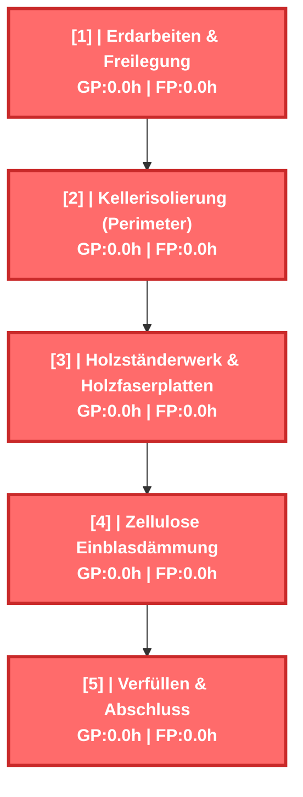
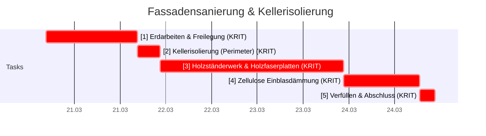
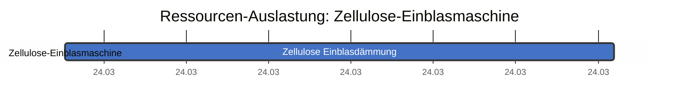
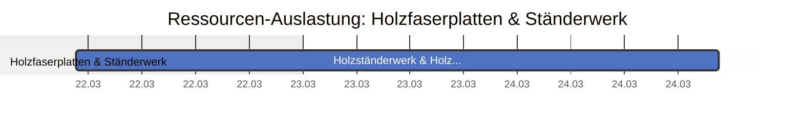
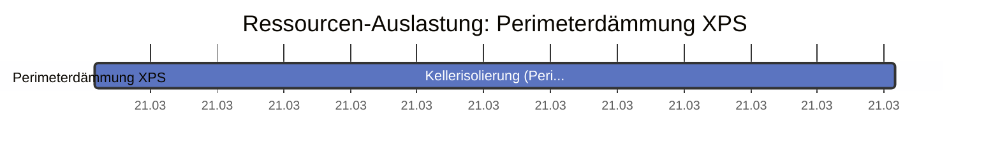
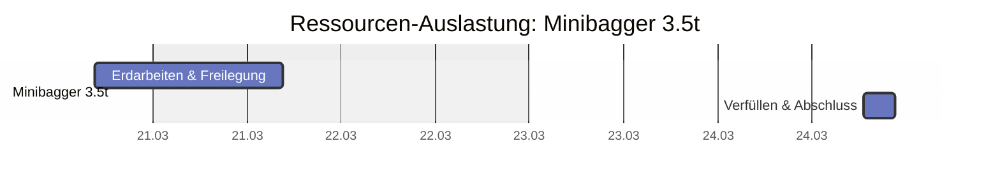
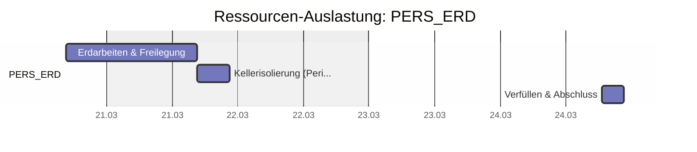
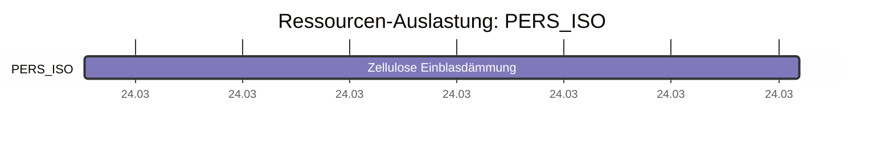
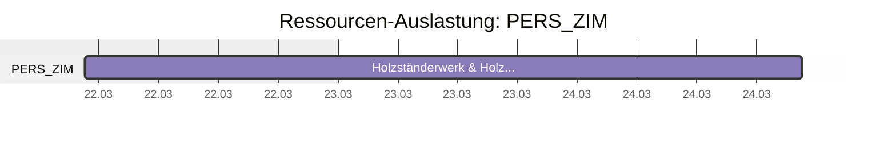

# Fassadensanierung & Kellerisolierung - CPM Report

Erstellt am: 2026-03-20 16:35:25

## CPM Analyse

### Projektzusammenfassung

- **Projekt:** Fassadensanierung & Kellerisolierung
- **Projektdauer:** 38.0h
- **Startdatum:** 2026-03-20 16:35
- **Enddatum (geschätzt):** 2026-03-25 10:35
- **Zeiteinheit:** hours
- **Anzahl Tasks:** 5
- **Kritische Tasks:** 5

---

### Kritischer Pfad

Der kritische Pfad besteht aus folgenden Tasks:

- **[1]** Erdarbeiten & Freilegung (Dauer: 8.0h)
- **[2]** Kellerisolierung (Perimeter) (Dauer: 6.0h)
- **[3]** Holzständerwerk & Holzfaserplatten (Dauer: 16.0h)
- **[4]** Zellulose Einblasdämmung (Dauer: 4.0h)
- **[5]** Verfüllen & Abschluss (Dauer: 4.0h)

---

### Netzplan

---

### Alle Tasks

| ID | Name | Dauer | FAZ | FEZ | SAZ | SEZ | GP | FP | Krit. |
|---|---|---|---|---|---|---|---|---|---|
| 1 | Erdarbeiten & Freilegung | 8.0h | 0.0h | 8.0h | 0.0h | 8.0h | 0.0h | 0.0h | JA |
| 2 | Kellerisolierung (Perimeter) | 6.0h | 8.0h | 14.0h | 8.0h | 14.0h | 0.0h | 0.0h | JA |
| 3 | Holzständerwerk & Holzfaserplatten | 16.0h | 14.0h | 30.0h | 14.0h | 30.0h | 0.0h | 0.0h | JA |
| 4 | Zellulose Einblasdämmung | 4.0h | 30.0h | 34.0h | 30.0h | 34.0h | 0.0h | 0.0h | JA |
| 5 | Verfüllen & Abschluss | 4.0h | 34.0h | 38.0h | 34.0h | 38.0h | 0.0h | 0.0h | JA |

---

### Gantt Chart (mit Wochenenden)

---

### Resource List

#### Ressourcenauslastung (Textform)

| Farbe | Name | Ressource | Anzahl Tasks | Tasks |
|---|---|---|---|---|
| ■ |  | Zellulose-Einblasmaschine (EB1) | 1 | 4 |
| ■ |  | Holzfaserplatten & Ständerwerk (MAT_WOOD) | 1 | 3 |
| ■ |  | Perimeterdämmung XPS (MAT_XPS) | 1 | 2 |
| ■ |  | Minibagger 3.5t (MB1) | 2 | 1, 5 |
| ■ |  | PERS_ERD (PERS_ERD) | 3 | 1, 2, 5 |
| ■ |  | PERS_ISO (PERS_ISO) | 1 | 4 |
| ■ |  | PERS_ZIM (PERS_ZIM) | 1 | 3 |

#### Ressourcenauslastung (Gantt-Diagramm)

#### Personen

| Person | Kosten/Stunde | Abwesenheiten im Projektzeitraum | Abwesenheiten kurz nach dem Projektzeitraum |
|---|---|---|---|
| Thomas Tiefbau | 60.00 €/h | keine | 2026-04-03 (Karfreitag), 2026-04-06 (Ostermontag) |
| Stefan Schnitt | 65.00 €/h | keine | 2026-04-03 (Karfreitag), 2026-04-06 (Ostermontag) |
| Klaus Flocke | 55.00 €/h | keine | 2026-04-03 (Karfreitag), 2026-04-06 (Ostermontag) |

#### Ressourcen-Details

| Ressource | Person | Typ |
|---|---|---|
| Minibagger 3.5t (MB1) |  | machine |
| Zellulose-Einblasmaschine (EB1) |  | machine |
| Perimeterdämmung XPS (MAT_XPS) |  | material |
| Holzfaserplatten & Ständerwerk (MAT_WOOD) |  | material |

---

### Kostenübersicht

| Ressource | Typ | Stunden | €/h | Bereitst. € | Lohnkosten € | Gesamt € |
|---|---|---|---|---|---|---|
| Zellulose-Einblasmaschine | machine | 4.0 | 45.00 | 50.00 | 180.00 | **230.00** |
| Minibagger 3.5t | machine | 12.0 | 85.00 | 120.00 | 1020.00 | **1140.00** |

**Zusammenfassung:**

- Maschinenkosten (Lohn): **1200.00 €**
- Bereitstellungskosten: **170.00 €**
- **Gesamtkosten: 1370.00 €**
