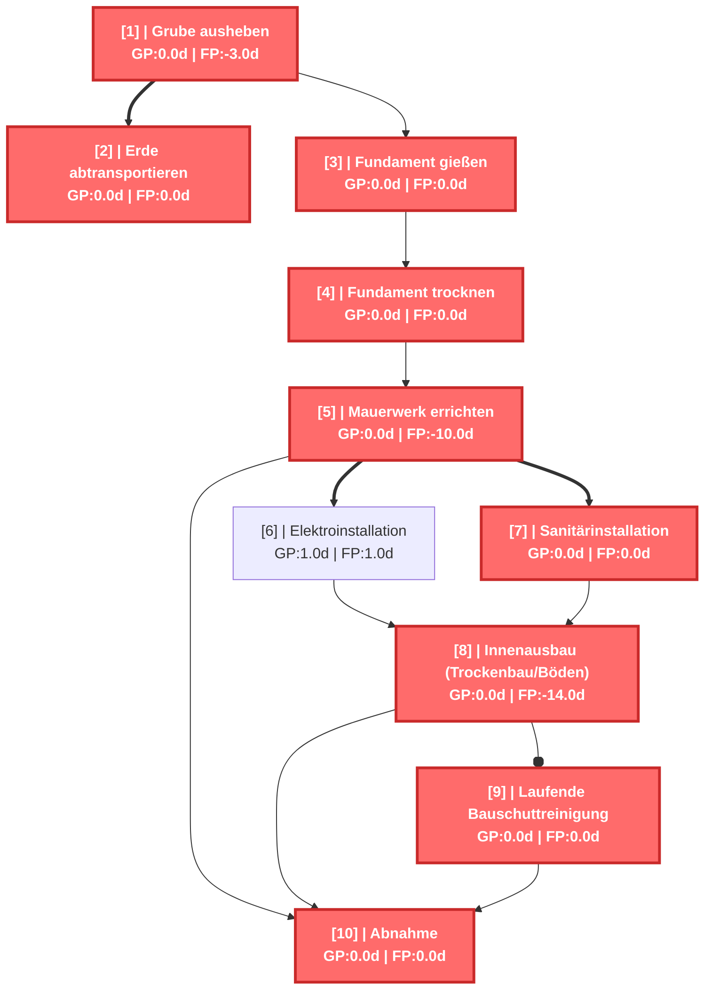
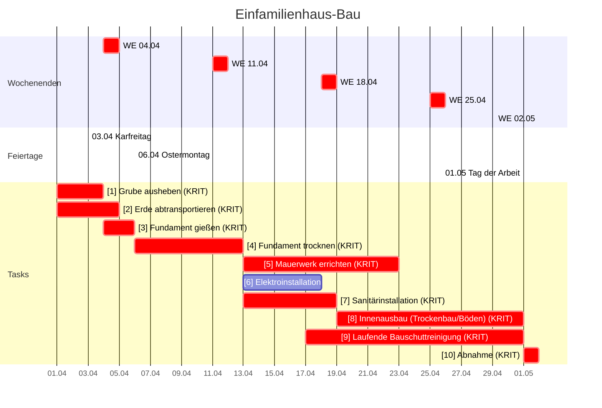

# Einfamilienhaus-Bau - CPM Report

Erstellt am: 2026-03-20 16:35:36

## CPM Analyse

### Projektzusammenfassung

- **Projekt:** Einfamilienhaus-Bau
- **Projektdauer:** 31.0d
- **Startdatum:** 2026-04-01 00:00
- **Enddatum (geschätzt):** 2026-05-02 00:00
- **Zeiteinheit:** days
- **Anzahl Tasks:** 10
- **Kritische Tasks:** 9

---

### Kritischer Pfad

Der kritische Pfad besteht aus folgenden Tasks:

- **[1]** Grube ausheben (Dauer: 3.0d)
- **[2]** Erde abtransportieren (Dauer: 4.0d)
- **[3]** Fundament gießen (Dauer: 2.0d)
- **[4]** Fundament trocknen (Dauer: 7.0d)
- **[5]** Mauerwerk errichten (Dauer: 10.0d)
- **[7]** Sanitärinstallation (Dauer: 6.0d)
- **[9]** Laufende Bauschuttreinigung (Dauer: 14.0d)
- **[8]** Innenausbau (Trockenbau/Böden) (Dauer: 12.0d)
- **[10]** Abnahme (Dauer: 1.0d)

---

### Netzplan

---

### Alle Tasks

| ID | Name | Dauer | FAZ | FEZ | SAZ | SEZ | GP | FP | Krit. |
|---|---|---|---|---|---|---|---|---|---|
| 1 | Grube ausheben | 3.0d | 0.0d | 3.0d | 0.0d | 3.0d | 0.0d | -3.0d | JA |
| 2 | Erde abtransportieren | 4.0d | 0.0d | 4.0d | 0.0d | 4.0d | 0.0d | 0.0d | JA |
| 3 | Fundament gießen | 2.0d | 3.0d | 5.0d | 3.0d | 5.0d | 0.0d | 0.0d | JA |
| 4 | Fundament trocknen | 7.0d | 5.0d | 12.0d | 5.0d | 12.0d | 0.0d | 0.0d | JA |
| 5 | Mauerwerk errichten | 10.0d | 12.0d | 22.0d | 12.0d | 22.0d | 0.0d | -10.0d | JA |
| 6 | Elektroinstallation | 5.0d | 12.0d | 17.0d | 13.0d | 18.0d | 1.0d | 1.0d |  |
| 7 | Sanitärinstallation | 6.0d | 12.0d | 18.0d | 12.0d | 18.0d | 0.0d | 0.0d | JA |
| 8 | Innenausbau (Trockenbau/Böden) | 12.0d | 18.0d | 30.0d | 18.0d | 30.0d | 0.0d | -14.0d | JA |
| 9 | Laufende Bauschuttreinigung | 14.0d | 16.0d | 30.0d | 16.0d | 30.0d | 0.0d | 0.0d | JA |
| 10 | Abnahme | 1.0d | 30.0d | 31.0d | 30.0d | 31.0d | 0.0d | 0.0d | JA |

---

### Gantt Chart (mit Wochenenden)

---

### Resource List

*Keine Ressourcen-Informationen verfügbar.*

---

### Kostenübersicht

*Keine Kostendaten verfügbar – Stundensätze fehlen.*
