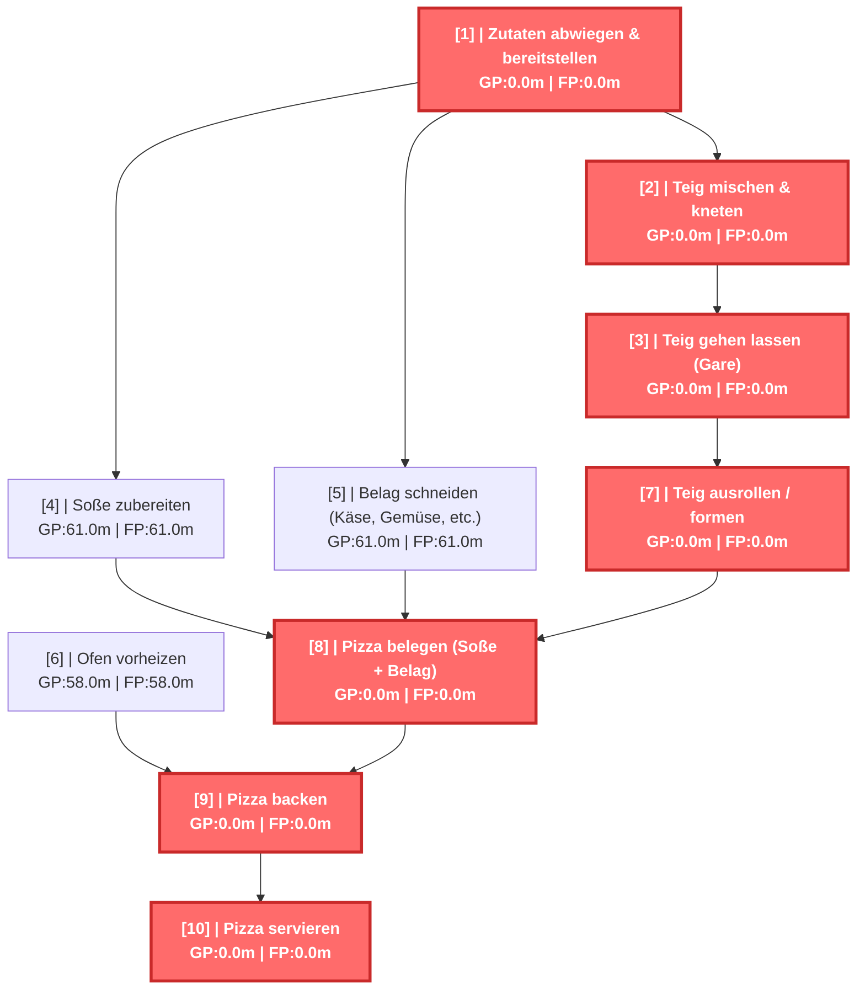
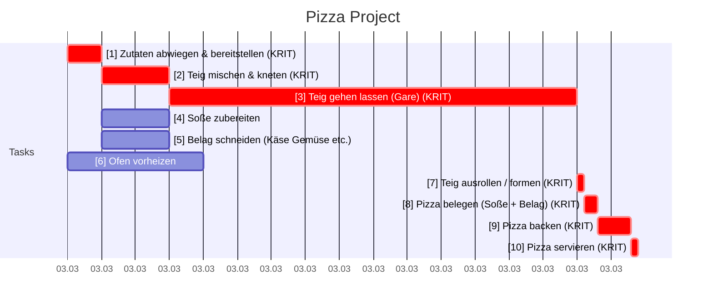

# Pizza Project - CPM Report

Erstellt am: 2026-03-20 16:35:45

## CPM Analyse

### Projektzusammenfassung

- **Projekt:** Pizza Project
- **Projektdauer:** 84.0m
- **Startdatum:** 2026-03-03 09:00
- **Enddatum (geschätzt):** 2026-03-03 13:12
- **Zeiteinheit:** minutes
- **Anzahl Tasks:** 10
- **Kritische Tasks:** 7

---

### Kritischer Pfad

Der kritische Pfad besteht aus folgenden Tasks:

- **[1]** Zutaten abwiegen & bereitstellen (Dauer: 5.0m)
- **[2]** Teig mischen & kneten (Dauer: 10.0m)
- **[3]** Teig gehen lassen (Gare) (Dauer: 60.0m)
- **[7]** Teig ausrollen / formen (Dauer: 1.0m)
- **[8]** Pizza belegen (Soße + Belag) (Dauer: 2.0m)
- **[9]** Pizza backen (Dauer: 5.0m)
- **[10]** Pizza servieren (Dauer: 1.0m)

---

### Netzplan

---

### Alle Tasks

| ID | Name | Dauer | FAZ | FEZ | SAZ | SEZ | GP | FP | Krit. |
|---|---|---|---|---|---|---|---|---|---|
| 1 | Zutaten abwiegen & bereitstellen | 5.0m | 0.0m | 5.0m | 0.0m | 5.0m | 0.0m | 0.0m | JA |
| 2 | Teig mischen & kneten | 10.0m | 5.0m | 15.0m | 5.0m | 15.0m | 0.0m | 0.0m | JA |
| 3 | Teig gehen lassen (Gare) | 60.0m | 15.0m | 75.0m | 15.0m | 75.0m | 0.0m | 0.0m | JA |
| 4 | Soße zubereiten | 10.0m | 5.0m | 15.0m | 66.0m | 76.0m | 61.0m | 61.0m |  |
| 5 | Belag schneiden (Käse, Gemüse, e... | 10.0m | 5.0m | 15.0m | 66.0m | 76.0m | 61.0m | 61.0m |  |
| 6 | Ofen vorheizen | 20.0m | 0.0m | 20.0m | 58.0m | 78.0m | 58.0m | 58.0m |  |
| 7 | Teig ausrollen / formen | 1.0m | 75.0m | 76.0m | 75.0m | 76.0m | 0.0m | 0.0m | JA |
| 8 | Pizza belegen (Soße + Belag) | 2.0m | 76.0m | 78.0m | 76.0m | 78.0m | 0.0m | 0.0m | JA |
| 9 | Pizza backen | 5.0m | 78.0m | 83.0m | 78.0m | 83.0m | 0.0m | 0.0m | JA |
| 10 | Pizza servieren | 1.0m | 83.0m | 84.0m | 83.0m | 84.0m | 0.0m | 0.0m | JA |

---

### Gantt Chart (mit Wochenenden)

---

### Resource List

*Keine Ressourcen-Informationen verfügbar.*

---

### Kostenübersicht

*Keine Kostendaten verfügbar – Stundensätze fehlen.*
