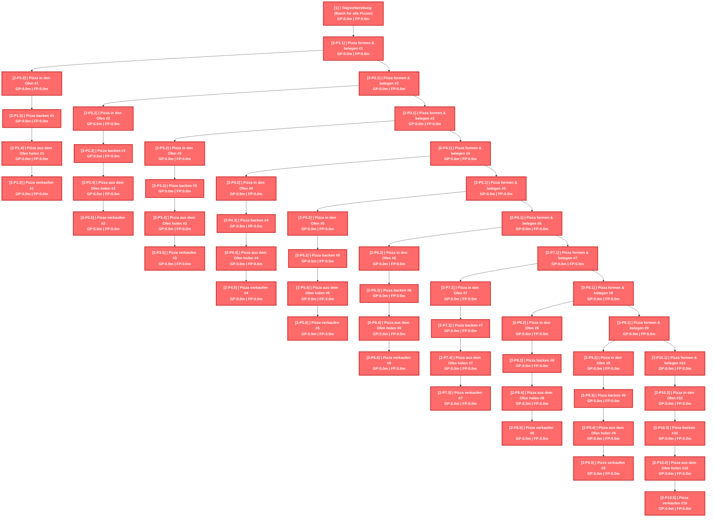
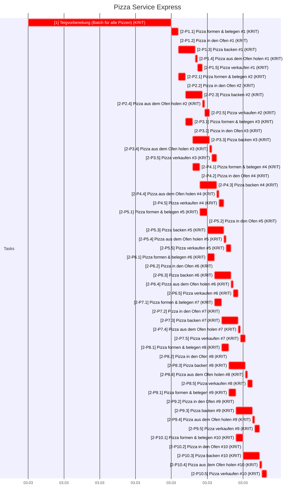
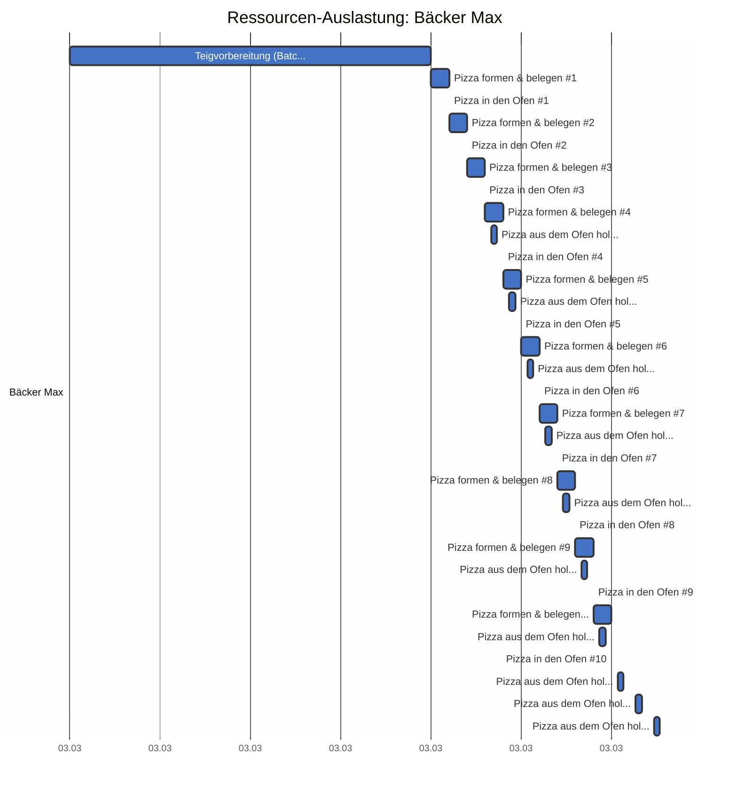
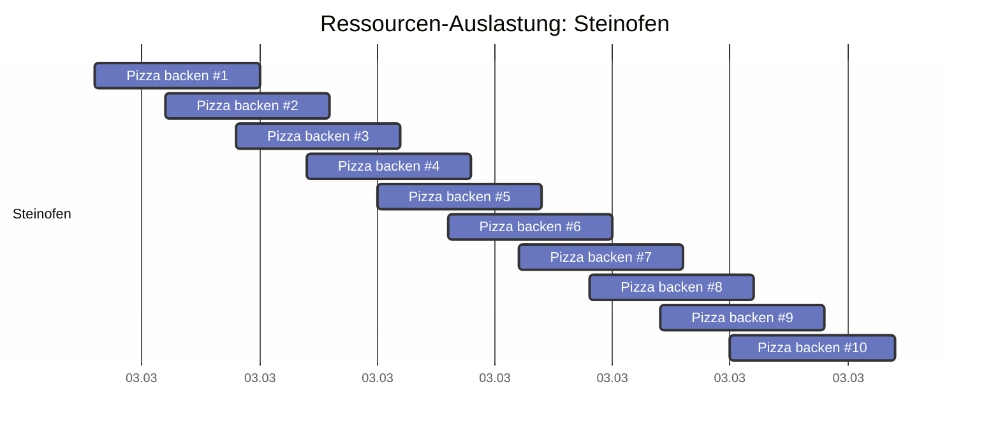
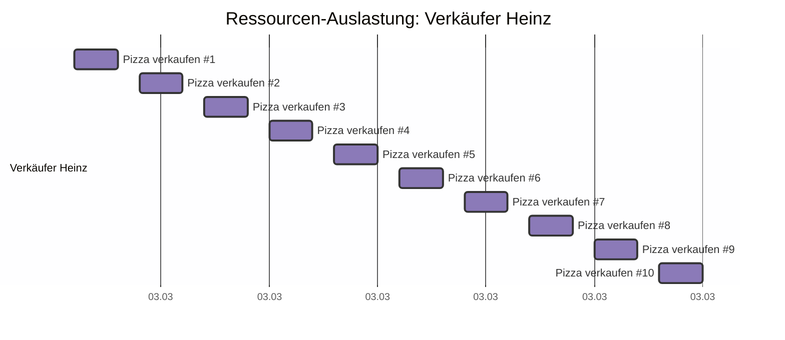

# Pizza Service Express - CPM Report

Erstellt am: 2026-03-20 16:35:56

## CPM Analyse

### Projektzusammenfassung

- **Projekt:** Pizza Service Express
- **Projektdauer:** 100.0m
- **Startdatum:** 2026-03-03 09:00
- **Enddatum (geschätzt):** 2026-03-03 14:00
- **Zeiteinheit:** minutes
- **Anzahl Tasks:** 51
- **Kritische Tasks:** 51

---

### Kritischer Pfad

Der kritische Pfad besteht aus folgenden Tasks:

- **[1]** Teigvorbereitung (Batch für alle Pizzen) (Dauer: 60.0m)
- **[2-P1.1]** Pizza formen & belegen #1 (Dauer: 3.0m)
- **[2-P1.2]** Pizza in den Ofen #1 (Dauer: 0.5m)
- **[2-P2.1]** Pizza formen & belegen #2 (Dauer: 3.0m)
- **[2-P1.3]** Pizza backen #1 (Dauer: 7.0m)
- **[2-P2.2]** Pizza in den Ofen #2 (Dauer: 0.5m)
- **[2-P3.1]** Pizza formen & belegen #3 (Dauer: 3.0m)
- **[2-P2.3]** Pizza backen #2 (Dauer: 7.0m)
- **[2-P3.2]** Pizza in den Ofen #3 (Dauer: 0.5m)
- **[2-P4.1]** Pizza formen & belegen #4 (Dauer: 3.0m)
- **[2-P3.3]** Pizza backen #3 (Dauer: 7.0m)
- **[2-P1.4]** Pizza aus dem Ofen holen #1 (Dauer: 0.5m)
- **[2-P1.5]** Pizza verkaufen #1 (Dauer: 2.0m)
- **[2-P4.2]** Pizza in den Ofen #4 (Dauer: 0.5m)
- **[2-P5.1]** Pizza formen & belegen #5 (Dauer: 3.0m)
- **[2-P4.3]** Pizza backen #4 (Dauer: 7.0m)
- **[2-P2.4]** Pizza aus dem Ofen holen #2 (Dauer: 0.5m)
- **[2-P2.5]** Pizza verkaufen #2 (Dauer: 2.0m)
- **[2-P5.2]** Pizza in den Ofen #5 (Dauer: 0.5m)
- **[2-P6.1]** Pizza formen & belegen #6 (Dauer: 3.0m)
- **[2-P5.3]** Pizza backen #5 (Dauer: 7.0m)
- **[2-P3.4]** Pizza aus dem Ofen holen #3 (Dauer: 0.5m)
- **[2-P3.5]** Pizza verkaufen #3 (Dauer: 2.0m)
- **[2-P6.2]** Pizza in den Ofen #6 (Dauer: 0.5m)
- **[2-P7.1]** Pizza formen & belegen #7 (Dauer: 3.0m)
- **[2-P6.3]** Pizza backen #6 (Dauer: 7.0m)
- **[2-P4.4]** Pizza aus dem Ofen holen #4 (Dauer: 0.5m)
- **[2-P4.5]** Pizza verkaufen #4 (Dauer: 2.0m)
- **[2-P7.2]** Pizza in den Ofen #7 (Dauer: 0.5m)
- **[2-P8.1]** Pizza formen & belegen #8 (Dauer: 3.0m)
- **[2-P7.3]** Pizza backen #7 (Dauer: 7.0m)
- **[2-P5.4]** Pizza aus dem Ofen holen #5 (Dauer: 0.5m)
- **[2-P5.5]** Pizza verkaufen #5 (Dauer: 2.0m)
- **[2-P8.2]** Pizza in den Ofen #8 (Dauer: 0.5m)
- **[2-P9.1]** Pizza formen & belegen #9 (Dauer: 3.0m)
- **[2-P8.3]** Pizza backen #8 (Dauer: 7.0m)
- **[2-P6.4]** Pizza aus dem Ofen holen #6 (Dauer: 0.5m)
- **[2-P6.5]** Pizza verkaufen #6 (Dauer: 2.0m)
- **[2-P9.2]** Pizza in den Ofen #9 (Dauer: 0.5m)
- **[2-P10.1]** Pizza formen & belegen #10 (Dauer: 3.0m)
- **[2-P9.3]** Pizza backen #9 (Dauer: 7.0m)
- **[2-P7.4]** Pizza aus dem Ofen holen #7 (Dauer: 0.5m)
- **[2-P7.5]** Pizza verkaufen #7 (Dauer: 2.0m)
- **[2-P10.2]** Pizza in den Ofen #10 (Dauer: 0.5m)
- **[2-P10.3]** Pizza backen #10 (Dauer: 7.0m)
- **[2-P8.4]** Pizza aus dem Ofen holen #8 (Dauer: 0.5m)
- **[2-P8.5]** Pizza verkaufen #8 (Dauer: 2.0m)
- **[2-P9.4]** Pizza aus dem Ofen holen #9 (Dauer: 0.5m)
- **[2-P9.5]** Pizza verkaufen #9 (Dauer: 2.0m)
- **[2-P10.4]** Pizza aus dem Ofen holen #10 (Dauer: 0.5m)
- **[2-P10.5]** Pizza verkaufen #10 (Dauer: 2.0m)

---

### Netzplan

---

### Alle Tasks

| ID | Name | Dauer | FAZ | FEZ | SAZ | SEZ | GP | FP | Krit. |
|---|---|---|---|---|---|---|---|---|---|
| 1 | Teigvorbereitung (Batch für alle... | 60.0m | 0.0m | 60.0m | 0.0m | 60.0m | 0.0m | 0.0m | JA |
| 2-P1.1 | Pizza formen & belegen #1 | 3.0m | 60.0m | 63.0m | 60.0m | 63.0m | 0.0m | 0.0m | JA |
| 2-P1.2 | Pizza in den Ofen #1 | 0.5m | 63.0m | 63.5m | 63.0m | 63.5m | 0.0m | 0.0m | JA |
| 2-P1.3 | Pizza backen #1 | 7.0m | 63.5m | 70.5m | 63.5m | 70.5m | 0.0m | 0.0m | JA |
| 2-P1.4 | Pizza aus dem Ofen holen #1 | 0.5m | 70.5m | 71.0m | 70.5m | 71.0m | 0.0m | 0.0m | JA |
| 2-P1.5 | Pizza verkaufen #1 | 2.0m | 71.0m | 73.0m | 71.0m | 73.0m | 0.0m | 0.0m | JA |
| 2-P2.1 | Pizza formen & belegen #2 | 3.0m | 63.0m | 66.0m | 63.0m | 66.0m | 0.0m | 0.0m | JA |
| 2-P2.2 | Pizza in den Ofen #2 | 0.5m | 66.0m | 66.5m | 66.0m | 66.5m | 0.0m | 0.0m | JA |
| 2-P2.3 | Pizza backen #2 | 7.0m | 66.5m | 73.5m | 66.5m | 73.5m | 0.0m | 0.0m | JA |
| 2-P2.4 | Pizza aus dem Ofen holen #2 | 0.5m | 73.5m | 74.0m | 73.5m | 74.0m | 0.0m | 0.0m | JA |
| 2-P2.5 | Pizza verkaufen #2 | 2.0m | 74.0m | 76.0m | 74.0m | 76.0m | 0.0m | 0.0m | JA |
| 2-P3.1 | Pizza formen & belegen #3 | 3.0m | 66.0m | 69.0m | 66.0m | 69.0m | 0.0m | 0.0m | JA |
| 2-P3.2 | Pizza in den Ofen #3 | 0.5m | 69.0m | 69.5m | 69.0m | 69.5m | 0.0m | 0.0m | JA |
| 2-P3.3 | Pizza backen #3 | 7.0m | 69.5m | 76.5m | 69.5m | 76.5m | 0.0m | 0.0m | JA |
| 2-P3.4 | Pizza aus dem Ofen holen #3 | 0.5m | 76.5m | 77.0m | 76.5m | 77.0m | 0.0m | 0.0m | JA |
| 2-P3.5 | Pizza verkaufen #3 | 2.0m | 77.0m | 79.0m | 77.0m | 79.0m | 0.0m | 0.0m | JA |
| 2-P4.1 | Pizza formen & belegen #4 | 3.0m | 69.0m | 72.0m | 69.0m | 72.0m | 0.0m | 0.0m | JA |
| 2-P4.2 | Pizza in den Ofen #4 | 0.5m | 72.0m | 72.5m | 72.0m | 72.5m | 0.0m | 0.0m | JA |
| 2-P4.3 | Pizza backen #4 | 7.0m | 72.5m | 79.5m | 72.5m | 79.5m | 0.0m | 0.0m | JA |
| 2-P4.4 | Pizza aus dem Ofen holen #4 | 0.5m | 79.5m | 80.0m | 79.5m | 80.0m | 0.0m | 0.0m | JA |
| 2-P4.5 | Pizza verkaufen #4 | 2.0m | 80.0m | 82.0m | 80.0m | 82.0m | 0.0m | 0.0m | JA |
| 2-P5.1 | Pizza formen & belegen #5 | 3.0m | 72.0m | 75.0m | 72.0m | 75.0m | 0.0m | 0.0m | JA |
| 2-P5.2 | Pizza in den Ofen #5 | 0.5m | 75.0m | 75.5m | 75.0m | 75.5m | 0.0m | 0.0m | JA |
| 2-P5.3 | Pizza backen #5 | 7.0m | 75.5m | 82.5m | 75.5m | 82.5m | 0.0m | 0.0m | JA |
| 2-P5.4 | Pizza aus dem Ofen holen #5 | 0.5m | 82.5m | 83.0m | 82.5m | 83.0m | 0.0m | 0.0m | JA |
| 2-P5.5 | Pizza verkaufen #5 | 2.0m | 83.0m | 85.0m | 83.0m | 85.0m | 0.0m | 0.0m | JA |
| 2-P6.1 | Pizza formen & belegen #6 | 3.0m | 75.0m | 78.0m | 75.0m | 78.0m | 0.0m | 0.0m | JA |
| 2-P6.2 | Pizza in den Ofen #6 | 0.5m | 78.0m | 78.5m | 78.0m | 78.5m | 0.0m | 0.0m | JA |
| 2-P6.3 | Pizza backen #6 | 7.0m | 78.5m | 85.5m | 78.5m | 85.5m | 0.0m | 0.0m | JA |
| 2-P6.4 | Pizza aus dem Ofen holen #6 | 0.5m | 85.5m | 86.0m | 85.5m | 86.0m | 0.0m | 0.0m | JA |
| 2-P6.5 | Pizza verkaufen #6 | 2.0m | 86.0m | 88.0m | 86.0m | 88.0m | 0.0m | 0.0m | JA |
| 2-P7.1 | Pizza formen & belegen #7 | 3.0m | 78.0m | 81.0m | 78.0m | 81.0m | 0.0m | 0.0m | JA |
| 2-P7.2 | Pizza in den Ofen #7 | 0.5m | 81.0m | 81.5m | 81.0m | 81.5m | 0.0m | 0.0m | JA |
| 2-P7.3 | Pizza backen #7 | 7.0m | 81.5m | 88.5m | 81.5m | 88.5m | 0.0m | 0.0m | JA |
| 2-P7.4 | Pizza aus dem Ofen holen #7 | 0.5m | 88.5m | 89.0m | 88.5m | 89.0m | 0.0m | 0.0m | JA |
| 2-P7.5 | Pizza verkaufen #7 | 2.0m | 89.0m | 91.0m | 89.0m | 91.0m | 0.0m | 0.0m | JA |
| 2-P8.1 | Pizza formen & belegen #8 | 3.0m | 81.0m | 84.0m | 81.0m | 84.0m | 0.0m | 0.0m | JA |
| 2-P8.2 | Pizza in den Ofen #8 | 0.5m | 84.0m | 84.5m | 84.0m | 84.5m | 0.0m | 0.0m | JA |
| 2-P8.3 | Pizza backen #8 | 7.0m | 84.5m | 91.5m | 84.5m | 91.5m | 0.0m | 0.0m | JA |
| 2-P8.4 | Pizza aus dem Ofen holen #8 | 0.5m | 91.5m | 92.0m | 91.5m | 92.0m | 0.0m | 0.0m | JA |
| 2-P8.5 | Pizza verkaufen #8 | 2.0m | 92.0m | 94.0m | 92.0m | 94.0m | 0.0m | 0.0m | JA |
| 2-P9.1 | Pizza formen & belegen #9 | 3.0m | 84.0m | 87.0m | 84.0m | 87.0m | 0.0m | 0.0m | JA |
| 2-P9.2 | Pizza in den Ofen #9 | 0.5m | 87.0m | 87.5m | 87.0m | 87.5m | 0.0m | 0.0m | JA |
| 2-P9.3 | Pizza backen #9 | 7.0m | 87.5m | 94.5m | 87.5m | 94.5m | 0.0m | 0.0m | JA |
| 2-P9.4 | Pizza aus dem Ofen holen #9 | 0.5m | 94.5m | 95.0m | 94.5m | 95.0m | 0.0m | 0.0m | JA |
| 2-P9.5 | Pizza verkaufen #9 | 2.0m | 95.0m | 97.0m | 95.0m | 97.0m | 0.0m | 0.0m | JA |
| 2-P10.1 | Pizza formen & belegen #10 | 3.0m | 87.0m | 90.0m | 87.0m | 90.0m | 0.0m | 0.0m | JA |
| 2-P10.2 | Pizza in den Ofen #10 | 0.5m | 90.0m | 90.5m | 90.0m | 90.5m | 0.0m | 0.0m | JA |
| 2-P10.3 | Pizza backen #10 | 7.0m | 90.5m | 97.5m | 90.5m | 97.5m | 0.0m | 0.0m | JA |
| 2-P10.4 | Pizza aus dem Ofen holen #10 | 0.5m | 97.5m | 98.0m | 97.5m | 98.0m | 0.0m | 0.0m | JA |
| 2-P10.5 | Pizza verkaufen #10 | 2.0m | 98.0m | 100.0m | 98.0m | 100.0m | 0.0m | 0.0m | JA |

---

### Gantt Chart (mit Wochenenden)

---

### Resource List

#### Ressourcenauslastung (Textform)

| Farbe | Name | Ressource | Anzahl Tasks | Tasks |
|---|---|---|---|---|
| ■ | Max Mustermann | Bäcker Max (R_BAECKER) | 31 | 1, 2-P1.1, 2-P1.2, 2-P1.4, 2-P2.1, 2-P2.2, 2-P2.4, 2-P3.1, 2-P3.2, 2-P3.4 ... (+21 weitere) |
| ■ |  | Steinofen (R_OFEN) | 10 | 2-P1.3, 2-P2.3, 2-P3.3, 2-P4.3, 2-P5.3, 2-P6.3, 2-P7.3, 2-P8.3, 2-P9.3, 2-P10.3 |
| ■ | Heinz Müller | Verkäufer Heinz (R_VERKAEUFER) | 10 | 2-P1.5, 2-P2.5, 2-P3.5, 2-P4.5, 2-P5.5, 2-P6.5, 2-P7.5, 2-P8.5, 2-P9.5, 2-P10.5 |

#### Ressourcenauslastung (Gantt-Diagramm)

#### Personen

| Person | Kosten/Stunde | Abwesenheiten im Projektzeitraum | Abwesenheiten kurz nach dem Projektzeitraum |
|---|---|---|---|
| Max Mustermann | 45.00 €/h | keine | keine |
| Heinz Müller | 35.00 €/h | keine | keine |

#### Ressourcen-Details

| Ressource | Person | Typ |
|---|---|---|
| Bäcker Max (R_BAECKER) | Max Mustermann | person |
| Verkäufer Heinz (R_VERKAEUFER) | Heinz Müller | person |
| Steinofen (R_OFEN) |  | machine |

---

### Kostenübersicht

| Ressource | Typ | Stunden | €/h | Bereitst. € | Lohnkosten € | Gesamt € |
|---|---|---|---|---|---|---|
| Bäcker Max | person | 1.7 | 45.00 | — | 75.00 | **75.00** |
| Verkäufer Heinz | person | 0.3 | 35.00 | — | 11.67 | **11.67** |

**Zusammenfassung:**

- Personalkosten: **86.67 €**
- **Gesamtkosten: 86.67 €**
