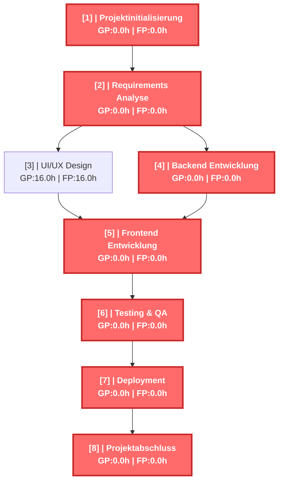
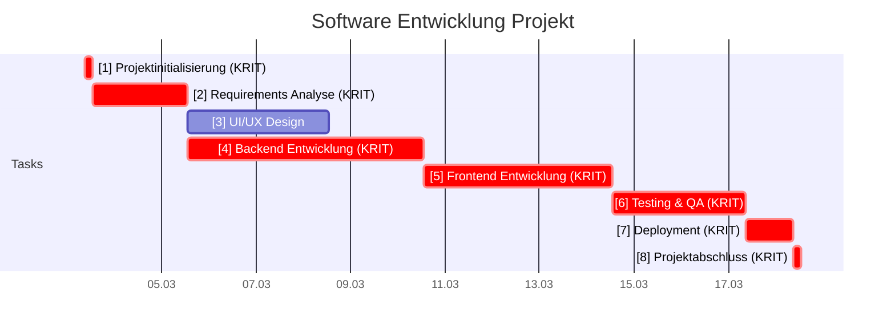
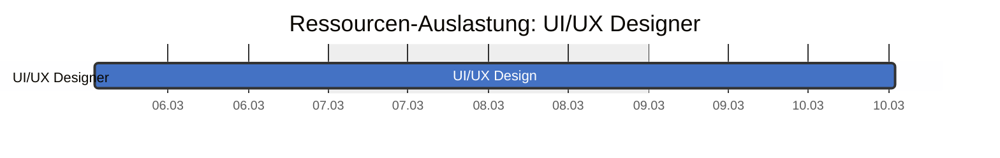
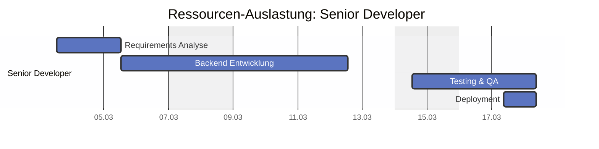
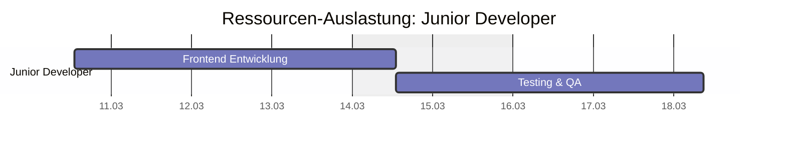
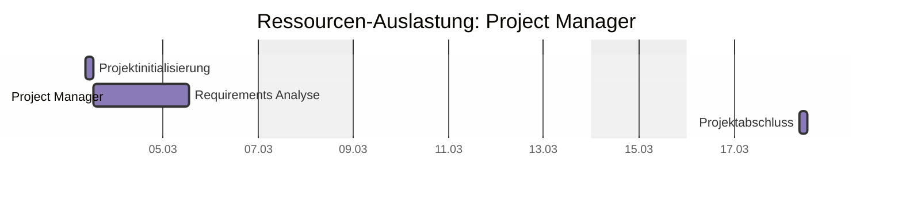

# Software Entwicklung Projekt - CPM Report

Erstellt am: 2026-03-20 16:36:11

## CPM Analyse

### Projektzusammenfassung

- **Projekt:** Software Entwicklung Projekt
- **Projektdauer:** 124.0h
- **Startdatum:** 2026-03-03 09:00
- **Enddatum (geschätzt):** 2026-03-18 21:00
- **Zeiteinheit:** hours
- **Anzahl Tasks:** 8
- **Kritische Tasks:** 7

---

### Kritischer Pfad

Der kritische Pfad besteht aus folgenden Tasks:

- **[1]** Projektinitialisierung (Dauer: 4.0h)
- **[2]** Requirements Analyse (Dauer: 16.0h)
- **[4]** Backend Entwicklung (Dauer: 40.0h)
- **[5]** Frontend Entwicklung (Dauer: 32.0h)
- **[6]** Testing & QA (Dauer: 20.0h)
- **[7]** Deployment (Dauer: 8.0h)
- **[8]** Projektabschluss (Dauer: 4.0h)

---

### Netzplan

---

### Alle Tasks

| ID | Name | Dauer | FAZ | FEZ | SAZ | SEZ | GP | FP | Krit. |
|---|---|---|---|---|---|---|---|---|---|
| 1 | Projektinitialisierung | 4.0h | 0.0h | 4.0h | 0.0h | 4.0h | 0.0h | 0.0h | JA |
| 2 | Requirements Analyse | 16.0h | 4.0h | 20.0h | 4.0h | 20.0h | 0.0h | 0.0h | JA |
| 3 | UI/UX Design | 24.0h | 20.0h | 44.0h | 36.0h | 60.0h | 16.0h | 16.0h |  |
| 4 | Backend Entwicklung | 40.0h | 20.0h | 60.0h | 20.0h | 60.0h | 0.0h | 0.0h | JA |
| 5 | Frontend Entwicklung | 32.0h | 60.0h | 92.0h | 60.0h | 92.0h | 0.0h | 0.0h | JA |
| 6 | Testing & QA | 20.0h | 92.0h | 112.0h | 92.0h | 112.0h | 0.0h | 0.0h | JA |
| 7 | Deployment | 8.0h | 112.0h | 120.0h | 112.0h | 120.0h | 0.0h | 0.0h | JA |
| 8 | Projektabschluss | 4.0h | 120.0h | 124.0h | 120.0h | 124.0h | 0.0h | 0.0h | JA |

---

### Gantt Chart (mit Wochenenden)

---

### Resource List

#### Ressourcenauslastung (Textform)

| Farbe | Name | Ressource | Anzahl Tasks | Tasks |
|---|---|---|---|---|
| ■ | Charlie | UI/UX Designer (R_DES1) | 1 | 3 |
| ■ | Alice | Senior Developer (R_DEV1) | 4 | 2, 4, 6, 7 |
| ■ | Bob | Junior Developer (R_DEV2) | 2 | 5, 6 |
| ■ | Diana | Project Manager (R_PM1) | 3 | 1, 2, 8 |

#### Ressourcenauslastung (Gantt-Diagramm)

#### Personen

| Person | Kosten/Stunde | Abwesenheiten im Projektzeitraum | Abwesenheiten kurz nach dem Projektzeitraum |
|---|---|---|---|
| Alice | 85.00 €/h | keine | 2026-04-01 – 2026-04-05 (Urlaub Alice), 2026-04-03 (Karfreitag), 2026-04-06 (Ostermontag) |
| Bob | 55.00 €/h | keine | 2026-04-03 (Karfreitag), 2026-04-06 (Ostermontag) |
| Charlie | 70.00 €/h | 2026-03-16 (Fortbildung) | 2026-04-03 (Karfreitag), 2026-04-06 (Ostermontag) |
| Diana | 95.00 €/h | keine | 2026-04-03 (Karfreitag), 2026-04-06 (Ostermontag) |

#### Ressourcen-Details

| Ressource | Person | Typ |
|---|---|---|
| Senior Developer (R_DEV1) | Alice | person |
| Junior Developer (R_DEV2) | Bob | person |
| UI/UX Designer (R_DES1) | Charlie | person |
| Project Manager (R_PM1) | Diana | person |

---

### Kostenübersicht

| Ressource | Typ | Stunden | €/h | Bereitst. € | Lohnkosten € | Gesamt € |
|---|---|---|---|---|---|---|
| UI/UX Designer | person | 24.0 | 70.00 | — | 1680.00 | **1680.00** |
| Senior Developer | person | 84.0 | 85.00 | — | 7140.00 | **7140.00** |
| Junior Developer | person | 52.0 | 55.00 | — | 2860.00 | **2860.00** |
| Project Manager | person | 24.0 | 95.00 | — | 2280.00 | **2280.00** |

**Zusammenfassung:**

- Personalkosten: **13960.00 €**
- **Gesamtkosten: 13960.00 €**
