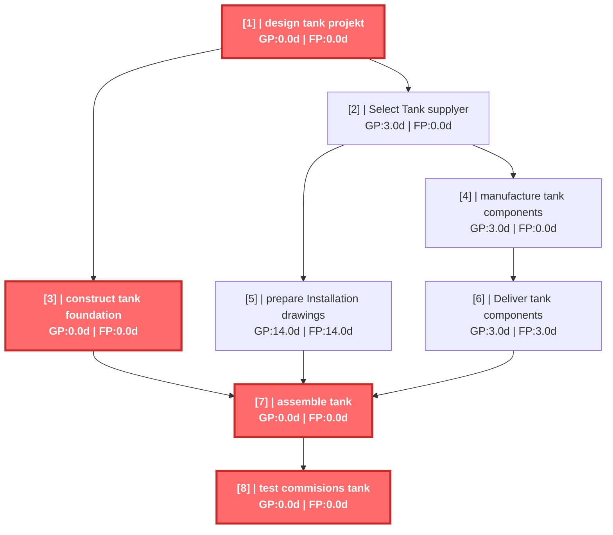
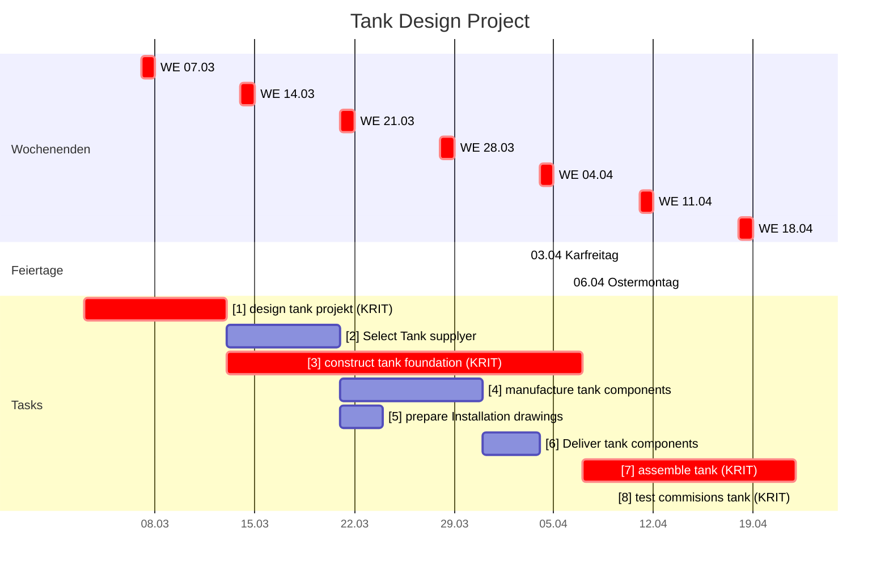

# Tank Design Project - CPM Report

Erstellt am: 2026-03-20 16:36:21

## CPM Analyse

### Projektzusammenfassung

- **Projekt:** Tank Design Project
- **Projektdauer:** 50.0d
- **Startdatum:** 2026-03-03 07:00
- **Enddatum (geschätzt):** 2026-04-22 07:00
- **Zeiteinheit:** days
- **Anzahl Tasks:** 8
- **Kritische Tasks:** 4

---

### Kritischer Pfad

Der kritische Pfad besteht aus folgenden Tasks:

- **[1]** design tank projekt (Dauer: 10.0d)
- **[3]** construct tank foundation (Dauer: 25.0d)
- **[7]** assemble tank (Dauer: 15.0d)
- **[8]** test commisions tank (Dauer: 0.0d)

---

### Netzplan

---

### Alle Tasks

| ID | Name | Dauer | FAZ | FEZ | SAZ | SEZ | GP | FP | Krit. |
|---|---|---|---|---|---|---|---|---|---|
| 1 | design tank projekt | 10.0d | 0.0d | 10.0d | 0.0d | 10.0d | 0.0d | 0.0d | JA |
| 2 | Select Tank supplyer | 8.0d | 10.0d | 18.0d | 13.0d | 21.0d | 3.0d | 0.0d |  |
| 3 | construct tank foundation | 25.0d | 10.0d | 35.0d | 10.0d | 35.0d | 0.0d | 0.0d | JA |
| 4 | manufacture tank components | 10.0d | 18.0d | 28.0d | 21.0d | 31.0d | 3.0d | 0.0d |  |
| 5 | prepare Installation drawings | 3.0d | 18.0d | 21.0d | 32.0d | 35.0d | 14.0d | 14.0d |  |
| 6 | Deliver tank components | 4.0d | 28.0d | 32.0d | 31.0d | 35.0d | 3.0d | 3.0d |  |
| 7 | assemble tank | 15.0d | 35.0d | 50.0d | 35.0d | 50.0d | 0.0d | 0.0d | JA |
| 8 | test commisions tank | 0.0d | 50.0d | 50.0d | 50.0d | 50.0d | 0.0d | 0.0d | JA |

---

### Gantt Chart (mit Wochenenden)

---

### Resource List

*Keine Ressourcen-Informationen verfügbar.*

---

### Kostenübersicht

*Keine Kostendaten verfügbar – Stundensätze fehlen.*
